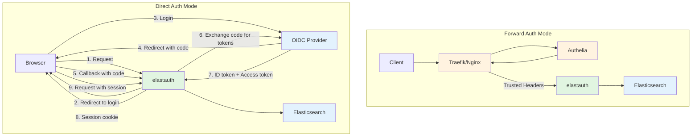
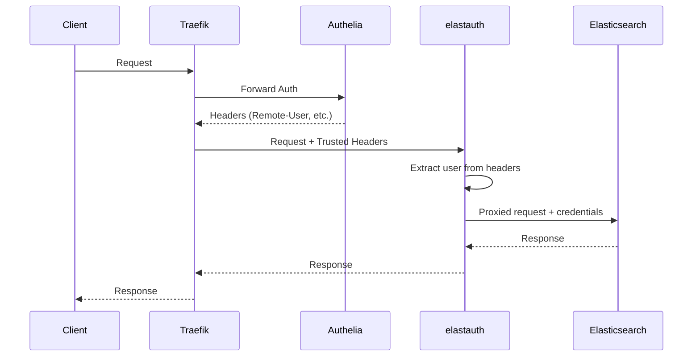
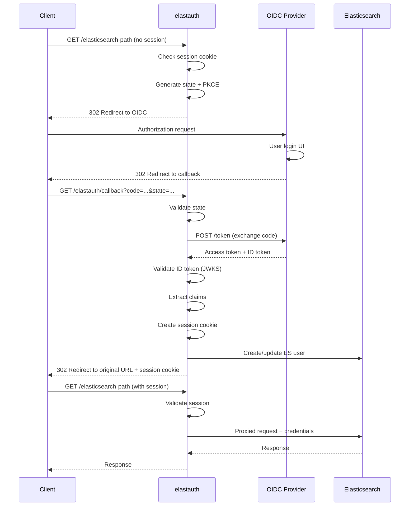

# Design Document: Operation Modes Security Fix

## Overview

This design fixes a critical security vulnerability in elastauth's current implementation and establishes explicit operation modes with proper security boundaries. The current "direct-proxy" mode incorrectly trusts authentication headers without validation, creating a security hole where any client can send fake headers.

This design introduces two secure operation modes:

1. **Forward Auth Mode**: For use with reverse proxies (Traefik/Nginx) that handle authentication upstream. elastauth trusts headers from the reverse proxy.
2. **Direct Auth Mode**: For direct client access without a reverse proxy. elastauth validates OIDC tokens cryptographically.

**Key Principle**: Make the security model explicit and enforced through configuration validation.

## Architecture

### High-Level Architecture



### Request Flow Comparison

**Forward Auth Mode:**


**Direct Auth Mode:**


## Components and Interfaces

### 1. Configuration Structure

Based on research of go-playground/validator best practices, here's the configuration structure:

```go
// Config represents the complete application configuration
type Config struct {
    // Global settings (all modes)
    OperationMode string `mapstructure:"operation_mode" validate:"required,oneof=forward-auth direct-auth"`
    BasePath      string `mapstructure:"base_path" validate:"required,startswith=/,excludes=//"`
    SecretKey     string `mapstructure:"secret_key" validate:"required,len=64,hexadecimal"`
    Listen        string `mapstructure:"listen"`
    LogLevel      string `mapstructure:"log_level" validate:"oneof=debug info warn error"`
    LogFormat     string `mapstructure:"log_format" validate:"oneof=text json"`
    EnableMetrics bool   `mapstructure:"enable_metrics"`
    EnableOtel    bool   `mapstructure:"enableOtel"`

    // Global: Elasticsearch configuration
    Elasticsearch ElasticsearchConfig `mapstructure:"elasticsearch" validate:"required"`
    
    // Global: Cache configuration
    Cache CacheConfig `mapstructure:"cache"`
    
    // Global: Proxy configuration
    Proxy ProxyConfig `mapstructure:"proxy"`
    
    // Global: Role mappings
    DefaultRoles  []string            `mapstructure:"default_roles"`
    GroupMappings map[string][]string `mapstructure:"group_mappings"`

    // Mode-specific: Forward auth (Authelia)
    Authelia AutheliaConfig `mapstructure:"authelia" validate:"required_if=OperationMode forward-auth"`
    
    // Mode-specific: Direct auth (OIDC)
    OIDC OIDCConfig `mapstructure:"oidc" validate:"required_if=OperationMode direct-auth"`
}

// ElasticsearchConfig holds Elasticsearch connection settings (global)
type ElasticsearchConfig struct {
    Hosts    []string `mapstructure:"hosts" validate:"required,min=1"`
    Username string   `mapstructure:"username" validate:"required"`
    Password string   `mapstructure:"password" validate:"required"`
    DryRun   bool     `mapstructure:"dry_run"`
}

// CacheConfig holds cache configuration (global)
type CacheConfig struct {
    Type       string        `mapstructure:"type" validate:"omitempty,oneof=memory redis file"`
    Expiration time.Duration `mapstructure:"expiration"`
    RedisHost  string        `mapstructure:"redis_host" validate:"required_if=Type redis"`
    RedisDB    int           `mapstructure:"redis_db" validate:"gte=0,lte=15"`
    Path       string        `mapstructure:"path" validate:"required_if=Type file"`
}

// ProxyConfig holds transparent proxy mode configuration (global)
type ProxyConfig struct {
    Enabled          bool          `mapstructure:"enabled" validate:"required_if=OperationMode direct-auth"`
    ElasticsearchURL string        `mapstructure:"elasticsearch_url" validate:"required_if=Enabled true,omitempty,url"`
    Timeout          time.Duration `mapstructure:"timeout"`
    MaxIdleConns     int           `mapstructure:"max_idle_conns"`
    IdleConnTimeout  time.Duration `mapstructure:"idle_conn_timeout"`
    TLS              TLSConfig     `mapstructure:"tls"`
}

// TLSConfig holds TLS configuration (global)
type TLSConfig struct {
    Enabled            bool   `mapstructure:"enabled"`
    InsecureSkipVerify bool   `mapstructure:"insecure_skip_verify"`
    CACert             string `mapstructure:"ca_cert"`
    ClientCert         string `mapstructure:"client_cert"`
    ClientKey          string `mapstructure:"client_key"`
}

// AutheliaConfig holds Authelia provider configuration (forward-auth mode only)
type AutheliaConfig struct {
    HeaderUsername string `mapstructure:"header_username" validate:"required"`
    HeaderGroups   string `mapstructure:"header_groups" validate:"required"`
    HeaderEmail    string `mapstructure:"header_email" validate:"required"`
    HeaderName     string `mapstructure:"header_name" validate:"required"`
}

// OIDCConfig holds OIDC provider configuration (direct-auth mode only)
type OIDCConfig struct {
    Issuer                string            `mapstructure:"issuer" validate:"required,url"`
    ClientID              string            `mapstructure:"client_id" validate:"required"`
    ClientSecret          string            `mapstructure:"client_secret" validate:"required"`
    RedirectURL           string            `mapstructure:"redirect_url" validate:"required,url"`
    Scopes                []string          `mapstructure:"scopes" validate:"required,min=1"`
    ClaimMappings         ClaimMappings     `mapstructure:"claim_mappings" validate:"required"`
    SessionDuration       time.Duration     `mapstructure:"session_duration"`
    UsePKCE               bool              `mapstructure:"use_pkce"`
    
    // Optional manual endpoint configuration (if discovery fails)
    AuthorizationEndpoint string            `mapstructure:"authorization_endpoint" validate:"omitempty,url"`
    TokenEndpoint         string            `mapstructure:"token_endpoint" validate:"omitempty,url"`
    UserinfoEndpoint      string            `mapstructure:"userinfo_endpoint" validate:"omitempty,url"`
    JWKSURI               string            `mapstructure:"jwks_uri" validate:"omitempty,url"`
}

// ClaimMappings holds OIDC claim mapping configuration
type ClaimMappings struct {
    Username string `mapstructure:"username" validate:"required"`
    Email    string `mapstructure:"email" validate:"required"`
    Groups   string `mapstructure:"groups" validate:"required"`
    FullName string `mapstructure:"full_name" validate:"required"`
}
```

### 2. Configuration Validation

Custom validator for mode compatibility:

```go
// RegisterCustomValidators registers custom validation rules
func RegisterCustomValidators(validate *validator.Validate) error {
    // Validate operation mode compatibility
    if err := validate.RegisterValidation("mode_compatible", validateModeCompatibility); err != nil {
        return err
    }
    
    // Validate base path format
    if err := validate.RegisterValidation("base_path", validateBasePath); err != nil {
        return err
    }
    
    return nil
}

// validateModeCompatibility ensures operation_mode and proxy.enabled are compatible
func validateModeCompatibility(fl validator.FieldLevel) bool {
    cfg := fl.Parent().Interface().(Config)
    
    // direct-auth mode REQUIRES proxy.enabled=true
    if cfg.OperationMode == "direct-auth" && !cfg.Proxy.Enabled {
        return false
    }
    
    return true
}

// validateBasePath ensures base_path is properly formatted
func validateBasePath(fl validator.FieldLevel) bool {
    path := fl.Field().String()
    
    // Must start with /
    if !strings.HasPrefix(path, "/") {
        return false
    }
    
    // Must not end with /
    if strings.HasSuffix(path, "/") {
        return false
    }
    
    // Must not contain //
    if strings.Contains(path, "//") {
        return false
    }
    
    return true
}

// LoadConfig loads and validates the configuration
func LoadConfig() (*Config, error) {
    validate := validator.New(validator.WithRequiredStructEnabled())
    
    // Register custom validators
    if err := RegisterCustomValidators(validate); err != nil {
        return nil, fmt.Errorf("failed to register custom validators: %w", err)
    }
    
    var cfg Config
    
    // Unmarshal configuration from viper
    if err := viper.Unmarshal(&cfg); err != nil {
        return nil, fmt.Errorf("failed to unmarshal config: %w", err)
    }
    
    // Validate using validator
    if err := validate.Struct(cfg); err != nil {
        return nil, fmt.Errorf("configuration validation failed: %w", err)
    }
    
    // Additional custom validations
    if err := validateConfiguration(&cfg); err != nil {
        return nil, err
    }
    
    return &cfg, nil
}

// validateConfiguration performs additional validation logic
func validateConfiguration(cfg *Config) error {
    // Validate secret key can be decoded
    decodedKey, err := hex.DecodeString(cfg.SecretKey)
    if err != nil {
        return fmt.Errorf("secret_key must be hex-encoded: %w", err)
    }
    if len(decodedKey) != 32 {
        return fmt.Errorf("secret_key must be 64 hex characters (32 bytes for AES-256)")
    }
    
    // Validate TLS cert/key pairs if proxy TLS is enabled
    if cfg.Proxy.TLS.Enabled {
        if cfg.Proxy.TLS.ClientCert != "" && cfg.Proxy.TLS.ClientKey == "" {
            return fmt.Errorf("proxy.tls.client_key is required when proxy.tls.client_cert is provided")
        }
        if cfg.Proxy.TLS.ClientKey != "" && cfg.Proxy.TLS.ClientCert == "" {
            return fmt.Errorf("proxy.tls.client_cert is required when proxy.tls.client_key is provided")
        }
        
        // Validate cert files exist
        if cfg.Proxy.TLS.CACert != "" {
            if _, err := os.Stat(cfg.Proxy.TLS.CACert); os.IsNotExist(err) {
                return fmt.Errorf("proxy.tls.ca_cert file does not exist: %s", cfg.Proxy.TLS.CACert)
            }
        }
        if cfg.Proxy.TLS.ClientCert != "" {
            if _, err := os.Stat(cfg.Proxy.TLS.ClientCert); os.IsNotExist(err) {
                return fmt.Errorf("proxy.tls.client_cert file does not exist: %s", cfg.Proxy.TLS.ClientCert)
            }
        }
        if cfg.Proxy.TLS.ClientKey != "" {
            if _, err := os.Stat(cfg.Proxy.TLS.ClientKey); os.IsNotExist(err) {
                return fmt.Errorf("proxy.tls.client_key file does not exist: %s", cfg.Proxy.TLS.ClientKey)
            }
        }
    }
    
    return nil
}
```

### 3. OIDC Authentication Handler (Direct Auth Mode)

Based on research of coreos/go-oidc and golang.org/x/oauth2:

```go
import (
    "github.com/coreos/go-oidc/v3/oidc"
    "golang.org/x/oauth2"
    "github.com/gorilla/sessions"
)

// OIDCAuthHandler handles OIDC authentication flow
type OIDCAuthHandler struct {
    config        *OIDCConfig
    provider      *oidc.Provider
    oauth2Config  *oauth2.Config
    verifier      *oidc.IDTokenVerifier
    sessionStore  *sessions.CookieStore
    basePath      string
}

// NewOIDCAuthHandler creates a new OIDC authentication handler
func NewOIDCAuthHandler(ctx context.Context, config *OIDCConfig, basePath string, secretKey []byte) (*OIDCAuthHandler, error) {
    // Initialize OIDC provider (with discovery)
    provider, err := oidc.NewProvider(ctx, config.Issuer)
    if err != nil {
        return nil, fmt.Errorf("failed to initialize OIDC provider: %w", err)
    }
    
    // Configure OAuth2 client
    oauth2Config := &oauth2.Config{
        ClientID:     config.ClientID,
        ClientSecret: config.ClientSecret,
        RedirectURL:  config.RedirectURL,
        Endpoint:     provider.Endpoint(),
        Scopes:       config.Scopes,
    }
    
    // Override endpoints if manually configured
    if config.AuthorizationEndpoint != "" {
        oauth2Config.Endpoint.AuthURL = config.AuthorizationEndpoint
    }
    if config.TokenEndpoint != "" {
        oauth2Config.Endpoint.TokenURL = config.TokenEndpoint
    }
    
    // Create ID token verifier
    verifier := provider.Verifier(&oidc.Config{
        ClientID: config.ClientID,
    })
    
    // Create session store
    sessionStore := sessions.NewCookieStore(secretKey)
    sessionStore.Options = &sessions.Options{
        Path:     "/",
        MaxAge:   int(config.SessionDuration.Seconds()),
        HttpOnly: true,
        Secure:   true, // Require HTTPS in production
        SameSite: http.SameSiteLaxMode,
    }
    
    return &OIDCAuthHandler{
        config:       config,
        provider:     provider,
        oauth2Config: oauth2Config,
        verifier:     verifier,
        sessionStore: sessionStore,
        basePath:     basePath,
    }, nil
}

// CheckAuthentication checks if the user has a valid session
func (h *OIDCAuthHandler) CheckAuthentication(w http.ResponseWriter, r *http.Request) (*provider.UserInfo, bool) {
    session, err := h.sessionStore.Get(r, "elastauth-session")
    if err != nil {
        return nil, false
    }
    
    // Check if session is authenticated
    authenticated, ok := session.Values["authenticated"].(bool)
    if !ok || !authenticated {
        return nil, false
    }
    
    // Extract user info from session
    userInfo := &provider.UserInfo{
        Username: session.Values["username"].(string),
        Email:    session.Values["email"].(string),
        FullName: session.Values["full_name"].(string),
        Groups:   session.Values["groups"].([]string),
    }
    
    return userInfo, true
}

// InitiateLogin redirects the user to the OIDC provider
func (h *OIDCAuthHandler) InitiateLogin(w http.ResponseWriter, r *http.Request) {
    // Generate state for CSRF protection
    state := generateRandomState()
    
    // Store state and original URL in session
    session, _ := h.sessionStore.Get(r, "elastauth-session")
    session.Values["state"] = state
    session.Values["original_url"] = r.URL.String()
    session.Save(r, w)
    
    // Build authorization URL
    authURL := h.oauth2Config.AuthCodeURL(state)
    
    // Add PKCE if enabled
    if h.config.UsePKCE {
        verifier := oauth2.GenerateVerifier()
        session.Values["pkce_verifier"] = verifier
        session.Save(r, w)
        authURL = h.oauth2Config.AuthCodeURL(state, oauth2.S256ChallengeOption(verifier))
    }
    
    // Redirect to OIDC provider
    http.Redirect(w, r, authURL, http.StatusFound)
}

// HandleCallback handles the OIDC callback
func (h *OIDCAuthHandler) HandleCallback(w http.ResponseWriter, r *http.Request) {
    ctx := r.Context()
    
    // Get session
    session, err := h.sessionStore.Get(r, "elastauth-session")
    if err != nil {
        http.Error(w, "Session error", http.StatusBadRequest)
        return
    }
    
    // Verify state parameter (CSRF protection)
    state := r.URL.Query().Get("state")
    sessionState, ok := session.Values["state"].(string)
    if !ok || state != sessionState {
        http.Error(w, "Invalid state parameter", http.StatusBadRequest)
        return
    }
    
    // Exchange authorization code for tokens
    code := r.URL.Query().Get("code")
    var oauth2Token *oauth2.Token
    
    if h.config.UsePKCE {
        verifier, ok := session.Values["pkce_verifier"].(string)
        if !ok {
            http.Error(w, "PKCE verifier not found", http.StatusBadRequest)
            return
        }
        oauth2Token, err = h.oauth2Config.Exchange(ctx, code, oauth2.VerifierOption(verifier))
    } else {
        oauth2Token, err = h.oauth2Config.Exchange(ctx, code)
    }
    
    if err != nil {
        http.Error(w, fmt.Sprintf("Token exchange failed: %v", err), http.StatusUnauthorized)
        return
    }
    
    // Extract ID token
    rawIDToken, ok := oauth2Token.Extra("id_token").(string)
    if !ok {
        http.Error(w, "No ID token in response", http.StatusUnauthorized)
        return
    }
    
    // Verify ID token
    idToken, err := h.verifier.Verify(ctx, rawIDToken)
    if err != nil {
        http.Error(w, fmt.Sprintf("ID token verification failed: %v", err), http.StatusUnauthorized)
        return
    }
    
    // Extract claims
    var claims map[string]interface{}
    if err := idToken.Claims(&claims); err != nil {
        http.Error(w, fmt.Sprintf("Failed to extract claims: %v", err), http.StatusInternalServerError)
        return
    }
    
    // Extract user information using claim mappings
    userInfo := &provider.UserInfo{
        Username: extractClaim(claims, h.config.ClaimMappings.Username),
        Email:    extractClaim(claims, h.config.ClaimMappings.Email),
        FullName: extractClaim(claims, h.config.ClaimMappings.FullName),
        Groups:   extractGroups(claims, h.config.ClaimMappings.Groups),
    }
    
    if userInfo.Username == "" {
        http.Error(w, "Username claim not found", http.StatusUnauthorized)
        return
    }
    
    // Store user info in session
    session.Values["authenticated"] = true
    session.Values["username"] = userInfo.Username
    session.Values["email"] = userInfo.Email
    session.Values["full_name"] = userInfo.FullName
    session.Values["groups"] = userInfo.Groups
    session.Values["access_token"] = oauth2Token.AccessToken
    
    // Clear temporary values
    delete(session.Values, "state")
    delete(session.Values, "pkce_verifier")
    
    // Save session
    if err := session.Save(r, w); err != nil {
        http.Error(w, "Failed to save session", http.StatusInternalServerError)
        return
    }
    
    // Redirect to original URL
    originalURL, ok := session.Values["original_url"].(string)
    if !ok || originalURL == "" {
        originalURL = "/"
    }
    delete(session.Values, "original_url")
    session.Save(r, w)
    
    http.Redirect(w, r, originalURL, http.StatusFound)
}

// generateRandomState generates a random state string for CSRF protection
func generateRandomState() string {
    b := make([]byte, 32)
    rand.Read(b)
    return base64.URLEncoding.EncodeToString(b)
}

// extractClaim extracts a string claim
func extractClaim(claims map[string]interface{}, claimName string) string {
    if val, ok := claims[claimName]; ok {
        if str, ok := val.(string); ok {
            return str
        }
    }
    return ""
}

// extractGroups extracts groups claim (can be string or []string)
func extractGroups(claims map[string]interface{}, claimName string) []string {
    if val, ok := claims[claimName]; ok {
        // Handle []interface{}
        if groups, ok := val.([]interface{}); ok {
            result := make([]string, 0, len(groups))
            for _, g := range groups {
                if str, ok := g.(string); ok {
                    result = append(result, str)
                }
            }
            return result
        }
        // Handle single string
        if str, ok := val.(string); ok {
            return []string{str}
        }
    }
    return []string{}
}
```

### 4. Provider Factory with Mode Awareness

```go
// ProviderFactory creates authentication providers based on operation mode
type ProviderFactory struct {
    config       *Config
    oidcHandler  *OIDCAuthHandler
}

// NewProviderFactory creates a new provider factory
func NewProviderFactory(ctx context.Context, config *Config) (*ProviderFactory, error) {
    factory := &ProviderFactory{
        config: config,
    }
    
    // Initialize OIDC handler if in direct-auth mode
    if config.OperationMode == "direct-auth" {
        secretKey, err := hex.DecodeString(config.SecretKey)
        if err != nil {
            return nil, fmt.Errorf("failed to decode secret key: %w", err)
        }
        
        handler, err := NewOIDCAuthHandler(ctx, &config.OIDC, config.BasePath, secretKey)
        if err != nil {
            return nil, fmt.Errorf("failed to initialize OIDC handler: %w", err)
        }
        factory.oidcHandler = handler
    }
    
    return factory, nil
}

// GetProvider returns the appropriate provider for the operation mode
func (f *ProviderFactory) GetProvider() (provider.AuthProvider, error) {
    switch f.config.OperationMode {
    case "forward-auth":
        // Authelia provider (trusts headers)
        return authelia.NewProvider(&f.config.Authelia), nil
        
    case "direct-auth":
        // OIDC provider (OAuth2 flow)
        return oidc.NewProvider(&f.config.OIDC, f.oidcHandler), nil
        
    default:
        return nil, fmt.Errorf("unknown operation mode: %s", f.config.OperationMode)
    }
}

// GetOIDCHandler returns the OIDC handler (for callback routing)
func (f *ProviderFactory) GetOIDCHandler() *OIDCAuthHandler {
    return f.oidcHandler
}
```

### 5. OIDC Provider Implementation

```go
// Provider implements the OIDC authentication provider
type Provider struct {
    config  *OIDCConfig
    handler *OIDCAuthHandler
}

// NewProvider creates a new OIDC provider
func NewProvider(config *OIDCConfig, handler *OIDCAuthHandler) *Provider {
    return &Provider{
        config:  config,
        handler: handler,
    }
}

// GetUser extracts user information from session
func (p *Provider) GetUser(ctx context.Context, req *provider.AuthRequest) (*provider.UserInfo, error) {
    // Check if user has a valid session
    // Note: This is called from the proxy handler, which has access to http.ResponseWriter
    // The actual session check happens in the middleware before this is called
    
    // In direct-auth mode, the middleware (OIDCAuthHandler.CheckAuthentication)
    // already validated the session and stored user info in the request context
    userInfo, ok := ctx.Value("user_info").(*provider.UserInfo)
    if !ok {
        return nil, fmt.Errorf("user info not found in context")
    }
    
    return userInfo, nil
}

// Type returns the provider type
func (p *Provider) Type() string {
    return "oidc"
}
```

### 6. Router with Base Path and OIDC Callback Support

```go
// Router handles request routing with configurable base path
type Router struct {
    basePath       string
    operationMode  string
    proxyEnabled   bool
    authHandler    http.Handler
    proxyServer    *goproxy.ProxyHttpServer
    oidcHandler    *OIDCAuthHandler
    healthHandler  http.Handler
    configHandler  http.Handler
    metricsHandler http.Handler
}

// NewRouter creates a new router
func NewRouter(config *Config, authHandler http.Handler, proxyServer *goproxy.ProxyHttpServer, oidcHandler *OIDCAuthHandler) *Router {
    return &Router{
        basePath:       config.BasePath,
        operationMode:  config.OperationMode,
        proxyEnabled:   config.Proxy.Enabled,
        authHandler:    authHandler,
        proxyServer:    proxyServer,
        oidcHandler:    oidcHandler,
        healthHandler:  NewHealthHandler(config),
        configHandler:  NewConfigHandler(config),
        metricsHandler: NewMetricsHandler(),
    }
}

// ServeHTTP implements http.Handler
func (r *Router) ServeHTTP(w http.ResponseWriter, req *http.Request) {
    // Check for internal paths (base_path prefix)
    if strings.HasPrefix(req.URL.Path, r.basePath+"/") {
        r.handleInternalPath(w, req)
        return
    }
    
    // In direct-auth mode, check authentication before proxying
    if r.operationMode == "direct-auth" && r.oidcHandler != nil {
        userInfo, authenticated := r.oidcHandler.CheckAuthentication(w, req)
        if !authenticated {
            // Store original URL and redirect to OIDC provider
            r.oidcHandler.InitiateLogin(w, req)
            return
        }
        
        // Store user info in context for provider
        ctx := context.WithValue(req.Context(), "user_info", userInfo)
        req = req.WithContext(ctx)
    }
    
    // Route based on mode and proxy setting
    if r.proxyEnabled {
        // Transparent proxy mode (both forward-auth and direct-auth)
        r.proxyServer.ServeHTTP(w, req)
    } else {
        // Auth-only mode (forward-auth only)
        r.authHandler.ServeHTTP(w, req)
    }
}

// handleInternalPath handles requests to internal endpoints
func (r *Router) handleInternalPath(w http.ResponseWriter, req *http.Request) {
    path := strings.TrimPrefix(req.URL.Path, r.basePath)
    
    switch {
    case path == "/health" || path == "/ready" || path == "/live":
        r.healthHandler.ServeHTTP(w, req)
    case path == "/config":
        r.configHandler.ServeHTTP(w, req)
    case path == "/metrics":
        r.metricsHandler.ServeHTTP(w, req)
    case path == "/callback" && r.oidcHandler != nil:
        // OIDC callback endpoint (direct-auth mode only)
        r.oidcHandler.HandleCallback(w, req)
    default:
        http.NotFound(w, req)
    }
}
```

## Data Models

### Configuration Schema

```yaml
# Global settings (all modes)
operation_mode: "forward-auth"  # or "direct-auth" (REQUIRED)
base_path: "/elastauth"         # Base path for internal routes (default: /elastauth)
listen: "0.0.0.0:8080"
secret_key: "0123456789abcdef..."  # 64 hex characters
log_level: "info"
log_format: "json"
enable_metrics: true
enableOtel: false

# Global: Elasticsearch configuration
elasticsearch:
  hosts:
    - "https://elasticsearch:9200"
  username: "elastic"
  password: "changeme"
  dry_run: false

# Global: Cache configuration
cache:
  type: "redis"
  expiration: "1h"
  redis_host: "redis:6379"
  redis_db: 0

# Global: Proxy configuration
proxy:
  enabled: true                                    # Required for direct-auth mode
  elasticsearch_url: "https://elasticsearch:9200"
  timeout: "30s"
  max_idle_conns: 100
  idle_conn_timeout: "90s"
  tls:
    enabled: true
    insecure_skip_verify: false
    ca_cert: "/path/to/ca.crt"
    client_cert: "/path/to/client.crt"
    client_key: "/path/to/client.key"

# Global: Role mappings
default_roles:
  - "kibana_user"
  - "monitoring_user"

group_mappings:
  admin:
    - "superuser"
  dev:
    - "kibana_admin"
    - "monitoring_user"

# Mode-specific: Forward auth (Authelia)
# Only required when operation_mode: forward-auth
authelia:
  header_username: "Remote-User"
  header_groups: "Remote-Groups"
  header_email: "Remote-Email"
  header_name: "Remote-Name"

# Mode-specific: Direct auth (OIDC)
# Only required when operation_mode: direct-auth
oidc:
  issuer: "https://auth.example.com"
  client_id: "elastauth"
  client_secret: "secret"
  redirect_url: "https://elastauth.example.com/elastauth/callback"
  scopes:
    - "openid"
    - "profile"
    - "email"
    - "groups"
  claim_mappings:
    username: "preferred_username"
    email: "email"
    groups: "groups"
    full_name: "name"
  session_duration: "24h"
  use_pkce: true
  
  # Optional manual endpoint configuration (if discovery fails)
  # authorization_endpoint: "https://auth.example.com/oauth2/authorize"
  # token_endpoint: "https://auth.example.com/oauth2/token"
  # userinfo_endpoint: "https://auth.example.com/oauth2/userinfo"
  # jwks_uri: "https://auth.example.com/.well-known/jwks.json"
```

### Environment Variables

```bash
# Global settings
ELASTAUTH_OPERATION_MODE=forward-auth  # or direct-auth
ELASTAUTH_BASE_PATH=/elastauth
ELASTAUTH_LISTEN=0.0.0.0:8080
ELASTAUTH_SECRET_KEY=0123456789abcdef...
ELASTAUTH_LOG_LEVEL=info
ELASTAUTH_LOG_FORMAT=json
ELASTAUTH_ENABLE_METRICS=true
ELASTAUTH_ENABLEOTEL=false

# Elasticsearch (global)
ELASTAUTH_ELASTICSEARCH_HOSTS_0=https://elasticsearch:9200
ELASTAUTH_ELASTICSEARCH_USERNAME=elastic
ELASTAUTH_ELASTICSEARCH_PASSWORD=changeme
ELASTAUTH_ELASTICSEARCH_DRY_RUN=false

# Cache (global)
ELASTAUTH_CACHE_TYPE=redis
ELASTAUTH_CACHE_EXPIRATION=1h
ELASTAUTH_CACHE_REDIS_HOST=redis:6379
ELASTAUTH_CACHE_REDIS_DB=0

# Proxy (global)
ELASTAUTH_PROXY_ENABLED=true
ELASTAUTH_PROXY_ELASTICSEARCH_URL=https://elasticsearch:9200
ELASTAUTH_PROXY_TIMEOUT=30s
ELASTAUTH_PROXY_MAX_IDLE_CONNS=100
ELASTAUTH_PROXY_IDLE_CONN_TIMEOUT=90s
ELASTAUTH_PROXY_TLS_ENABLED=true
ELASTAUTH_PROXY_TLS_INSECURE_SKIP_VERIFY=false
ELASTAUTH_PROXY_TLS_CA_CERT=/path/to/ca.crt
ELASTAUTH_PROXY_TLS_CLIENT_CERT=/path/to/client.crt
ELASTAUTH_PROXY_TLS_CLIENT_KEY=/path/to/client.key

# Role mappings (global)
ELASTAUTH_DEFAULT_ROLES=kibana_user,monitoring_user
ELASTAUTH_GROUP_MAPPINGS_ADMIN=superuser
ELASTAUTH_GROUP_MAPPINGS_DEV=kibana_admin,monitoring_user

# Authelia (forward-auth mode only)
ELASTAUTH_AUTHELIA_HEADER_USERNAME=Remote-User
ELASTAUTH_AUTHELIA_HEADER_GROUPS=Remote-Groups
ELASTAUTH_AUTHELIA_HEADER_EMAIL=Remote-Email
ELASTAUTH_AUTHELIA_HEADER_NAME=Remote-Name

# OIDC (direct-auth mode only)
ELASTAUTH_OIDC_ISSUER=https://auth.example.com
ELASTAUTH_OIDC_CLIENT_ID=elastauth
ELASTAUTH_OIDC_CLIENT_SECRET=secret
ELASTAUTH_OIDC_REDIRECT_URL=https://elastauth.example.com/elastauth/callback
ELASTAUTH_OIDC_SCOPES=openid,profile,email,groups
ELASTAUTH_OIDC_CLAIM_MAPPINGS_USERNAME=preferred_username
ELASTAUTH_OIDC_CLAIM_MAPPINGS_EMAIL=email
ELASTAUTH_OIDC_CLAIM_MAPPINGS_GROUPS=groups
ELASTAUTH_OIDC_CLAIM_MAPPINGS_FULL_NAME=name
ELASTAUTH_OIDC_SESSION_DURATION=24h
ELASTAUTH_OIDC_USE_PKCE=true

# Optional manual endpoint configuration
# ELASTAUTH_OIDC_AUTHORIZATION_ENDPOINT=https://auth.example.com/oauth2/authorize
# ELASTAUTH_OIDC_TOKEN_ENDPOINT=https://auth.example.com/oauth2/token
# ELASTAUTH_OIDC_USERINFO_ENDPOINT=https://auth.example.com/oauth2/userinfo
# ELASTAUTH_OIDC_JWKS_URI=https://auth.example.com/.well-known/jwks.json
```

## Correctness Properties

*A property is a characteristic or behavior that should hold true across all valid executions of a system—essentially, a formal statement about what the system should do. Properties serve as the bridge between human-readable specifications and machine-verifiable correctness guarantees.*

### Configuration Validation Properties

**Property 1: Operation Mode Enforcement**
```
∀ config ∈ ValidConfigs:
  config.operation_mode ∈ {"forward-auth", "direct-auth"}
```
*The system SHALL only accept configurations with explicitly defined operation modes.*

**Property 2: Mode-Provider Compatibility**
```
∀ config ∈ ValidConfigs:
  (config.operation_mode = "forward-auth" ⟹ config.authelia ≠ ∅) ∧
  (config.operation_mode = "direct-auth" ⟹ config.oidc ≠ ∅)
```
*Forward-auth mode SHALL require Authelia configuration, and direct-auth mode SHALL require OIDC configuration.*

**Property 3: Proxy Mode Requirement for Direct-Auth**
```
∀ config ∈ ValidConfigs:
  config.operation_mode = "direct-auth" ⟹ config.proxy.enabled = true
```
*Direct-auth mode SHALL require proxy mode to be enabled.*

**Property 4: Base Path Format**
```
∀ config ∈ ValidConfigs:
  config.base_path[0] = '/' ∧
  config.base_path[len(config.base_path)-1] ≠ '/' ∧
  "//" ∉ config.base_path
```
*Base path SHALL start with '/', SHALL NOT end with '/', and SHALL NOT contain consecutive slashes.*

**Property 5: Secret Key Format**
```
∀ config ∈ ValidConfigs:
  len(config.secret_key) = 64 ∧
  ∀ c ∈ config.secret_key: c ∈ [0-9a-f]
```
*Secret key SHALL be exactly 64 hexadecimal characters (32 bytes for AES-256).*

### Authentication Properties

**Property 6: Forward-Auth Header Trust**
```
∀ req ∈ Requests, config ∈ ValidConfigs:
  config.operation_mode = "forward-auth" ⟹
    GetUser(req) = ExtractFromHeaders(req, config.authelia)
```
*In forward-auth mode, user information SHALL be extracted from headers without validation.*

**Property 7: Direct-Auth Token Validation**
```
∀ req ∈ Requests, config ∈ ValidConfigs:
  config.operation_mode = "direct-auth" ⟹
    (HasValidSession(req) ∨ RedirectToOIDC(req))
```
*In direct-auth mode, requests SHALL either have a valid session or be redirected to OIDC provider.*

**Property 8: Session Validity**
```
∀ session ∈ Sessions:
  IsValid(session) ⟺
    (session.authenticated = true ∧
     session.created_at + session.duration > now() ∧
     VerifySignature(session, secret_key))
```
*A session SHALL be valid if and only if it is authenticated, not expired, and has a valid signature.*

**Property 9: OIDC Token Verification**
```
∀ token ∈ IDTokens, config ∈ ValidConfigs:
  IsValidToken(token, config) ⟺
    (VerifySignature(token, config.oidc.jwks) ∧
     token.issuer = config.oidc.issuer ∧
     token.audience = config.oidc.client_id ∧
     token.expiry > now())
```
*An OIDC ID token SHALL be valid if and only if its signature is verified, issuer matches, audience matches, and it is not expired.*

**Property 10: State Parameter CSRF Protection**
```
∀ callback ∈ OIDCCallbacks:
  ProcessCallback(callback) ⟹
    callback.state = session.stored_state
```
*OIDC callbacks SHALL only be processed if the state parameter matches the stored session state.*

### Routing Properties

**Property 11: Internal Path Routing**
```
∀ req ∈ Requests, config ∈ ValidConfigs:
  StartsWith(req.path, config.base_path + "/") ⟹
    Route(req) ∈ {HealthHandler, ConfigHandler, MetricsHandler, CallbackHandler}
```
*Requests to internal paths SHALL be routed to internal handlers, not proxied to Elasticsearch.*

**Property 12: Callback Endpoint Availability**
```
∀ config ∈ ValidConfigs:
  config.operation_mode = "direct-auth" ⟹
    IsAccessible(config.base_path + "/callback")
```
*In direct-auth mode, the callback endpoint SHALL be accessible at {base_path}/callback.*

**Property 13: Proxy Mode Routing**
```
∀ req ∈ Requests, config ∈ ValidConfigs:
  (config.proxy.enabled = true ∧ ¬IsInternalPath(req.path)) ⟹
    ProxyTo(req, config.proxy.elasticsearch_url)
```
*When proxy mode is enabled and the request is not to an internal path, it SHALL be proxied to Elasticsearch.*

**Property 14: Auth-Only Mode Routing**
```
∀ req ∈ Requests, config ∈ ValidConfigs:
  (config.proxy.enabled = false ∧ ¬IsInternalPath(req.path)) ⟹
    ReturnHeaders(req)
```
*When proxy mode is disabled and the request is not to an internal path, it SHALL return authentication headers.*

### Session Management Properties

**Property 15: Session Creation**
```
∀ callback ∈ SuccessfulOIDCCallbacks:
  ∃ session ∈ Sessions:
    session.username = ExtractClaim(callback.id_token, config.oidc.claim_mappings.username) ∧
    session.authenticated = true ∧
    session.created_at = now()
```
*After successful OIDC authentication, a session SHALL be created with user information from ID token claims.*

**Property 16: Session Cookie Security**
```
∀ cookie ∈ SessionCookies:
  cookie.httpOnly = true ∧
  cookie.secure = true ∧
  cookie.sameSite = "Lax"
```
*Session cookies SHALL be HttpOnly, Secure, and use SameSite=Lax for security.*

**Property 17: Session Expiration**
```
∀ session ∈ Sessions:
  session.created_at + config.oidc.session_duration < now() ⟹
    IsValid(session) = false
```
*Sessions SHALL be invalid after their configured duration has elapsed.*

### OAuth2 Flow Properties

**Property 18: Authorization Code Exchange**
```
∀ code ∈ AuthorizationCodes:
  Exchange(code) ⟹
    ∃ tokens: tokens.access_token ≠ ∅ ∧ tokens.id_token ≠ ∅
```
*Exchanging an authorization code SHALL result in both an access token and an ID token.*

**Property 19: PKCE Verification**
```
∀ config ∈ ValidConfigs, exchange ∈ TokenExchanges:
  config.oidc.use_pkce = true ⟹
    exchange.code_verifier = session.stored_verifier
```
*When PKCE is enabled, token exchange SHALL include the code verifier that matches the stored verifier.*

**Property 20: Redirect URL Validation**
```
∀ callback ∈ OIDCCallbacks:
  callback.redirect_uri = config.oidc.redirect_url
```
*OIDC callbacks SHALL only be accepted if the redirect URI matches the configured redirect URL.*

### Elasticsearch Integration Properties

**Property 21: User Creation**
```
∀ userInfo ∈ AuthenticatedUsers:
  ∃ esUser ∈ ElasticsearchUsers:
    esUser.username = userInfo.username ∧
    esUser.roles = MapRoles(userInfo.groups, config.group_mappings, config.default_roles)
```
*For each authenticated user, an Elasticsearch user SHALL be created or updated with mapped roles.*

**Property 22: Credential Caching**
```
∀ userInfo ∈ AuthenticatedUsers:
  ∃ cacheEntry ∈ Cache:
    cacheEntry.key = Hash(userInfo.username) ∧
    cacheEntry.value = Encrypt(GeneratePassword(userInfo), secret_key) ∧
    cacheEntry.expiry = now() + config.cache.expiration
```
*User credentials SHALL be cached with encryption and expiration.*

**Property 23: Role Mapping**
```
∀ userInfo ∈ AuthenticatedUsers:
  MapRoles(userInfo.groups, config.group_mappings, config.default_roles) =
    config.default_roles ∪ ⋃{config.group_mappings[g] | g ∈ userInfo.groups ∧ g ∈ config.group_mappings}
```
*User roles SHALL be the union of default roles and mapped roles from user groups.*

### Error Handling Properties

**Property 24: Configuration Validation Failure**
```
∀ config ∈ Configs:
  ¬IsValid(config) ⟹ FailToStart(config)
```
*The system SHALL fail to start if configuration validation fails.*

**Property 25: Token Validation Failure**
```
∀ token ∈ IDTokens:
  ¬IsValidToken(token, config) ⟹ ReturnUnauthorized()
```
*Invalid OIDC tokens SHALL result in HTTP 401 Unauthorized responses.*

**Property 26: State Validation Failure**
```
∀ callback ∈ OIDCCallbacks:
  callback.state ≠ session.stored_state ⟹ ReturnBadRequest()
```
*OIDC callbacks with invalid state parameters SHALL result in HTTP 400 Bad Request responses.*

**Property 27: Missing Session Redirect**
```
∀ req ∈ Requests, config ∈ ValidConfigs:
  (config.operation_mode = "direct-auth" ∧
   ¬HasValidSession(req) ∧
   ¬IsInternalPath(req.path)) ⟹
    RedirectToOIDC(req)
```
*In direct-auth mode, requests without valid sessions SHALL be redirected to the OIDC provider.*

### Backward Compatibility Properties

**Property 28: Forward-Auth Preservation**
```
∀ config ∈ ValidConfigs:
  config.operation_mode = "forward-auth" ⟹
    Behavior(config) = LegacyBehavior()
```
*Forward-auth mode SHALL preserve the behavior of the legacy implementation.*

**Property 29: Breaking Change Enforcement**
```
∀ config ∈ Configs:
  config.operation_mode = ∅ ⟹ FailToStart(config)
```
*Configurations without an explicit operation mode SHALL fail to start (breaking change).*

### Discovery Properties

**Property 30: OIDC Discovery**
```
∀ config ∈ ValidConfigs:
  config.operation_mode = "direct-auth" ⟹
    (config.oidc.authorization_endpoint ≠ ∅ ∨
     ∃ discovery: discovery = Fetch(config.oidc.issuer + "/.well-known/openid-configuration"))
```
*In direct-auth mode, OIDC endpoints SHALL be either manually configured or discovered from the issuer.*

**Property 31: JWKS Retrieval**
```
∀ config ∈ ValidConfigs:
  config.operation_mode = "direct-auth" ⟹
    ∃ jwks: jwks = Fetch(config.oidc.jwks_uri)
```
*In direct-auth mode, JWKS SHALL be retrieved from the configured or discovered JWKS URI.*

These properties provide formal specifications for the system's behavior and can be used for:
- **Testing**: Generate test cases that verify each property
- **Validation**: Ensure implementation matches specification
- **Documentation**: Communicate expected behavior precisely
- **Debugging**: Identify which property is violated when issues occur


## Configuration Documentation

### Configuration Reference Table

The following table documents all elastauth configuration settings:

| Setting | CLI Parameter | Environment Variable | Default | Scope | Required | Description |
|---------|--------------|---------------------|---------|-------|----------|-------------|
| **Global Settings** |
| `operation_mode` | `--operation-mode` | `ELASTAUTH_OPERATION_MODE` | _(none)_ | Global | ✅ Yes | Operating mode: `forward-auth` or `direct-auth` |
| `base_path` | `--base-path` | `ELASTAUTH_BASE_PATH` | `/elastauth` | Global | No | Base path for internal routes (health, config, metrics) |
| `listen` | `--listen` | `ELASTAUTH_LISTEN` | `127.0.0.1:5000` | Global | No | Listen address and port |
| `secret_key` | `--secret-key` | `ELASTAUTH_SECRET_KEY` | _(auto-generated)_ | Global | ✅ Yes | 64-character hex encryption key for credential caching |
| `log_level` | `--log-level` | `ELASTAUTH_LOG_LEVEL` | `info` | Global | No | Log level: `debug`, `info`, `warn`, `error` |
| `log_format` | `--log-format` | `ELASTAUTH_LOG_FORMAT` | `text` | Global | No | Log format: `text` or `json` |
| `enable_metrics` | `--enable-metrics` | `ELASTAUTH_ENABLE_METRICS` | `false` | Global | No | Enable Prometheus metrics endpoint |
| `enableOtel` | `--enableOtel` | `ELASTAUTH_ENABLEOTEL` | `false` | Global | No | Enable OpenTelemetry tracing |
| **Elasticsearch Settings (Global)** |
| `elasticsearch.hosts` | N/A | `ELASTAUTH_ELASTICSEARCH_HOSTS_0` | _(none)_ | Global | ✅ Yes | Elasticsearch cluster URLs (array) |
| `elasticsearch.username` | N/A | `ELASTAUTH_ELASTICSEARCH_USERNAME` | _(none)_ | Global | ✅ Yes | Elasticsearch admin username |
| `elasticsearch.password` | N/A | `ELASTAUTH_ELASTICSEARCH_PASSWORD` | _(none)_ | Global | ✅ Yes | Elasticsearch admin password |
| `elasticsearch.dry_run` | N/A | `ELASTAUTH_ELASTICSEARCH_DRY_RUN` | `false` | Global | No | Dry run mode (don't create users) |
| **Cache Settings (Global)** |
| `cache.type` | N/A | `ELASTAUTH_CACHE_TYPE` | _(empty)_ | Global | No | Cache type: `memory`, `redis`, `file`, or empty (disabled) |
| `cache.expiration` | N/A | `ELASTAUTH_CACHE_EXPIRATION` | `1h` | Global | No | Cache entry expiration duration |
| `cache.redis_host` | N/A | `ELASTAUTH_CACHE_REDIS_HOST` | `localhost:6379` | Global | If `cache.type=redis` | Redis server address |
| `cache.redis_db` | N/A | `ELASTAUTH_CACHE_REDIS_DB` | `0` | Global | No | Redis database number (0-15) |
| `cache.path` | N/A | `ELASTAUTH_CACHE_PATH` | `/tmp/elastauth-cache` | Global | If `cache.type=file` | File cache directory path |
| **Proxy Settings (Global)** |
| `proxy.enabled` | N/A | `ELASTAUTH_PROXY_ENABLED` | `false` | Global | If `operation_mode=direct-auth` | Enable transparent proxy mode |
| `proxy.elasticsearch_url` | N/A | `ELASTAUTH_PROXY_ELASTICSEARCH_URL` | _(none)_ | Global | If `proxy.enabled=true` | Target Elasticsearch URL for proxying |
| `proxy.timeout` | N/A | `ELASTAUTH_PROXY_TIMEOUT` | `30s` | Global | No | Request timeout duration |
| `proxy.max_idle_conns` | N/A | `ELASTAUTH_PROXY_MAX_IDLE_CONNS` | `100` | Global | No | Maximum idle connections in pool |
| `proxy.idle_conn_timeout` | N/A | `ELASTAUTH_PROXY_IDLE_CONN_TIMEOUT` | `90s` | Global | No | Idle connection timeout |
| `proxy.tls.enabled` | N/A | `ELASTAUTH_PROXY_TLS_ENABLED` | `false` | Global | No | Enable TLS for Elasticsearch connections |
| `proxy.tls.insecure_skip_verify` | N/A | `ELASTAUTH_PROXY_TLS_INSECURE_SKIP_VERIFY` | `false` | Global | No | Skip TLS certificate verification (dev only) |
| `proxy.tls.ca_cert` | N/A | `ELASTAUTH_PROXY_TLS_CA_CERT` | _(none)_ | Global | No | Path to CA certificate file |
| `proxy.tls.client_cert` | N/A | `ELASTAUTH_PROXY_TLS_CLIENT_CERT` | _(none)_ | Global | No | Path to client certificate file |
| `proxy.tls.client_key` | N/A | `ELASTAUTH_PROXY_TLS_CLIENT_KEY` | _(none)_ | Global | No | Path to client key file |
| **Role Mapping Settings (Global)** |
| `default_roles` | N/A | `ELASTAUTH_DEFAULT_ROLES` | _(empty)_ | Global | No | Default Elasticsearch roles (comma-separated) |
| `group_mappings.<group>` | N/A | `ELASTAUTH_GROUP_MAPPINGS_<GROUP>` | _(empty)_ | Global | No | Map group to Elasticsearch roles (comma-separated) |
| **Authelia Settings (Forward-Auth Mode Only)** |
| `authelia.header_username` | N/A | `ELASTAUTH_AUTHELIA_HEADER_USERNAME` | `Remote-User` | Forward-Auth | ✅ Yes | Header name for username |
| `authelia.header_groups` | N/A | `ELASTAUTH_AUTHELIA_HEADER_GROUPS` | `Remote-Groups` | Forward-Auth | ✅ Yes | Header name for groups |
| `authelia.header_email` | N/A | `ELASTAUTH_AUTHELIA_HEADER_EMAIL` | `Remote-Email` | Forward-Auth | ✅ Yes | Header name for email |
| `authelia.header_name` | N/A | `ELASTAUTH_AUTHELIA_HEADER_NAME` | `Remote-Name` | Forward-Auth | ✅ Yes | Header name for full name |
| **OIDC Settings (Direct-Auth Mode Only)** |
| `oidc.issuer` | N/A | `ELASTAUTH_OIDC_ISSUER` | _(none)_ | Direct-Auth | ✅ Yes | OIDC issuer URL (used for discovery) |
| `oidc.client_id` | N/A | `ELASTAUTH_OIDC_CLIENT_ID` | _(none)_ | Direct-Auth | ✅ Yes | OIDC client ID |
| `oidc.client_secret` | N/A | `ELASTAUTH_OIDC_CLIENT_SECRET` | _(none)_ | Direct-Auth | ✅ Yes | OIDC client secret |
| `oidc.redirect_url` | N/A | `ELASTAUTH_OIDC_REDIRECT_URL` | _(none)_ | Direct-Auth | ✅ Yes | OAuth2 callback URL (e.g., `https://elastauth.example.com/elastauth/callback`) |
| `oidc.scopes` | N/A | `ELASTAUTH_OIDC_SCOPES` | `openid,profile,email,groups` | Direct-Auth | No | OIDC scopes (comma-separated) |
| `oidc.claim_mappings.username` | N/A | `ELASTAUTH_OIDC_CLAIM_MAPPINGS_USERNAME` | `preferred_username` | Direct-Auth | No | JWT claim for username |
| `oidc.claim_mappings.email` | N/A | `ELASTAUTH_OIDC_CLAIM_MAPPINGS_EMAIL` | `email` | Direct-Auth | No | JWT claim for email |
| `oidc.claim_mappings.groups` | N/A | `ELASTAUTH_OIDC_CLAIM_MAPPINGS_GROUPS` | `groups` | Direct-Auth | No | JWT claim for groups |
| `oidc.claim_mappings.full_name` | N/A | `ELASTAUTH_OIDC_CLAIM_MAPPINGS_FULL_NAME` | `name` | Direct-Auth | No | JWT claim for full name |
| `oidc.session_duration` | N/A | `ELASTAUTH_OIDC_SESSION_DURATION` | `24h` | Direct-Auth | No | Session cookie duration |
| `oidc.use_pkce` | N/A | `ELASTAUTH_OIDC_USE_PKCE` | `true` | Direct-Auth | No | Use PKCE for enhanced security |
| `oidc.authorization_endpoint` | N/A | `ELASTAUTH_OIDC_AUTHORIZATION_ENDPOINT` | _(auto-discovered)_ | Direct-Auth | No | Manual override for authorization endpoint |
| `oidc.token_endpoint` | N/A | `ELASTAUTH_OIDC_TOKEN_ENDPOINT` | _(auto-discovered)_ | Direct-Auth | No | Manual override for token endpoint |
| `oidc.userinfo_endpoint` | N/A | `ELASTAUTH_OIDC_USERINFO_ENDPOINT` | _(auto-discovered)_ | Direct-Auth | No | Manual override for userinfo endpoint |
| `oidc.jwks_uri` | N/A | `ELASTAUTH_OIDC_JWKS_URI` | _(auto-discovered)_ | Direct-Auth | No | Manual override for JWKS URI |

### Configuration Precedence

Configuration values are loaded in the following order (highest to lowest priority):

1. **Environment Variables** - `ELASTAUTH_*` environment variables
2. **Configuration File** - `config.yml` in the config directory
3. **Default Values** - Built-in defaults

Example: If `ELASTAUTH_LOG_LEVEL=debug` is set and `config.yml` has `log_level: info`, the environment variable wins and log level will be `debug`.

### Configuration Examples

#### Forward-Auth Mode with Traefik

<Tabs syncKey="config-format">
<TabItem label="YAML (config.yml)">

```yaml
# Global settings
operation_mode: "forward-auth"
base_path: "/elastauth"
listen: "0.0.0.0:8080"
secret_key: "0123456789abcdef0123456789abcdef0123456789abcdef0123456789abcdef"
log_level: "info"
log_format: "json"
enable_metrics: true

# Elasticsearch configuration
elasticsearch:
  hosts:
    - "https://elasticsearch:9200"
  username: "elastic"
  password: "changeme"
  dry_run: false

# Cache configuration
cache:
  type: "redis"
  expiration: "1h"
  redis_host: "redis:6379"
  redis_db: 0

# Proxy configuration (auth-only mode)
proxy:
  enabled: false

# Role mappings
default_roles:
  - "kibana_user"
  - "monitoring_user"

group_mappings:
  admin:
    - "superuser"
  dev:
    - "kibana_admin"
    - "monitoring_user"

# Authelia configuration (forward-auth mode)
authelia:
  header_username: "Remote-User"
  header_groups: "Remote-Groups"
  header_email: "Remote-Email"
  header_name: "Remote-Name"
```

</TabItem>
<TabItem label="Environment Variables">

```bash
# Global settings
export ELASTAUTH_OPERATION_MODE=forward-auth
export ELASTAUTH_BASE_PATH=/elastauth
export ELASTAUTH_LISTEN=0.0.0.0:8080
export ELASTAUTH_SECRET_KEY=0123456789abcdef0123456789abcdef0123456789abcdef0123456789abcdef
export ELASTAUTH_LOG_LEVEL=info
export ELASTAUTH_LOG_FORMAT=json
export ELASTAUTH_ENABLE_METRICS=true

# Elasticsearch configuration
export ELASTAUTH_ELASTICSEARCH_HOSTS_0=https://elasticsearch:9200
export ELASTAUTH_ELASTICSEARCH_USERNAME=elastic
export ELASTAUTH_ELASTICSEARCH_PASSWORD=changeme
export ELASTAUTH_ELASTICSEARCH_DRY_RUN=false

# Cache configuration
export ELASTAUTH_CACHE_TYPE=redis
export ELASTAUTH_CACHE_EXPIRATION=1h
export ELASTAUTH_CACHE_REDIS_HOST=redis:6379
export ELASTAUTH_CACHE_REDIS_DB=0

# Proxy configuration (auth-only mode)
export ELASTAUTH_PROXY_ENABLED=false

# Role mappings
export ELASTAUTH_DEFAULT_ROLES=kibana_user,monitoring_user
export ELASTAUTH_GROUP_MAPPINGS_ADMIN=superuser
export ELASTAUTH_GROUP_MAPPINGS_DEV=kibana_admin,monitoring_user

# Authelia configuration (forward-auth mode)
export ELASTAUTH_AUTHELIA_HEADER_USERNAME=Remote-User
export ELASTAUTH_AUTHELIA_HEADER_GROUPS=Remote-Groups
export ELASTAUTH_AUTHELIA_HEADER_EMAIL=Remote-Email
export ELASTAUTH_AUTHELIA_HEADER_NAME=Remote-Name
```

</TabItem>
</Tabs>

#### Direct-Auth Mode with OIDC

<Tabs syncKey="config-format">
<TabItem label="YAML (config.yml)">

```yaml
# Global settings
operation_mode: "direct-auth"
base_path: "/elastauth"
listen: "0.0.0.0:8080"
secret_key: "0123456789abcdef0123456789abcdef0123456789abcdef0123456789abcdef"
log_level: "info"
log_format: "json"
enable_metrics: true

# Elasticsearch configuration
elasticsearch:
  hosts:
    - "https://elasticsearch:9200"
  username: "elastic"
  password: "changeme"
  dry_run: false

# Cache configuration
cache:
  type: "redis"
  expiration: "1h"
  redis_host: "redis:6379"
  redis_db: 0

# Proxy configuration (required for direct-auth)
proxy:
  enabled: true
  elasticsearch_url: "https://elasticsearch:9200"
  timeout: "30s"
  max_idle_conns: 100
  idle_conn_timeout: "90s"
  tls:
    enabled: true
    insecure_skip_verify: false
    ca_cert: "/path/to/ca.crt"
    client_cert: "/path/to/client.crt"
    client_key: "/path/to/client.key"

# Role mappings
default_roles:
  - "kibana_user"
  - "monitoring_user"

group_mappings:
  admin:
    - "superuser"
  dev:
    - "kibana_admin"
    - "monitoring_user"

# OIDC configuration (direct-auth mode)
oidc:
  issuer: "https://auth.example.com"
  client_id: "elastauth"
  client_secret: "your-client-secret"
  redirect_url: "https://elastauth.example.com/elastauth/callback"
  scopes:
    - "openid"
    - "profile"
    - "email"
    - "groups"
  claim_mappings:
    username: "preferred_username"
    email: "email"
    groups: "groups"
    full_name: "name"
  session_duration: "24h"
  use_pkce: true
```

</TabItem>
<TabItem label="Environment Variables">

```bash
# Global settings
export ELASTAUTH_OPERATION_MODE=direct-auth
export ELASTAUTH_BASE_PATH=/elastauth
export ELASTAUTH_LISTEN=0.0.0.0:8080
export ELASTAUTH_SECRET_KEY=0123456789abcdef0123456789abcdef0123456789abcdef0123456789abcdef
export ELASTAUTH_LOG_LEVEL=info
export ELASTAUTH_LOG_FORMAT=json
export ELASTAUTH_ENABLE_METRICS=true

# Elasticsearch configuration
export ELASTAUTH_ELASTICSEARCH_HOSTS_0=https://elasticsearch:9200
export ELASTAUTH_ELASTICSEARCH_USERNAME=elastic
export ELASTAUTH_ELASTICSEARCH_PASSWORD=changeme
export ELASTAUTH_ELASTICSEARCH_DRY_RUN=false

# Cache configuration
export ELASTAUTH_CACHE_TYPE=redis
export ELASTAUTH_CACHE_EXPIRATION=1h
export ELASTAUTH_CACHE_REDIS_HOST=redis:6379
export ELASTAUTH_CACHE_REDIS_DB=0

# Proxy configuration (required for direct-auth)
export ELASTAUTH_PROXY_ENABLED=true
export ELASTAUTH_PROXY_ELASTICSEARCH_URL=https://elasticsearch:9200
export ELASTAUTH_PROXY_TIMEOUT=30s
export ELASTAUTH_PROXY_MAX_IDLE_CONNS=100
export ELASTAUTH_PROXY_IDLE_CONN_TIMEOUT=90s
export ELASTAUTH_PROXY_TLS_ENABLED=true
export ELASTAUTH_PROXY_TLS_INSECURE_SKIP_VERIFY=false
export ELASTAUTH_PROXY_TLS_CA_CERT=/path/to/ca.crt
export ELASTAUTH_PROXY_TLS_CLIENT_CERT=/path/to/client.crt
export ELASTAUTH_PROXY_TLS_CLIENT_KEY=/path/to/client.key

# Role mappings
export ELASTAUTH_DEFAULT_ROLES=kibana_user,monitoring_user
export ELASTAUTH_GROUP_MAPPINGS_ADMIN=superuser
export ELASTAUTH_GROUP_MAPPINGS_DEV=kibana_admin,monitoring_user

# OIDC configuration (direct-auth mode)
export ELASTAUTH_OIDC_ISSUER=https://auth.example.com
export ELASTAUTH_OIDC_CLIENT_ID=elastauth
export ELASTAUTH_OIDC_CLIENT_SECRET=your-client-secret
export ELASTAUTH_OIDC_REDIRECT_URL=https://elastauth.example.com/elastauth/callback
export ELASTAUTH_OIDC_SCOPES=openid,profile,email,groups
export ELASTAUTH_OIDC_CLAIM_MAPPINGS_USERNAME=preferred_username
export ELASTAUTH_OIDC_CLAIM_MAPPINGS_EMAIL=email
export ELASTAUTH_OIDC_CLAIM_MAPPINGS_GROUPS=groups
export ELASTAUTH_OIDC_CLAIM_MAPPINGS_FULL_NAME=name
export ELASTAUTH_OIDC_SESSION_DURATION=24h
export ELASTAUTH_OIDC_USE_PKCE=true
```

</TabItem>
</Tabs>

### Minimal Configuration Examples

#### Minimal Forward-Auth Mode

```yaml
operation_mode: "forward-auth"
secret_key: "0123456789abcdef0123456789abcdef0123456789abcdef0123456789abcdef"

elasticsearch:
  hosts:
    - "https://elasticsearch:9200"
  username: "elastic"
  password: "changeme"

authelia:
  header_username: "Remote-User"
  header_groups: "Remote-Groups"
  header_email: "Remote-Email"
  header_name: "Remote-Name"
```

#### Minimal Direct-Auth Mode

```yaml
operation_mode: "direct-auth"
secret_key: "0123456789abcdef0123456789abcdef0123456789abcdef0123456789abcdef"

elasticsearch:
  hosts:
    - "https://elasticsearch:9200"
  username: "elastic"
  password: "changeme"

proxy:
  enabled: true
  elasticsearch_url: "https://elasticsearch:9200"

oidc:
  issuer: "https://auth.example.com"
  client_id: "elastauth"
  client_secret: "your-client-secret"
  redirect_url: "https://elastauth.example.com/elastauth/callback"
```

### Generating a Secret Key

To generate a valid secret key:

```bash
./elastauth --generateKey
```

Or using OpenSSL:

```bash
openssl rand -hex 32
```

The secret key must be exactly 64 hexadecimal characters (32 bytes for AES-256 encryption).

### Configuration Validation

elastauth validates configuration at startup and will fail with descriptive errors if:

- `operation_mode` is not set or invalid
- Required fields are missing for the selected mode
- Invalid combinations are detected (e.g., `forward-auth` + OIDC provider)
- `direct-auth` mode without `proxy.enabled=true`
- Invalid URLs, timeouts, or other format errors
- TLS certificate files don't exist when TLS is enabled

Example validation error:

```
Configuration validation failed: operation_mode is required
```

```
Configuration validation failed: operation_mode must be one of: forward-auth, direct-auth
```

```
Configuration validation failed: oidc.issuer is required when operation_mode is direct-auth
```

```
Configuration validation failed: proxy.enabled must be true when operation_mode is direct-auth
```


## Implementation Phases

### Phase 1: Forward Auth Mode (Header-Based)

**Goal**: Refactor configuration and preserve current header-based authentication flow.

**Scope**:
- Add `operation_mode` configuration parameter
- Add `base_path` configuration parameter
- Refactor configuration validation with go-playground/validator
- Implement mode-specific configuration validation
- Update router to use configurable base_path
- Preserve existing Authelia header-based authentication
- Update health/config endpoints to show operation mode
- Create deployment example with Traefik + Authelia + Elasticsearch

**Definition of Done**:
- ✅ Configuration loads with `operation_mode: forward-auth`
- ✅ Existing Authelia header-based auth works unchanged
- ✅ All internal endpoints accessible at `{base_path}/health`, etc.
- ✅ Configuration validation rejects invalid combinations
- ✅ Docker Compose example works end-to-end
- ✅ Manual testing checklist passes 100%
- ✅ All unit tests pass
- ✅ Documentation updated

**Manual Testing**:
1. Start docker-compose with Traefik + Authelia + elastauth + Elasticsearch
2. Access Elasticsearch through Traefik
3. Verify Authelia login page appears
4. Login with test credentials
5. Verify Elasticsearch response
6. Verify elastauth creates Elasticsearch user
7. Verify subsequent requests use cached credentials
8. Verify health endpoints work at `/elastauth/health`, etc.

**Dependencies**:
- Traefik
- Authelia
- Elasticsearch
- Redis (for cache)

### Phase 2: Direct Auth Mode (OIDC OAuth2)

**Goal**: Implement OIDC OAuth2 authorization code flow for direct authentication.

**Scope**:
- Implement OIDC discovery
- Implement OAuth2 authorization code flow
- Implement session management with secure cookies
- Implement OIDC callback handler
- Implement PKCE support
- Implement state parameter for CSRF protection
- Create deployment example with OIDC provider + Elasticsearch

**Definition of Done**:
- ✅ Configuration loads with `operation_mode: direct-auth`
- ✅ OIDC discovery works (auto-configure endpoints)
- ✅ OAuth2 authorization code flow works end-to-end
- ✅ Session management works (cookies, expiration)
- ✅ OIDC callback handles code exchange and token validation
- ✅ Docker Compose example works end-to-end
- ✅ Manual testing checklist passes 100%
- ✅ Phase 1 (forward-auth) still works
- ✅ All unit tests pass
- ✅ Documentation updated

**Manual Testing**:
1. Start docker-compose with OIDC provider + elastauth + Elasticsearch
2. Access Elasticsearch through elastauth (no session)
3. Verify redirect to OIDC provider login page
4. Login with test credentials
5. Verify redirect back to elastauth callback
6. Verify redirect to original Elasticsearch URL
7. Verify Elasticsearch response
8. Verify elastauth creates Elasticsearch user
9. Verify subsequent requests use session (no redirect)
10. Verify session expiration triggers re-authentication

**Dependencies**:
- OIDC provider (Keycloak, Auth0, Okta, etc.)
- Elasticsearch
- Redis (for cache)

## Browser Requirement for Direct-Auth Mode

### Access Method Compatibility

| Access Method | Forward-Auth Mode | Direct-Auth Mode |
|---------------|-------------------|------------------|
| **Web Browser** | ✅ Supported | ✅ Supported |
| **CLI (curl, etc.)** | ✅ Supported (with headers) | ❌ Not Supported |
| **Programmatic** | ✅ Supported (with headers) | ❌ Not Supported |
| **Kibana** | ✅ Supported | ✅ Supported |
| **Web Apps** | ✅ Supported | ✅ Supported |

### Why Direct-Auth Requires Browser

Direct-auth mode implements OAuth2 authorization code flow, which requires:

1. **User Interaction**: User must interact with OIDC provider's login page
2. **Redirects**: Multiple HTTP redirects between elastauth and OIDC provider
3. **Cookies**: Session management requires browser cookie support
4. **JavaScript**: Some OIDC providers require JavaScript for login UI

This is standard OAuth2 behavior and applies to all OAuth2 authorization code flow implementations.

### CLI/Programmatic Access Recommendations

**For CLI/Programmatic Access**:
- Use **forward-auth mode** with Authelia
- Authelia supports header-based authentication
- Headers can be set programmatically in CLI tools

**Example CLI Access with Forward-Auth**:
```bash
# Get Authelia session (one-time setup)
curl -X POST http://authelia:9091/api/firstfactor \
  -H "Content-Type: application/json" \
  -d '{"username":"user","password":"pass"}'

# Access Elasticsearch with headers
curl -H "Remote-User: user" \
     -H "Remote-Groups: admin" \
     -H "Remote-Email: user@example.com" \
     http://elastauth:8080/_search
```

### Future Enhancement: Device Code Flow

For CLI access in direct-auth mode, a future enhancement could add support for OAuth2 Device Authorization Grant (RFC 8628):

1. CLI requests device code from elastauth
2. elastauth gets device code from OIDC provider
3. CLI displays URL and user code
4. User visits URL in browser, enters code
5. CLI polls elastauth for token
6. Once authorized, CLI gets access token

This is a complex flow and not all OIDC providers support it. For v1, we recommend using forward-auth mode for CLI access.

## Security Considerations

### Forward-Auth Mode Security

**Threat Model**:
- Assumes trusted reverse proxy (Traefik/Nginx)
- Reverse proxy validates authentication
- elastauth trusts headers from reverse proxy
- **Critical**: Reverse proxy MUST strip client-provided headers

**Security Requirements**:
- Deploy behind trusted reverse proxy only
- Configure reverse proxy to strip authentication headers from clients
- Use TLS between reverse proxy and elastauth
- Use TLS between elastauth and Elasticsearch

**Attack Vectors**:
- ❌ Direct client access to elastauth (bypasses auth)
- ❌ Misconfigured reverse proxy (doesn't strip headers)
- ✅ Mitigated by network isolation and proper reverse proxy config

### Direct-Auth Mode Security

**Threat Model**:
- Clients connect directly to elastauth
- elastauth validates OIDC tokens cryptographically
- No trust in client-provided data
- Session cookies are secure and HTTP-only

**Security Requirements**:
- Use HTTPS for elastauth (TLS termination)
- Use secure session cookies (Secure, HttpOnly, SameSite)
- Validate OIDC tokens with JWKS
- Use PKCE for authorization code flow
- Use state parameter for CSRF protection
- Use TLS between elastauth and Elasticsearch

**Attack Vectors**:
- ❌ Fake OIDC tokens (mitigated by JWKS validation)
- ❌ Session hijacking (mitigated by secure cookies)
- ❌ CSRF attacks (mitigated by state parameter)
- ❌ Authorization code interception (mitigated by PKCE)

### Comparison

| Security Aspect | Forward-Auth | Direct-Auth |
|----------------|--------------|-------------|
| **Trust Model** | Trust reverse proxy | Trust OIDC provider |
| **Token Validation** | None (trusts headers) | Cryptographic (JWKS) |
| **Network Isolation** | Required | Optional |
| **TLS Requirement** | Recommended | Required |
| **Session Management** | Reverse proxy | elastauth |
| **CSRF Protection** | Reverse proxy | State parameter |
| **Attack Surface** | Smaller (internal) | Larger (public) |

