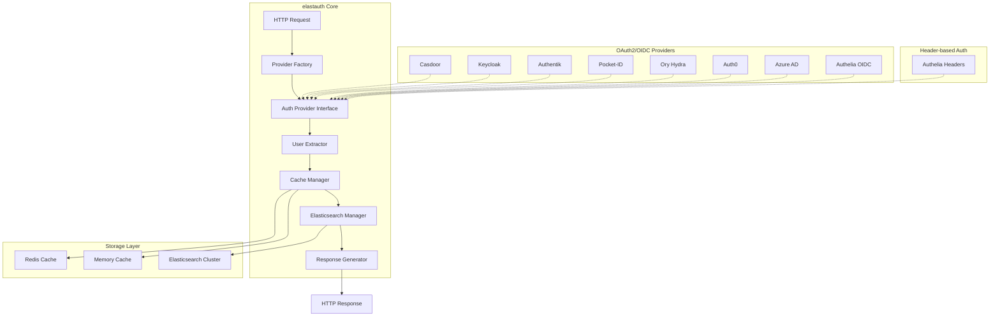
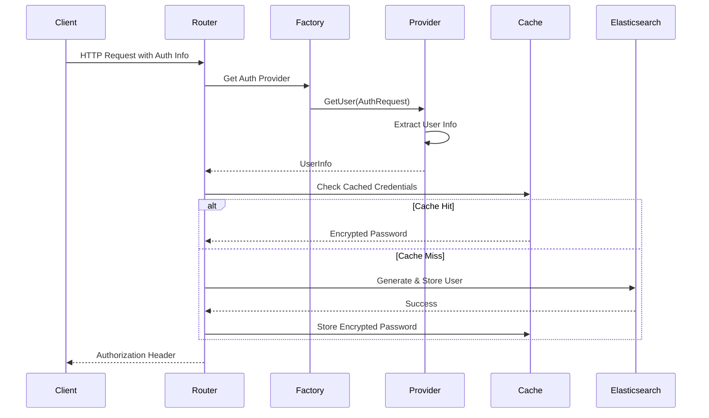
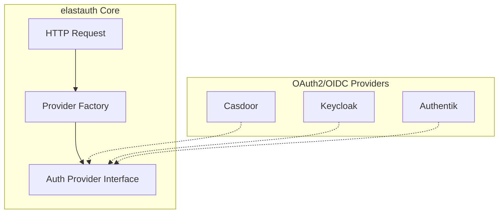

# Design Document: Pluggable Authentication Providers

## Overview

This design transforms elastauth from an Authelia-specific authentication proxy into a pluggable authentication system that can work with any authentication provider. The system maintains its core purpose as a stateless bridge between authentication systems and Elasticsearch/Kibana while adding support for two types of authentication providers:

1. **Authelia Provider**: Header-based authentication for backward compatibility with existing Authelia deployments
2. **OAuth2/OIDC Provider**: Generic OAuth2/OIDC support that works with any compliant provider including Casdoor, Keycloak, Authentik, Auth0, Azure AD, Pocket-ID, Ory Hydra, and others

This approach significantly simplifies the architecture while maximizing compatibility and extensibility.

### Benefits of the Generic OAuth2/OIDC Approach

**Simplicity**: Instead of implementing provider-specific logic for each authentication system, we implement one generic OAuth2/OIDC provider that works with all compliant systems.

**Extensibility**: Any new OAuth2/OIDC-compliant provider automatically works without code changes - only configuration is needed.

**Maintainability**: Less code to maintain, test, and debug. OAuth2/OIDC standards handle the complexity.

**Standards Compliance**: By following OAuth2 and OIDC standards, we ensure compatibility with the broader ecosystem.

**Future-Proof**: As new authentication providers emerge, they'll likely support OAuth2/OIDC, making them automatically compatible.

The architecture follows the principle of separation of concerns: authentication decisions are delegated to pluggable providers, while elastauth focuses on its core competency of managing Elasticsearch user accounts and credentials.

## Architecture

### High-Level Architecture



### Component Interaction Flow



## Components and Interfaces

### Core Interfaces

#### AuthProvider Interface

```go
// AuthProvider defines the interface that all authentication providers must implement
type AuthProvider interface {
    // GetUser extracts user information from the authentication request
    GetUser(ctx context.Context, req *AuthRequest) (*UserInfo, error)
    
    // Type returns the provider type identifier
    Type() string
    
    // Validate checks if the provider configuration is valid
    Validate() error
}

// AuthRequest wraps the HTTP request with helper methods for different auth mechanisms
type AuthRequest struct {
    *http.Request
}

// Helper methods for AuthRequest
func (r *AuthRequest) GetHeader(key string) string
func (r *AuthRequest) GetCookie(key string) (*http.Cookie, error)
func (r *AuthRequest) GetQueryParam(key string) string
func (r *AuthRequest) GetBearerToken() (string, error)

// UserInfo represents standardized user information from any provider
type UserInfo struct {
    Username string   `json:"username"`
    Email    string   `json:"email"`
    Groups   []string `json:"groups"`
    FullName string   `json:"full_name"`
}
```

#### Provider Factory

```go
// ProviderFactory manages provider registration and instantiation
type ProviderFactory struct {
    providers map[string]func(config interface{}) (AuthProvider, error)
}

func (f *ProviderFactory) Register(providerType string, constructor func(config interface{}) (AuthProvider, error))
func (f *ProviderFactory) Create(providerType string, config interface{}) (AuthProvider, error)
func (f *ProviderFactory) ListAvailable() []string
```

### Provider Implementations

#### Authelia Provider

```go
type AutheliaProvider struct {
    config AutheliaConfig
}

type AutheliaConfig struct {
    HeaderUsername string `mapstructure:"header_username"`
    HeaderGroups   string `mapstructure:"header_groups"`
    HeaderEmail    string `mapstructure:"header_email"`
    HeaderName     string `mapstructure:"header_name"`
}

func (p *AutheliaProvider) GetUser(ctx context.Context, req *AuthRequest) (*UserInfo, error) {
    username := req.GetHeader(p.config.HeaderUsername)
    if username == "" {
        return nil, fmt.Errorf("username header %s not found", p.config.HeaderUsername)
    }
    
    groups := parseGroups(req.GetHeader(p.config.HeaderGroups))
    email := req.GetHeader(p.config.HeaderEmail)
    fullName := req.GetHeader(p.config.HeaderName)
    
    return &UserInfo{
        Username: username,
        Email:    email,
        Groups:   groups,
        FullName: fullName,
    }, nil
}
```

#### Generic OAuth2/OIDC Provider

```go
type OIDCProvider struct {
    config   OIDCConfig
    verifier *oidc.IDTokenVerifier
    oauth2Config *oauth2.Config
    provider *oidc.Provider
}

type OIDCConfig struct {
    // Standard OAuth2/OIDC settings
    Issuer       string `mapstructure:"issuer"`
    ClientID     string `mapstructure:"client_id"`
    ClientSecret string `mapstructure:"client_secret"`
    
    // Optional manual endpoint configuration
    AuthorizationEndpoint string `mapstructure:"authorization_endpoint"`
    TokenEndpoint        string `mapstructure:"token_endpoint"`
    UserinfoEndpoint     string `mapstructure:"userinfo_endpoint"`
    JWKSURI             string `mapstructure:"jwks_uri"`
    
    // OAuth2 settings
    Scopes              []string          `mapstructure:"scopes"`
    ClientAuthMethod    string            `mapstructure:"client_auth_method"`
    TokenValidation     string            `mapstructure:"token_validation"`
    ClaimMappings       map[string]string `mapstructure:"claim_mappings"`
    CustomHeaders       map[string]string `mapstructure:"custom_headers"`
    
    // Security settings
    UsePKCE bool `mapstructure:"use_pkce"`
}

func (p *OIDCProvider) GetUser(ctx context.Context, req *AuthRequest) (*UserInfo, error) {
    // Support both Bearer token and cookie-based authentication
    var token string
    var err error
    
    // Try Bearer token first
    if token, err = req.GetBearerToken(); err != nil {
        // Try cookie-based session
        if cookie, err := req.GetCookie("access_token"); err == nil {
            token = cookie.Value
        } else {
            return nil, fmt.Errorf("no authentication token found")
        }
    }
    
    // Validate token based on configuration
    var claims map[string]interface{}
    switch p.config.TokenValidation {
    case "jwks":
        claims, err = p.validateWithJWKS(ctx, token)
    case "userinfo":
        claims, err = p.validateWithUserinfo(ctx, token)
    case "both":
        // Try JWKS first, fallback to userinfo
        if claims, err = p.validateWithJWKS(ctx, token); err != nil {
            claims, err = p.validateWithUserinfo(ctx, token)
        }
    default:
        return nil, fmt.Errorf("invalid token validation method: %s", p.config.TokenValidation)
    }
    
    if err != nil {
        return nil, fmt.Errorf("token validation failed: %w", err)
    }
    
    return p.mapClaimsToUserInfo(claims), nil
}

func (p *OIDCProvider) validateWithJWKS(ctx context.Context, token string) (map[string]interface{}, error) {
    idToken, err := p.verifier.Verify(ctx, token)
    if err != nil {
        return nil, err
    }
    
    var claims map[string]interface{}
    if err := idToken.Claims(&claims); err != nil {
        return nil, err
    }
    
    return claims, nil
}

func (p *OIDCProvider) validateWithUserinfo(ctx context.Context, token string) (map[string]interface{}, error) {
    // Use OAuth2 token to call userinfo endpoint
    tokenSource := oauth2.StaticTokenSource(&oauth2.Token{AccessToken: token})
    userInfo, err := p.provider.UserInfo(ctx, tokenSource)
    if err != nil {
        return nil, err
    }
    
    var claims map[string]interface{}
    if err := userInfo.Claims(&claims); err != nil {
        return nil, err
    }
    
    return claims, nil
}

func (p *OIDCProvider) mapClaimsToUserInfo(claims map[string]interface{}) *UserInfo {
    userInfo := &UserInfo{}
    
    // Map claims based on configuration
    if username, ok := getClaimValue(claims, p.config.ClaimMappings["username"]); ok {
        userInfo.Username = username
    }
    if email, ok := getClaimValue(claims, p.config.ClaimMappings["email"]); ok {
        userInfo.Email = email
    }
    if fullName, ok := getClaimValue(claims, p.config.ClaimMappings["full_name"]); ok {
        userInfo.FullName = fullName
    }
    if groups, ok := getClaimSlice(claims, p.config.ClaimMappings["groups"]); ok {
        userInfo.Groups = groups
    }
    
    return userInfo
}

// Helper function to extract claim values with support for nested claims
func getClaimValue(claims map[string]interface{}, claimPath string) (string, bool) {
    // Support nested claims like "realm_access.roles"
    parts := strings.Split(claimPath, ".")
    current := claims
    
    for i, part := range parts {
        if i == len(parts)-1 {
            // Last part - extract the value
            if val, ok := current[part]; ok {
                if str, ok := val.(string); ok {
                    return str, true
                }
            }
        } else {
            // Intermediate part - navigate deeper
            if next, ok := current[part].(map[string]interface{}); ok {
                current = next
            } else {
                return "", false
            }
        }
    }
    
    return "", false
}

func getClaimSlice(claims map[string]interface{}, claimPath string) ([]string, bool) {
    // Similar to getClaimValue but returns string slice for groups/roles
    parts := strings.Split(claimPath, ".")
    current := claims
    
    for i, part := range parts {
        if i == len(parts)-1 {
            if val, ok := current[part]; ok {
                // Handle different group formats
                switch v := val.(type) {
                case []string:
                    return v, true
                case []interface{}:
                    var groups []string
                    for _, item := range v {
                        if str, ok := item.(string); ok {
                            groups = append(groups, str)
                        }
                    }
                    return groups, true
                case string:
                    // Single group as string
                    return []string{v}, true
                }
            }
        } else {
            if next, ok := current[part].(map[string]interface{}); ok {
                current = next
            } else {
                return nil, false
            }
        }
    }
    
    return nil, false
}
```

### Configuration Management

#### Enhanced Configuration Structure

```yaml
# Provider selection (exactly one must be specified)
auth_provider: "authelia"  # or "oidc"

# Provider-specific configurations
authelia:
  header_username: "Remote-User"
  header_groups: "Remote-Groups"
  header_email: "Remote-Email"
  header_name: "Remote-Name"

# Generic OAuth2/OIDC configuration - works with any OAuth2/OIDC provider
oidc:
  # Standard OAuth2/OIDC settings
  issuer: "https://auth.example.com"  # For Keycloak, Casdoor, etc.
  client_id: "elastauth"
  client_secret: "${OIDC_CLIENT_SECRET}"
  
  # Optional: Manual endpoint configuration (if discovery not supported)
  authorization_endpoint: "https://auth.example.com/auth"
  token_endpoint: "https://auth.example.com/token"
  userinfo_endpoint: "https://auth.example.com/userinfo"
  jwks_uri: "https://auth.example.com/.well-known/jwks.json"
  
  # Scopes to request
  scopes: ["openid", "profile", "email", "groups"]
  
  # Claim mappings (customize for your provider)
  claim_mappings:
    username: "preferred_username"  # or "sub", "email", etc.
    email: "email"
    groups: "groups"  # or "roles", "authorities", etc.
    full_name: "name"  # or "display_name", etc.
  
  # Token validation method
  token_validation: "jwks"  # or "userinfo", or "both"
  
  # Client authentication method
  client_auth_method: "client_secret_basic"  # or "client_secret_post"
  
  # Optional: Custom headers for provider-specific requirements
  custom_headers:
    "X-Custom-Header": "value"

# Examples for specific providers:
# 
# Casdoor:
# oidc:
#   issuer: "https://casdoor.example.com"
#   client_id: "elastauth-app"
#   client_secret: "${CASDOOR_SECRET}"
#   scopes: ["openid", "profile", "email"]
#   claim_mappings:
#     username: "name"
#     email: "email"
#     groups: "roles"
#     full_name: "displayName"
#
# Keycloak:
# oidc:
#   issuer: "https://keycloak.example.com/realms/myrealm"
#   client_id: "elastauth"
#   client_secret: "${KEYCLOAK_SECRET}"
#   scopes: ["openid", "profile", "email", "roles"]
#   claim_mappings:
#     username: "preferred_username"
#     email: "email"
#     groups: "realm_access.roles"
#     full_name: "name"
#
# Authentik:
# oidc:
#   issuer: "https://authentik.example.com/application/o/elastauth/"
#   client_id: "elastauth"
#   client_secret: "${AUTHENTIK_SECRET}"
#   scopes: ["openid", "profile", "email", "groups"]
#   claim_mappings:
#     username: "preferred_username"
#     email: "email"
#     groups: "groups"
#     full_name: "name"

# Cache configuration (zero or one type)
cache_type: "redis"  # or "memory", or omit for no caching

redis:
  host: "localhost:6379"
  db: 0

# Elasticsearch configuration (supports multiple endpoints)
elasticsearch:
  hosts:
    - "https://es1.example.com:9200"
    - "https://es2.example.com:9200"
    - "https://es3.example.com:9200"
  username: "elastauth"
  password: "${ELASTICSEARCH_PASSWORD}"
  dry_run: false

# Existing configuration remains
default_roles:
  - kibana_user
group_mappings:
  admin_group:
    - kibana_admin
```

### Enhanced Cache Management with Cachego

#### Cachego Integration

```go
import (
    "github.com/wasilak/cachego"
    "github.com/wasilak/cachego/config"
)

type CacheManager struct {
    cache cachego.CacheInterface
    config config.Config
}

func NewCacheManager(cacheType string, cacheConfig map[string]interface{}) (*CacheManager, error) {
    config := config.Config{
        Type: cacheType,
        // Map configuration from Viper to cachego config
    }
    
    cache, err := cachego.CacheInit(context.Background(), config)
    if err != nil {
        return nil, err
    }
    
    return &CacheManager{
        cache: cache,
        config: config,
    }, nil
}

func (cm *CacheManager) Get(key string) ([]byte, bool, error) {
    return cm.cache.Get(key)
}

func (cm *CacheManager) Set(key string, value []byte) error {
    return cm.cache.Set(key, value)
}

func (cm *CacheManager) GetItemTTL(key string) (time.Duration, bool, error) {
    return cm.cache.GetItemTTL(key)
}

func (cm *CacheManager) ExtendTTL(key string, value []byte) error {
    return cm.cache.ExtendTTL(key, value)
}
```

#### Cache Provider Configuration

```yaml
# Cache configuration using cachego
cache:
  type: "redis"  # or "memory", "file", or omit for no caching
  expiration: "1h"
  
  # Redis-specific configuration
  redis_host: "localhost:6379"
  redis_db: 0
  
  # File-specific configuration  
  path: "/tmp/elastauth-cache"

# Legacy configuration support (deprecated but maintained for backward compatibility)
cache_type: "redis"  # Maps to cache.type
redis_host: "localhost:6379"  # Maps to cache.redis_host
redis_db: 0  # Maps to cache.redis_db
cache_expire: "1h"  # Maps to cache.expiration
```

## Data Models

### Enhanced Configuration Models

```go
// AppConfig represents the complete application configuration
type AppConfig struct {
    AuthProvider string `mapstructure:"auth_provider"`
    
    // Provider configurations
    Authelia AutheliaConfig `mapstructure:"authelia"`
    OIDC     OIDCConfig     `mapstructure:"oidc"`
    
    // Cachego configuration
    Cache CacheConfig `mapstructure:"cache"`
    
    // Legacy cache configuration (for backward compatibility)
    CacheType   string `mapstructure:"cache_type"`
    RedisHost   string `mapstructure:"redis_host"`
    RedisDB     int    `mapstructure:"redis_db"`
    CacheExpire string `mapstructure:"cache_expire"`
    
    // Elasticsearch configuration
    Elasticsearch ElasticsearchConfig `mapstructure:"elasticsearch"`
    
    // Existing fields
    DefaultRoles  []string            `mapstructure:"default_roles"`
    GroupMappings map[string][]string `mapstructure:"group_mappings"`
    SecretKey     string              `mapstructure:"secret_key"`
}

type CacheConfig struct {
    Type       string `mapstructure:"type"`        // "memory", "redis", "file", or empty for no cache
    Expiration string `mapstructure:"expiration"`  // TTL duration
    RedisHost  string `mapstructure:"redis_host"`  // Redis host:port
    RedisDB    int    `mapstructure:"redis_db"`    // Redis database number
    Path       string `mapstructure:"path"`        // File cache path
}

type ElasticsearchConfig struct {
    Hosts    []string `mapstructure:"hosts"`
    Username string   `mapstructure:"username"`
    Password string   `mapstructure:"password"`
    DryRun   bool     `mapstructure:"dry_run"`
}
```

### API Response Models

```go
// Enhanced config response for the /config endpoint
type ConfigResponse struct {
    AuthProvider    string                 `json:"auth_provider"`
    Cache           CacheStatus            `json:"cache"`
    DefaultRoles    []string               `json:"default_roles"`
    GroupMappings   map[string][]string    `json:"group_mappings"`
    Elasticsearch   ElasticsearchStatus    `json:"elasticsearch"`
    ProviderConfig  map[string]interface{} `json:"provider_config"`
}

type CacheStatus struct {
    Type       string `json:"type"`        // "memory", "redis", "file", or "disabled"
    Expiration string `json:"expiration"`  // TTL duration
    RedisHost  string `json:"redis_host,omitempty"`  // Only for redis type
    RedisDB    int    `json:"redis_db,omitempty"`    // Only for redis type
    Path       string `json:"path,omitempty"`        // Only for file type
}

type ElasticsearchStatus struct {
    Endpoints []string `json:"endpoints"`
    Username  string   `json:"username"`
    Password  string   `json:"password"` // Always masked as "***"
    DryRun    bool     `json:"dry_run"`
}

// Standard error response
type ErrorResponse struct {
    Error   string `json:"error"`
    Code    int    `json:"code"`
    Details string `json:"details,omitempty"`
}

// Success response for main auth endpoint
type AuthResponse struct {
    Status string `json:"status"`
    User   string `json:"user"`
}
```
## Correctness Properties

*A property is a characteristic or behavior that should hold true across all valid executions of a system-essentially, a formal statement about what the system should do. Properties serve as the bridge between human-readable specifications and machine-verifiable correctness guarantees.*

### Property 1: Provider Interface Compliance
*For any* authentication provider implementation, calling GetUser with a valid AuthRequest should return a UserInfo object with username, email, groups, and full_name fields, and calling Type should return a consistent string identifier.
**Validates: Requirements 1.1, 1.2, 1.4**

### Property 2: Standardized User Information
*For any* authentication provider and valid authentication request, the returned UserInfo should have the same structure and field types regardless of which provider processed the request.
**Validates: Requirements 1.3**

### Property 3: Authelia Header Extraction
*For any* HTTP request with Authelia headers (Remote-User, Remote-Groups, Remote-Email, Remote-Name), the Authelia provider should correctly extract all provided values into the corresponding UserInfo fields.
**Validates: Requirements 2.1, 2.2, 2.3, 2.4**

### Property 4: Provider Error Handling
*For any* authentication provider and invalid or incomplete authentication request, the provider should return an appropriate error rather than invalid UserInfo.
**Validates: Requirements 2.5, 3.5, 4.4**

### Property 5: Single Provider Configuration
*For any* valid configuration, exactly one authentication provider should be instantiated and active, and attempts to configure zero or multiple providers should result in configuration errors.
**Validates: Requirements 5.1, 5.5, 6.1**

### Property 6: Configuration Precedence
*For any* configuration setting that can be specified via environment variables, config files, and defaults, the environment variable value should take precedence over config file values, which should take precedence over defaults.
**Validates: Requirements 5.7, 13.6**

### Property 7: Cache Configuration Validation
*For any* cache configuration, exactly zero or one cache type should be configured, and attempts to configure multiple cache types should result in configuration errors.
**Validates: Requirements 9.3, 9.4**

### Property 8: Stateless Authentication
*For any* sequence of authentication requests, the authentication decision should depend only on the current request and provider, not on any previously stored authentication state.
**Validates: Requirements 9.1, 9.2**

### Property 9: Cache Behavior Consistency
*For any* authentication provider, when caching is enabled, successful authentication should result in encrypted credentials being cached, and when caching is disabled, each request should generate new credentials.
**Validates: Requirements 9.5, 9.6**

### Property 10: Elasticsearch Failover
*For any* list of Elasticsearch endpoints where the first endpoint fails, the system should attempt subsequent endpoints in order until one succeeds or all fail.
**Validates: Requirements 10.3, 10.7**

### Property 11: JSON Response Consistency
*For any* API endpoint and request (successful or failed), the response should be valid JSON with consistent structure, never just HTTP status codes without response body.
**Validates: Requirements 11.4, 11.5**

### Property 12: Configuration Masking
*For any* sensitive configuration value (passwords, secrets, tokens) returned by the config endpoint, the value should be masked while non-sensitive values should be returned unmasked.
**Validates: Requirements 12.4, 12.6**

### Property 13: Input Validation and Sanitization
*For any* user input received from authentication providers, the system should validate the input format and sanitize it before processing or logging.
**Validates: Requirements 16.1, 16.2, 16.3**

### Property 14: Credential Encryption
*For any* temporary password stored in cache, the password should be encrypted using the configured encryption key before storage.
**Validates: Requirements 16.5**

### Property 15: Documentation Migration Completeness
*For any* existing documentation file in the current docs/ folder, the migrated Starlight documentation should contain equivalent content with proper navigation and cross-references.
**Validates: Requirements 17.1, 17.5, 17.13**

### Property 16: Starlight Feature Integration
*For any* Starlight documentation build, the generated site should include search functionality, theme switching (light/dark/system), responsive design, and Mermaid diagram support.
**Validates: Requirements 17.3, 17.4, 17.11**

## Error Handling

### Error Categories

The system defines several categories of errors with specific handling approaches:

1. **Configuration Errors**: Invalid or missing configuration that prevents startup
   - HTTP 500 Internal Server Error during startup
   - Detailed error messages in logs
   - System exits with non-zero code

2. **Authentication Errors**: Provider-specific authentication failures
   - HTTP 401 Unauthorized
   - JSON error response with provider context
   - Sanitized error logging

3. **Validation Errors**: Invalid user input or data format issues
   - HTTP 400 Bad Request
   - JSON error response with validation details
   - Input sanitization before logging

4. **Infrastructure Errors**: Elasticsearch or cache connectivity issues
   - HTTP 503 Service Unavailable
   - JSON error response with retry guidance
   - Automatic failover where possible

### Error Response Format

All error responses follow a consistent JSON structure:

```json
{
  "error": "Human-readable error message",
  "code": 400,
  "details": "Additional context or troubleshooting information",
  "provider": "authelia",
  "timestamp": "2024-01-15T10:30:00Z"
}
```

### Logging Strategy

- **Structured Logging**: All logs use structured format (JSON) for machine parsing
- **Context Preservation**: Include request ID, provider type, and user context
- **Sensitive Data Masking**: Automatically mask passwords, tokens, and secrets
- **Error Correlation**: Link related log entries through correlation IDs
- **Performance Metrics**: Log timing information for provider calls and Elasticsearch operations

## Testing Strategy

### Dual Testing Approach

The system requires both unit testing and property-based testing for comprehensive coverage:

**Unit Tests**:
- Verify specific examples and edge cases
- Test integration points between components
- Validate error conditions and boundary cases
- Test configuration parsing and validation
- Verify API endpoint responses

**Property-Based Tests**:
- Verify universal properties across all inputs
- Test provider interface compliance across implementations
- Validate configuration precedence rules
- Test failover behavior with random endpoint failures
- Verify encryption/decryption round-trip properties

### Property-Based Testing Configuration

- **Minimum 100 iterations** per property test due to randomization
- **Test Framework**: Use Go's testing package with a property-based testing library like `gopter`
- **Tag Format**: Each property test must reference its design document property:
  ```go
  // Feature: pluggable-auth-providers, Property 1: Provider Interface Compliance
  func TestProviderInterfaceCompliance(t *testing.T) { ... }
  ```

### Test Data Generation

**Smart Generators**:
- **AuthRequest Generator**: Creates HTTP requests with various header combinations, tokens, and cookies
- **Configuration Generator**: Generates valid and invalid configuration combinations
- **UserInfo Generator**: Creates user information with various field combinations
- **Provider Response Generator**: Simulates different provider response scenarios

**Edge Case Coverage**:
- Empty and nil values
- Extremely long strings
- Special characters and encoding issues
- Malformed JSON and invalid data formats
- Network timeouts and connection failures

### Integration Testing

**Provider Integration**:
- Test each provider with real authentication scenarios
- Verify provider-specific error handling
- Test configuration validation for each provider type

**Elasticsearch Integration**:
- Test multi-endpoint failover scenarios
- Verify user creation and update operations
- Test connection failure and recovery

**Cache Integration**:
- Test both Redis and memory cache implementations
- Verify cache encryption and decryption
- Test cache expiration and extension behavior

### Performance Testing

**Load Testing**:
- Test concurrent authentication requests
- Verify cache performance under load
- Test Elasticsearch failover performance

**Memory Testing**:
- Verify no memory leaks in long-running scenarios
- Test cache memory usage patterns
- Validate garbage collection behavior

### Security Testing

**Input Validation**:
- Test injection attacks through provider inputs
- Verify sanitization of log outputs
- Test configuration validation security

**Encryption Testing**:
- Verify cache encryption strength
- Test key rotation scenarios
- Validate secure credential handling

## Documentation Migration to Starlight

### Migration Strategy

The existing documentation in the `docs/` folder will be migrated to use the Starlight documentation framework, providing a modern, searchable, and well-organized documentation experience. This migration enhances the user experience while maintaining all existing content and improving discoverability.

### Starlight Framework Benefits

**Modern Documentation Experience**:
- Full-text search functionality built-in
- Dark mode and mobile-responsive design
- SEO optimization with proper meta tags
- Fast static site generation with Astro

**Enhanced Navigation**:
- Sidebar navigation with proper categorization
- Auto-generation of navigation from directory structure
- Table of contents for each page
- Breadcrumb navigation

**Developer-Friendly Features**:
- Built-in code highlighting with syntax support
- Edit links for community contributions
- Internationalization (i18n) support for future expansion
- Cross-references and internal linking

### Migration Architecture

```mermaid
graph TB
    subgraph "Current Documentation"
        CD[docs/]
        CC[docs/concepts.md]
        CP[docs/providers/]
        CCH[docs/cache/]
        CT[docs/troubleshooting.md]
        CO[docs/openapi.yaml]
    end
    
    subgraph "Starlight Documentation"
        SD[docs/ (Starlight)]
        SC[src/content/docs/]
        SP[src/content/docs/providers/]
        SCH[src/content/docs/cache/]
        ST[src/content/docs/troubleshooting/]
        SA[astro.config.mjs]
        SN[package.json]
    end
    
    subgraph "GitHub Pages Deployment"
        GW[GitHub Workflow]
        GB[Build Process]
        GD[GitHub Pages]
    end
    
    CD --> SD
    CC --> SC
    CP --> SP
    CCH --> SCH
    CT --> ST
    CO --> SC
    
    SD --> GW
    GW --> GB
    GB --> GD
```

### Content Migration Plan

#### Directory Structure Mapping

```
Current docs/                    →  Starlight docs/src/content/docs/
├── concepts.md                  →  ├── index.md (getting started)
├── openapi.yaml                 →  ├── api/
├── providers/                   →  ├── providers/
│   ├── README.md               →  │   ├── index.md
│   ├── authelia.md             →  │   ├── authelia.md
│   └── oidc.md                 →  │   └── oidc.md
├── cache/                       →  ├── cache/
│   ├── README.md               →  │   ├── index.md
│   └── redis.md                →  │   └── redis.md
├── troubleshooting.md          →  ├── troubleshooting.md
├── upgrading.md                →  ├── upgrading.md
└── examples/                    →  └── examples/
    └── README.md               →      └── index.md
```

#### Starlight Configuration

```javascript
// astro.config.mjs
import { defineConfig } from 'astro/config';
import starlight from '@astrojs/starlight';
import rehypeMermaid from 'rehype-mermaid';

export default defineConfig({
  site: 'https://wasilak.github.io/elastauth',
  base: '/elastauth',
  markdown: {
    syntaxHighlight: {
      type: 'shiki',
      excludeLangs: ['mermaid'],
    },
    rehypePlugins: [rehypeMermaid],
  },
  integrations: [
    starlight({
      title: 'elastauth Documentation',
      description: 'Kibana Authentication Proxy with Pluggable Providers',
      logo: {
        src: './src/assets/logo.svg',
        replacesTitle: false,
      },
      social: [
        {
          icon: 'github',
          label: 'GitHub',
          href: 'https://github.com/wasilak/elastauth',
        },
      ],
      editLink: {
        baseUrl: 'https://github.com/wasilak/elastauth/edit/main/docs/',
      },
      lastUpdated: true,
      sidebar: [
        {
          label: 'Getting Started',
          items: [
            { label: 'Introduction', slug: 'index' },
            { label: 'Installation', slug: 'installation' },
            { label: 'Configuration', slug: 'configuration' },
          ],
        },
        {
          label: 'Authentication Providers',
          autogenerate: { directory: 'providers' },
        },
        {
          label: 'Cache Providers',
          autogenerate: { directory: 'cache' },
        },
        {
          label: 'API Reference',
          items: [
            { label: 'OpenAPI Specification', slug: 'api/openapi' },
            { label: 'Endpoints', slug: 'api/endpoints' },
          ],
        },
        {
          label: 'Operations',
          items: [
            { label: 'Troubleshooting', slug: 'troubleshooting' },
            { label: 'Upgrading', slug: 'upgrading' },
            { label: 'Examples', slug: 'examples' },
          ],
        },
      ],
      // No custom CSS - using default Starlight styling
      // Built-in light/dark/system theme support
      // Built-in Pagefind search
      // No internationalization configuration (English only)
    }),
  ],
});
```

### GitHub Pages Deployment

#### Workflow Configuration

The deployment will use the provided GitHub Actions workflow with Node.js 24 and Task runner:

```yaml
name: Deploy Documentation
on:
  push:
    branches: [main]
    paths:
      - "docs/**"
  pull_request:
    branches: [main]
    paths:
      - "docs/**"
  workflow_dispatch:

permissions:
  contents: read
  pages: write
  id-token: write

concurrency:
  group: "pages"
  cancel-in-progress: false

jobs:
  build:
    runs-on: gha-runner-scale-set-metricspack
    steps:
      - name: Checkout
        uses: actions/checkout@v5
        with:
          fetch-depth: 0
      
      - name: Setup Node.js
        uses: actions/setup-node@v6
        with:
          node-version: "24"
          cache: "npm"
          cache-dependency-path: docs/package-lock.json
      
      - name: Install Task
        uses: go-task/setup-task@v1
      
      - name: Install dependencies and build documentation
        run: |
          task docs:install
          task docs:build
      
      - name: Setup Pages
        uses: actions/configure-pages@v5
      
      - name: Upload build artifacts
        uses: actions/upload-pages-artifact@v4
        with:
          path: docs/build

  deploy:
    if: github.ref == 'refs/heads/main' && github.event_name == 'push'
    needs: build
    runs-on: gha-runner-scale-set-metricspack
    permissions:
      pages: write
      id-token: write
    environment:
      name: github-pages
      url: ${{ steps.deployment.outputs.page_url }}
    steps:
      - name: Deploy to GitHub Pages
        id: deployment
        uses: actions/deploy-pages@v4
```

#### Task Configuration

The Taskfile will include documentation-specific tasks:

```yaml
# Taskfile.yml (documentation section)
docs:install:
  desc: Install documentation dependencies
  dir: docs
  cmds:
    - npm install

docs:dev:
  desc: Start documentation development server
  dir: docs
  cmds:
    - npm run dev

docs:build:
  desc: Build documentation for production
  dir: docs
  cmds:
    - npm run build

docs:preview:
  desc: Preview built documentation
  dir: docs
  cmds:
    - npm run preview
```

### Content Enhancement Features

#### Search Integration

Starlight provides built-in full-text search using Pagefind, automatically indexing all content without additional configuration. The search is fast, client-side, and works offline.

#### Mermaid Diagram Support

Enhanced diagram support using rehype-mermaid plugin for architecture and flow diagrams:



#### Configuration Examples

YAML configuration examples for different providers and deployment scenarios:

```yaml
# Example: OAuth2/OIDC Configuration
auth_provider: "oidc"
oidc:
  issuer: "https://keycloak.example.com/realms/myrealm"
  client_id: "elastauth"
  client_secret: "${KEYCLOAK_SECRET}"
  scopes: ["openid", "profile", "email", "roles"]
  claim_mappings:
    username: "preferred_username"
    email: "email"
    groups: "realm_access.roles"
    full_name: "name"
```

#### Theme Support

Built-in light/dark/system theme modes without custom styling:
- **Light Mode**: Default Starlight light theme
- **Dark Mode**: Default Starlight dark theme  
- **System Mode**: Automatically follows system preference

### Migration Benefits

**User Experience**:
- Faster page loading with static site generation
- Better mobile experience with responsive design (built-in)
- Improved search functionality across all documentation (Pagefind)
- Theme switching support (light/dark/system)

**Maintainability**:
- Markdown-based content that's easy to edit
- Automatic navigation generation from file structure
- Built-in validation for internal links
- Community contribution support with edit links
- No custom CSS to maintain

**SEO and Discoverability**:
- Proper meta tags and structured data (built-in)
- Sitemap generation (automatic)
- Search engine optimization (built-in)
- Fast loading times with static generation