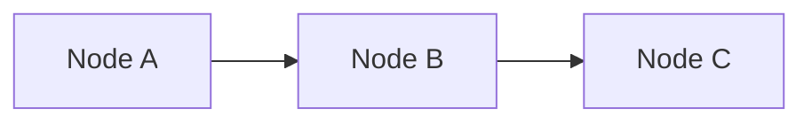
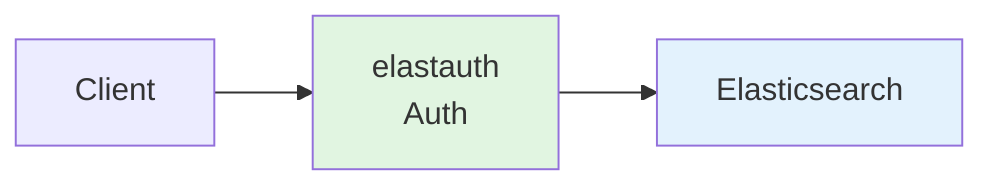
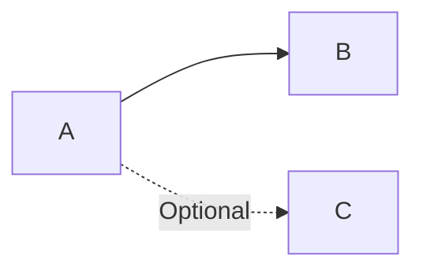
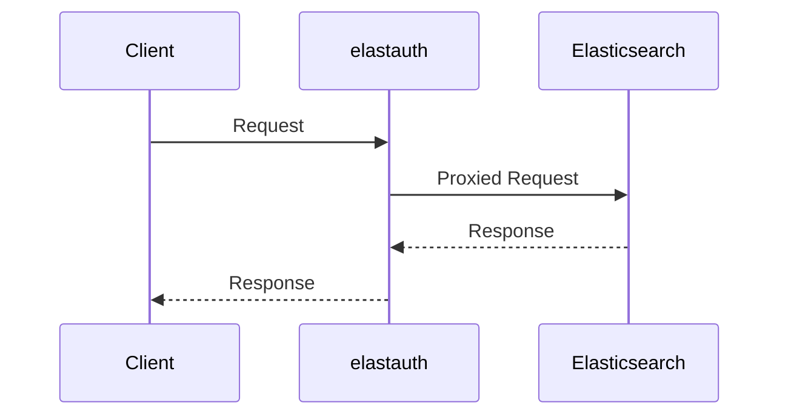
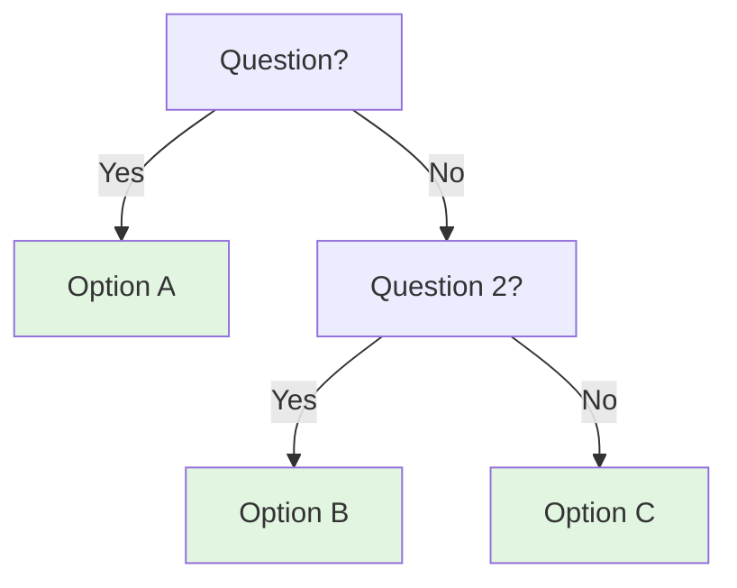
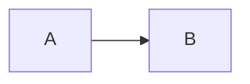
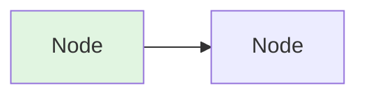

# Starlight Documentation Best Practices

## Overview

The elastauth documentation is built with [Starlight](https://starlight.astro.build/), an Astro-based documentation framework. This guide ensures all documentation follows Starlight conventions and uses its features effectively.

## File Format Requirements

### Use .mdx for Components

**CRITICAL**: Files that use Starlight components MUST use `.mdx` extension, not `.md`.

```
✅ docs/src/content/docs/deployment/auth-only-mode.mdx
❌ docs/src/content/docs/deployment/auth-only-mode.md (if using components)
```

### Use .md for Simple Markdown

Files with only standard Markdown (no components) can use `.md`:

```
✅ docs/src/content/docs/guides/simple-guide.md
```

## Frontmatter Structure

Every documentation file MUST have frontmatter with title and description:

```yaml
---
title: Page Title
description: Brief description for SEO and navigation
---
```

**IMPORTANT**: Do NOT repeat the title in the content. Starlight automatically renders the title from frontmatter.

```mdx
---
title: Authentication-Only Mode
description: Deploy elastauth with Traefik
---

❌ # Authentication-Only Mode  (Don't do this - duplicate title)

✅ Authentication-only mode is...  (Start with content directly)
```

## Starlight Components

### Available Components

Import components at the top of `.mdx` files:

```mdx
import { Tabs, TabItem } from '@astrojs/starlight/components';
import { Steps } from '@astrojs/starlight/components';
import { Card, CardGrid } from '@astrojs/starlight/components';
import { Badge } from '@astrojs/starlight/components';
import { LinkCard } from '@astrojs/starlight/components';
```

### Tabs Component

Use for multi-option content (different configurations, providers, methods):

```mdx
<Tabs syncKey="config-format">
  <TabItem label="YAML">
    ```yaml
    config: value
    ```
  </TabItem>
  <TabItem label="Environment Variables">
    ```bash
    VARIABLE=value
    ```
  </TabItem>
</Tabs>
```

**syncKey**: Keeps tabs synchronized across the page when users switch.

### Steps Component

Use for sequential instructions:

```mdx
<Steps>

1. First step with description
   ```bash
   command here
   ```

2. Second step with description

3. Third step

</Steps>
```

**Note**: Steps must be numbered lists (1, 2, 3) inside `<Steps>` tags.

### Card and CardGrid

Use for feature highlights, comparisons, or grouped information:

```mdx
<CardGrid>
  <Card title="Feature Name" icon="rocket">
    Description of the feature
  </Card>
  <Card title="Another Feature" icon="setting">
    Another description
  </Card>
</CardGrid>
```

**Available icons**: rocket, setting, puzzle, list-format, document, warning, approve-check, open-book, pencil, etc.

### Badge Component

Use for status indicators:

```mdx
<Badge text="Default Mode" variant="tip" />
<Badge text="Deprecated" variant="caution" />
<Badge text="Experimental" variant="note" />
<Badge text="Breaking" variant="danger" />
```

**Variants**: note, tip, caution, danger, success

### LinkCard Component

Use for navigation to related pages:

```mdx
<CardGrid>
  <LinkCard
    title="Related Guide"
    description="Learn more about this topic"
    href="/elastauth/guides/related/"
  />
  <LinkCard
    title="API Reference"
    description="Complete API documentation"
    href="/elastauth/api/"
  />
</CardGrid>
```

## Asides (Callouts)

Use `:::` syntax for callouts:

```mdx
:::note
General information or notes
:::

:::tip[Custom Title]
Helpful tips and best practices
:::

:::caution
Warnings about potential issues
:::

:::danger[Critical Warning]
Dangerous operations or security concerns
:::
```

**When to use**:
- `:::note` - General information, FYI
- `:::tip` - Best practices, recommendations
- `:::caution` - Warnings, things to be careful about
- `:::danger` - Critical warnings, security issues, data loss risks

## Mermaid Diagrams

### Always Use Mermaid, Never ASCII

**NEVER** use ASCII box-drawing diagrams:

```
❌ Don't do this:
┌─────────┐    ┌─────────┐
│ Client  │───►│ Server  │
└─────────┘    └─────────┘
```

**ALWAYS** use Mermaid diagrams:

```
✅ Do this:

```

### Mermaid Graph Syntax

**Basic flow**:



**With styling**:



**Common colors**:
- `#e1f5e1` - Light green (for elastauth/main components)
- `#e3f2fd` - Light blue (for external services)
- `#fff3e0` - Light orange (for auth providers)
- `#ffebee` - Light red (for warnings/errors)

**Dotted lines** (for optional/indirect connections):



### Mermaid Sequence Diagrams

For request/response flows:



### Mermaid Decision Trees

For decision flows:



## Code Blocks

### Basic Code Blocks

Use triple backticks with language identifier:

````markdown
```yaml
config: value
```

```bash
command --flag value
```

```go
func main() {
    // code
}
```
````

### Code Block Titles

Add titles to code blocks for context:

````markdown
```yaml title="config.yml"
proxy:
  enabled: true
```
````

## Documentation Structure

### Recommended Section Order

1. **Frontmatter** (title, description)
2. **Imports** (Starlight components)
3. **Badges** (status indicators)
4. **Introduction** (brief overview)
5. **Overview** section
6. **Architecture** (with Mermaid diagram)
7. **When to Use** (with Cards)
8. **Configuration** (with Tabs)
9. **Main Content** (with Steps where appropriate)
10. **Testing** (with Tabs for different methods)
11. **Troubleshooting** (with Asides for warnings)
12. **Performance/Security** sections
13. **Next Steps** (with LinkCards)

### Example Structure

```mdx
---
title: Feature Name
description: Brief description
---

import { Tabs, TabItem } from '@astrojs/starlight/components';
import { Steps } from '@astrojs/starlight/components';
import { Card, CardGrid } from '@astrojs/starlight/components';

<Badge text="Status" variant="tip" />

Brief introduction paragraph.

## Overview

Description of the feature.

### Architecture



## When to Use

<CardGrid>
  <Card title="Use Case 1" icon="rocket">
    Description
  </Card>
</CardGrid>

## Configuration

<Tabs syncKey="format">
  <TabItem label="YAML">
    ```yaml
    config: value
    ```
  </TabItem>
</Tabs>

## Setup

<Steps>

1. First step
2. Second step

</Steps>

## Troubleshooting

:::caution
Warning message
:::

## Next Steps

<CardGrid>
  <LinkCard
    title="Related"
    description="Description"
    href="/path/"
  />
</CardGrid>
```

## Common Patterns

### Configuration Examples

Always provide both YAML and environment variable options:

```mdx
<Tabs syncKey="config-format">
  <TabItem label="YAML">
    ```yaml
    setting: value
    ```
  </TabItem>
  <TabItem label="Environment Variables">
    ```bash
    VARIABLE=value
    ```
  </TabItem>
</Tabs>
```

### Testing Examples

Provide multiple testing methods:

```mdx
<Tabs syncKey="test-method">
  <TabItem label="Method 1">
    ```bash
    test command
    ```
  </TabItem>
  <TabItem label="Method 2">
    ```bash
    alternative test
    ```
  </TabItem>
</Tabs>
```

### Troubleshooting Sections

Use Steps for solutions:

```mdx
### Issue: Problem Description

:::danger[Error Message]
Description of the problem
:::

**Solutions:**

<Steps>

1. Check configuration:
   ```yaml
   setting: value
   ```

2. Verify connectivity:
   ```bash
   test command
   ```

3. Review logs:
   ```bash
   log command
   ```

</Steps>
```

### Feature Highlights

Use CardGrid for features:

```mdx
<CardGrid>
  <Card title="✅ Feature 1" icon="rocket">
    Description
  </Card>
  <Card title="✅ Feature 2" icon="setting">
    Description
  </Card>
</CardGrid>
```

## Best Practices

### Do's

✅ Use `.mdx` extension for files with components
✅ Import components at the top of the file
✅ Use Mermaid for all diagrams
✅ Use Tabs for multi-option content
✅ Use Steps for sequential instructions
✅ Use Cards for feature highlights
✅ Use Asides for warnings and tips
✅ Use LinkCards for navigation
✅ Add `syncKey` to related Tabs
✅ Style Mermaid diagrams with colors
✅ Provide both YAML and env var examples

### Don'ts

❌ Don't repeat the title in content (Starlight renders it)
❌ Don't use ASCII box-drawing diagrams
❌ Don't use `.md` extension for files with components
❌ Don't forget to import components
❌ Don't use plain text for flows (use Mermaid)
❌ Don't create walls of text (use Cards/Steps)
❌ Don't forget aside syntax (`:::`)
❌ Don't use generic titles ("Configuration" - be specific)

## Testing Documentation

Before committing documentation:

1. **Check file extension**: `.mdx` if using components
2. **Verify imports**: All used components are imported
3. **Test Mermaid**: Diagrams render correctly
4. **Check asides**: Proper `:::` syntax
5. **Verify tabs**: `syncKey` for related tabs
6. **Review structure**: Follows recommended order
7. **Check links**: All internal links work

## Quick Reference

### Component Imports

```mdx
import { Tabs, TabItem } from '@astrojs/starlight/components';
import { Steps } from '@astrojs/starlight/components';
import { Card, CardGrid } from '@astrojs/starlight/components';
import { Badge } from '@astrojs/starlight/components';
import { LinkCard } from '@astrojs/starlight/components';
```

### Aside Syntax

```mdx
:::note
Content
:::

:::tip[Title]
Content
:::

:::caution
Content
:::

:::danger[Title]
Content
:::
```

### Mermaid Basic



## Resources

- [Starlight Documentation](https://starlight.astro.build/)
- [Starlight Components](https://starlight.astro.build/components/)
- [Mermaid Documentation](https://mermaid.js.org/)
- [Mermaid Live Editor](https://mermaid.live/)

## Remember

When creating or updating elastauth documentation:

1. **Always use Starlight components** for better UX
2. **Always use Mermaid diagrams** instead of ASCII
3. **Always use `.mdx`** when using components
4. **Never repeat the title** in content
5. **Always provide examples** in multiple formats (YAML + env vars)
6. **Always use proper asides** for warnings and tips
7. **Always add navigation** with LinkCards at the end

This ensures consistent, professional, and user-friendly documentation across the entire elastauth project.
