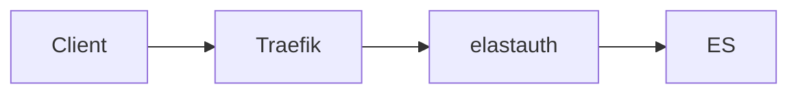

# Deployment Examples and Documentation

## Minimal READMEs for Deployment Examples

Deployment example directories (e.g., `deployment/example/*`) should have **minimal READMEs** that focus on quick start and reference comprehensive Starlight documentation.

### Principle: Single Source of Truth

**Starlight documentation is the authoritative reference.** Example READMEs should not duplicate extensive documentation.

### README Structure for Deployment Examples

```markdown
# [Example Name]

Brief description (1-2 sentences).

> 📚 **Full Documentation**: Link to relevant Starlight doc page

## Quick Start

### Prerequisites
- List essential requirements

### 1. Setup Step
Brief instructions

### 2. Start Services
```bash
docker compose up -d
```

### 3. Test
Basic verification steps

## Configuration

Key settings only (not exhaustive)

## Cleanup

```bash
docker compose down -v
```

## Documentation

Links to:
- Deployment guide
- Configuration reference
- Troubleshooting

## Security Warning

⚠️ Demo credentials warning

## Support

- GitHub Issues link
- Documentation link
```

### What to INCLUDE in Example READMEs

✅ **Quick start instructions** - Get running fast
✅ **Essential prerequisites** - Docker, ports, etc.
✅ **Basic commands** - Start, stop, test
✅ **Key configuration** - Most important settings
✅ **Links to full docs** - Clear navigation to Starlight
✅ **Security warnings** - Demo credentials notice

### What to EXCLUDE from Example READMEs

❌ **Architecture diagrams** - Put in Starlight docs
❌ **Detailed troubleshooting** - Put in Starlight docs
❌ **Performance tuning** - Put in Starlight docs
❌ **Security deep-dives** - Put in Starlight docs
❌ **Advanced configuration** - Put in Starlight docs
❌ **Extensive explanations** - Put in Starlight docs

### Example: Good vs Bad

#### ❌ Bad (Too Verbose)

```markdown
# Example

## Architecture

[500 lines of diagrams and explanations]

## Configuration

[200 lines of every possible option]

## Troubleshooting

[300 lines of every possible issue]

## Performance

[200 lines of tuning advice]

## Security

[300 lines of security considerations]
```

**Problem**: Duplicates Starlight docs, hard to maintain, overwhelming

#### ✅ Good (Minimal)

```markdown
# Example

Brief description.

> 📚 **Full Documentation**: [Link to Starlight]

## Quick Start

1. Prerequisites
2. Start: `docker compose up -d`
3. Test: Open browser

## Configuration

Key settings in `.env.example`

## Documentation

- [Deployment Guide](link)
- [Configuration](link)
- [Troubleshooting](link)

## Security Warning

⚠️ Change demo credentials for production
```

**Benefits**: Quick to read, easy to maintain, clear navigation

## Starlight Documentation Requirements

Since example READMEs are minimal, **Starlight docs must be comprehensive**:

### Deployment Mode Documentation

Each deployment mode needs a complete Starlight guide:

**Required Sections**:
1. **Overview** - What is this mode?
2. **Architecture** - Mermaid diagrams showing flow
3. **When to Use** - Use cases with Cards
4. **Prerequisites** - What you need
5. **Configuration** - Complete options with Tabs
6. **Setup** - Step-by-step with Steps component
7. **Testing** - How to verify it works
8. **Troubleshooting** - Common issues with Asides
9. **Performance** - Tuning and scaling
10. **Security** - Best practices
11. **Next Steps** - LinkCards to related docs

**Use Starlight Components**:
- Tabs for configuration formats
- Steps for sequential instructions
- Cards for features/use cases
- Asides for warnings/tips
- Mermaid for all diagrams
- LinkCards for navigation

### Example Structure

```mdx
---
title: Auth-Only Mode
description: Deploy with Traefik forward auth
---

import { Tabs, TabItem } from '@astrojs/starlight/components';
import { Steps } from '@astrojs/starlight/components';
import { Card, CardGrid } from '@astrojs/starlight/components';

Brief introduction.

## Architecture



## When to Use

<CardGrid>
  <Card title="Use Case 1" icon="rocket">
    Description
  </Card>
</CardGrid>

## Configuration

<Tabs syncKey="config">
  <TabItem label="YAML">
    ```yaml
    config: value
    ```
  </TabItem>
  <TabItem label="Environment">
    ```bash
    VAR=value
    ```
  </TabItem>
</Tabs>

## Setup

<Steps>

1. First step
2. Second step

</Steps>

## Troubleshooting

:::caution
Common issue and solution
:::

## Next Steps

<CardGrid>
  <LinkCard
    title="Related Guide"
    href="/path/"
  />
</CardGrid>
```

## Benefits of This Approach

### For Users

✅ **Quick Start**: Example READMEs get them running fast
✅ **Deep Dive**: Starlight docs provide comprehensive info
✅ **Clear Navigation**: Easy to find what they need
✅ **Professional**: Consistent, well-structured docs

### For Maintainers

✅ **Single Source**: Update docs once in Starlight
✅ **Less Duplication**: Don't maintain same info in multiple places
✅ **Easier Updates**: Change architecture? Update Starlight only
✅ **Consistency**: All examples follow same pattern

### For Project

✅ **Professional**: Shows attention to documentation quality
✅ **Maintainable**: Easier to keep docs current
✅ **Scalable**: Easy to add new examples
✅ **User-Friendly**: Clear separation of quick start vs deep dive

## Implementation Checklist

When creating a new deployment example:

- [ ] Create minimal README with quick start
- [ ] Add links to Starlight docs (even if not written yet)
- [ ] Create comprehensive Starlight guide
- [ ] Use Starlight components (Tabs, Steps, Cards, etc.)
- [ ] Add Mermaid diagrams to Starlight docs
- [ ] Include troubleshooting in Starlight docs
- [ ] Add security considerations to Starlight docs
- [ ] Link example README to Starlight guide
- [ ] Verify no duplication between README and Starlight

## elastauth-Specific Guidelines

### Deployment Examples Location

```
deployment/example/
├── traefik-auth-only/     # Minimal README + docker-compose
├── direct-proxy/          # Minimal README + docker-compose
└── kubernetes/            # Minimal README + manifests
```

### Starlight Docs Location

```
docs/src/content/docs/deployment/
├── auth-only-mode.mdx     # Comprehensive guide
├── proxy-mode.mdx         # Comprehensive guide
└── modes.md               # Comparison and selection
```

### Documentation Flow

1. **User finds example** in `deployment/example/`
2. **Reads minimal README** for quick start
3. **Clicks link** to Starlight docs
4. **Reads comprehensive guide** with all details
5. **Returns to example** to implement

## Remember

**Example READMEs**: Quick start only, link to docs
**Starlight Docs**: Comprehensive, authoritative, well-structured

This ensures elastauth has professional, maintainable documentation that serves both quick-start users and those needing deep technical details.
