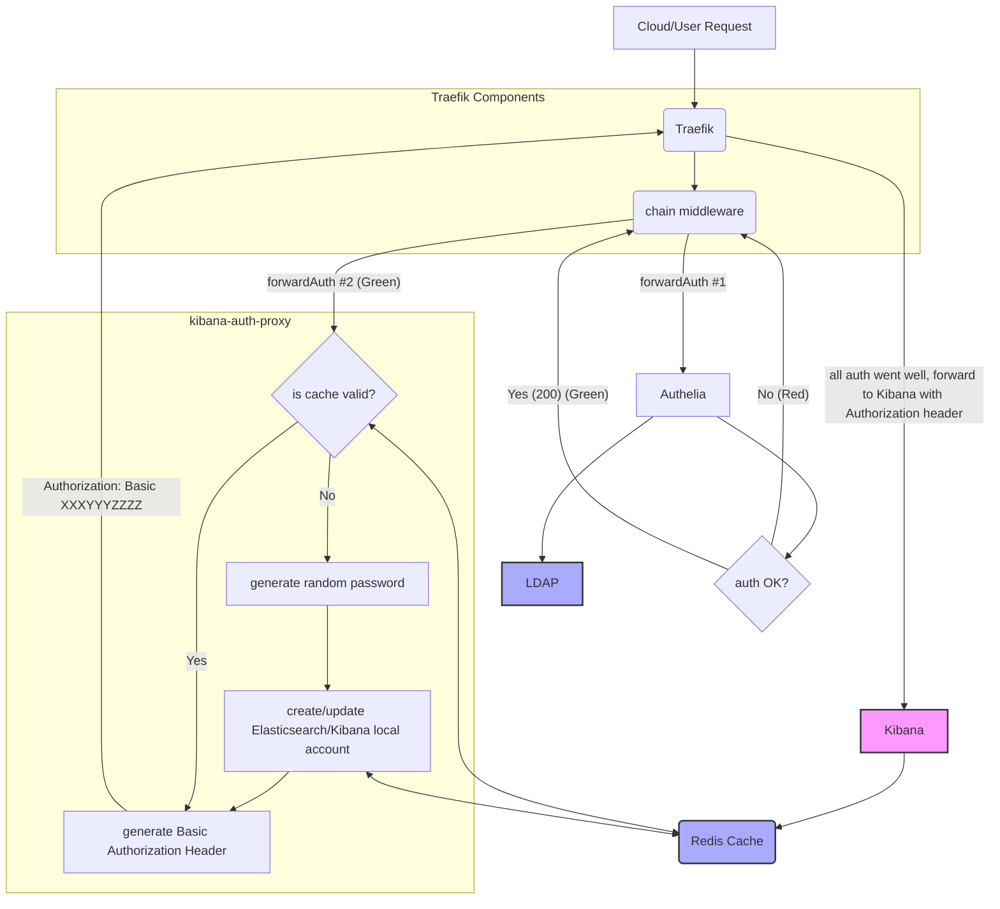
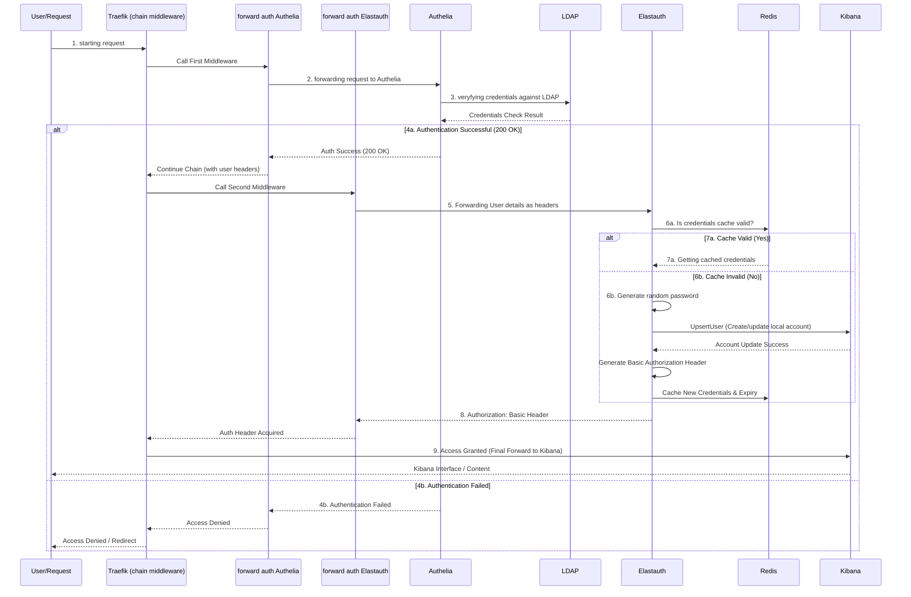

# Elastauth
-[](https://quay.io/repository/wasilak/elastauth) [](https://github.com/wasilak/elastauth/actions/workflows/main.yml) [](https://codeclimate.com/github/wasilak/elastauth/maintainability) [](https://pkg.go.dev/github.com/wasilak/elastauth)

Kibana LDAP/Active Directory Authentication Proxy

This project provides a specialized **Traefik forwardAuth proxy** solution to enable **LDAP/Active Directory** (AD) authentication for **Kibana/Elasticsearch** without requiring a paid subscription.

While designed and tested for Traefik, the core concepts can be adapted for other reverse proxies that support a `forwardAuth` mechanism (e.g., Nginx).

---

## 🎯 Quick Overview

**elastauth** acts as a secure bridge between your infrastructure components:

```text
User → Traefik → Authelia (LDAP Check) → elastauth (Account Mgmt) → Kibana
```

The system ensures users are authenticated against AD/LDAP while maintaining seamless access to Kibana through automatically managed local accounts with role-based permissions.

---

## 💡 How It Works: Multi-Stage Authentication Flow

The system orchestrates a **two-stage authentication** process to ensure AD security is maintained while integrating with Kibana's local user system.

### Stage 1: LDAP Authentication (Authelia)

1. **User Request:** A user attempts to access Kibana, intercepted by **Traefik**.
2. **External Check:** Traefik's **chain middleware** forwards the request to **Authelia** (forwardAuth #1).
3. **AD Validation:** **Authelia** validates credentials against your **LDAP/Active Directory** server.
4. **Result:**
    - ✅ **Success (HTTP 200):** Authelia enriches the request with user headers (`remote-user`, `remote-groups`, `remote-email`) and passes control to the next middleware.
    - ❌ **Failure:** Request is denied or redirected by Authelia.

### Stage 2: Kibana Account Management (elastauth)

Upon successful LDAP authentication, **elastauth** handles local account management:

1. **Proxy Receives Request:** Traefik forwards the authenticated request with user headers to elastauth (forwardAuth #2).
2. **Cache Validation:** elastauth checks Redis for a valid cached password for this user.
3. **If Cache is Valid:**
    - Retrieves the cached credentials and proceeds.
4. **If Cache is Expired/Missing:**
    - Generates a **new, random, short-lived password** (separate from LDAP password).
    - Creates or updates the local Kibana account via the Elasticsearch API.
    - Maps the user's AD groups to appropriate Kibana roles.
    - Stores the new password and expiry in Redis.
5. **Generate Auth Header:** elastauth creates an `Authorization: Basic` header with the username and password.
6. **Return to Traefik:** Traefik receives the auth header and forwards the request to Kibana.

### Stage 3: Transparent Login (Kibana)

1. **Final Forward:** Traefik proxies the original request to **Kibana** with the generated `Authorization` header.
2. **Instant Access:** Kibana accepts the Basic auth, logging the user in with their managed local account and inherited AD roles.

> **Security Note:** Local Kibana passwords are **short-lived** and **automatically regenerated** on each access, ensuring a strong security posture without requiring user password changes.

---

## 🔗 Authentication Headers

The following headers are passed through the authentication chain and used by elastauth for account management:

| Header | Purpose |
|--------|---------|
| `remote-user` | Username/login identifier |
| `remote-email` | User's email address |
| `remote-groups` | Comma-separated list of AD groups |
| `remote-name` | User's full name |

---

## 📊 Visual Flows

### Diagram 1: High-Level Flow (Decision & Data Flow)

This diagram illustrates the complete authentication journey with decision points and component interactions:



**Key Decision Points:**

- **Auth OK?** - Authelia validates user credentials against LDAP
- **Is cache valid?** - elastauth checks Redis for existing cached credentials
- Color coding: 🟢 Green = Success path, 🔴 Red = Failure path

### Diagram 2: Sequence Flow (Step-by-Step Timeline)

This diagram shows the detailed sequence of interactions between all components in chronological order:



**Timeline Highlights:**

- **Steps 1-3:** Request validation phase (Traefik → Authelia → LDAP)
- **Steps 4-5:** Cache check phase (elastauth receives validated request)
- **Steps 6-8:** Account management phase (password generation/caching)
- **Step 9:** Final access granted to Kibana
