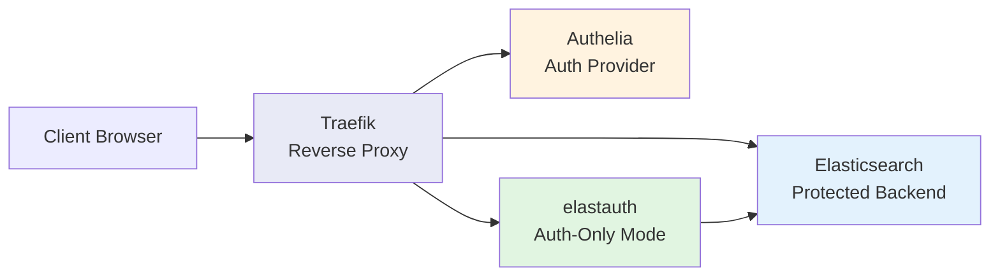
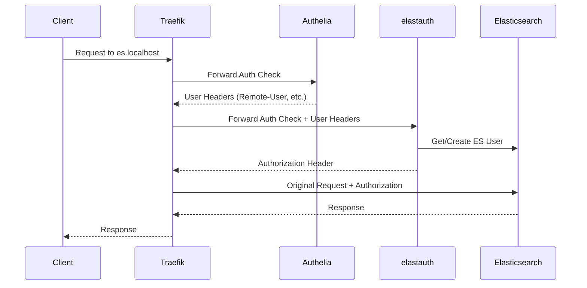

# Traefik Integration Example (Auth-Only Mode)

This example demonstrates how to deploy elastauth in **auth-only mode** with Traefik as a reverse proxy using forward authentication middleware. This is the recommended deployment pattern when you want to use Traefik for routing and load balancing while elastauth handles Elasticsearch credential injection.

## Architecture

### Component Overview



### Request Flow



### Authentication Chain

1. **Traefik** receives the client request
2. **Authelia** authenticates the user (first middleware)
   - Returns user information in headers: `Remote-User`, `Remote-Groups`, `Remote-Name`, `Remote-Email`
3. **elastauth** receives the authenticated request (second middleware)
   - Extracts user info from Authelia headers
   - Generates or retrieves cached Elasticsearch credentials
   - Returns `Authorization` header with Basic Auth
4. **Traefik** forwards the request to Elasticsearch with the Authorization header
5. **Elasticsearch** processes the request with the injected credentials

## Components

### Traefik (Reverse Proxy)
- **Role**: Routes requests and orchestrates forward authentication
- **Port**: 80 (HTTP), 8080 (Dashboard)
- **Configuration**: Uses Docker labels and dynamic config file

### Authelia (Authentication Provider)
- **Role**: Authenticates users and provides user information
- **Port**: 9091
- **Users**: 
  - Username: `john`, Password: `password`, Groups: `admins`, `dev`
  - Username: `jane`, Password: `password`, Groups: `dev`

### elastauth (Credential Injection)
- **Role**: Generates Elasticsearch credentials and injects Authorization header
- **Mode**: Auth-only (proxy disabled)
- **Port**: 5000
- **Configuration**: Uses Authelia provider, Redis cache

### Elasticsearch (Protected Backend)
- **Role**: The protected resource requiring authentication
- **Port**: 9200
- **Access**: Only accessible through Traefik with proper authentication

### Redis (Cache)
- **Role**: Caches Elasticsearch credentials
- **Port**: 6379

## Prerequisites

- Docker and Docker Compose installed
- Ports 80, 8080, 9200 available
- At least 2GB RAM available for Elasticsearch

## Quick Start

### 1. Start the Stack

```bash
cd deployment/example/traefik-auth-only
docker compose up -d
```

### 2. Wait for Services to be Ready

```bash
# Check all services are running
docker compose ps

# Wait for Elasticsearch to be healthy (may take 1-2 minutes)
docker compose logs -f elasticsearch
```

### 3. Access the Services

Add these entries to your `/etc/hosts` file:

```
127.0.0.1 es.localhost
127.0.0.1 auth.localhost
127.0.0.1 elastauth.localhost
```

### 4. Test the Setup

#### Access Elasticsearch (Protected)

1. Open your browser and navigate to: `http://es.localhost`
2. You'll be redirected to Authelia login page
3. Login with:
   - Username: `john`
   - Password: `password`
4. After successful authentication, you'll see the Elasticsearch response

#### Test with curl

```bash
# This will fail without authentication
curl http://es.localhost

# This will work after setting up a session
# First, login through browser, then use the session cookie
curl -b cookies.txt http://es.localhost/_cluster/health
```

## Testing the Authentication Flow

### Test 1: Verify Traefik Dashboard

```bash
# Access Traefik dashboard
open http://localhost:8080
```

You should see:
- All routers configured
- Middleware chains active
- Services healthy

### Test 2: Verify Authelia Authentication

```bash
# Access Authelia directly
curl http://auth.localhost

# Should return Authelia login page HTML
```

### Test 3: Verify elastauth Health

```bash
# Check elastauth health
curl http://elastauth.localhost/health

# Expected response:
# {"status":"healthy","mode":"auth-only"}
```

### Test 4: Test Full Authentication Chain

```bash
# Create a session file
touch cookies.txt

# Try to access Elasticsearch (will redirect to auth)
curl -c cookies.txt -L http://es.localhost

# Login through browser at http://es.localhost
# Then test with the session:
curl -b cookies.txt http://es.localhost/_cluster/health
```

### Test 5: Verify Credential Injection

```bash
# Check elastauth logs to see credential generation
docker compose logs elastauth

# You should see logs about:
# - Receiving authentication request
# - Extracting user from Authelia headers
# - Generating/retrieving Elasticsearch credentials
# - Returning Authorization header
```

### Test 6: Verify User Creation in Elasticsearch

```bash
# Access Elasticsearch directly (bypassing auth for admin check)
docker exec elasticsearch curl -u elastic:changeme http://localhost:9200/_security/user

# You should see the elastauth-created user (e.g., "john")
```

## Configuration Details

### Traefik Middleware Chain

The middleware chain is defined in `dynamic-config.yml`:

```yaml
middlewares:
  authelia-forward-auth:
    forwardAuth:
      address: "http://authelia:9091/api/verify?rd=http://auth.localhost"
      trustForwardHeader: true
      authResponseHeaders:
        - "Remote-User"
        - "Remote-Groups"
        - "Remote-Name"
        - "Remote-Email"

  elastauth-forward-auth:
    forwardAuth:
      address: "http://elastauth:5000/"
      trustForwardHeader: true
      authResponseHeaders:
        - "Authorization"
```

### elastauth Configuration

elastauth is configured via environment variables in `docker-compose.yml`:

```yaml
environment:
  - ELASTAUTH_AUTH_PROVIDER=authelia
  - ELASTAUTH_PROXY_ENABLED=false  # Auth-only mode
  - ELASTAUTH_CACHE_TYPE=redis
  - ELASTAUTH_CACHE_EXPIRATION=1h
```

### Elasticsearch Protection

Elasticsearch is protected by the middleware chain:

```yaml
labels:
  - "traefik.http.routers.elasticsearch.middlewares=authelia-forward-auth,elastauth-forward-auth"
```

## Troubleshooting

### Issue: Redirect Loop

**Symptoms**: Browser keeps redirecting between Authelia and the target service

**Solutions**:

1. Check Authelia configuration:
   ```bash
   docker compose logs authelia
   ```

2. Verify session domain in `authelia/configuration.yml`:
   ```yaml
   session:
     domain: localhost
   ```

3. Clear browser cookies and try again

### Issue: 401 Unauthorized from Elasticsearch

**Symptoms**: Authentication succeeds but Elasticsearch returns 401

**Solutions**:

1. Check elastauth logs:
   ```bash
   docker compose logs elastauth
   ```

2. Verify Elasticsearch credentials in docker-compose.yml match

3. Check if user was created in Elasticsearch:
   ```bash
   docker exec elasticsearch curl -u elastic:changeme http://localhost:9200/_security/user
   ```

### Issue: elastauth Returns 500 Error

**Symptoms**: elastauth logs show errors about Elasticsearch connection

**Solutions**:

1. Verify Elasticsearch is healthy:
   ```bash
   docker compose ps elasticsearch
   curl http://localhost:9200/_cluster/health
   ```

2. Check network connectivity:
   ```bash
   docker exec elastauth ping elasticsearch
   ```

3. Verify Elasticsearch credentials are correct

### Issue: Authelia Headers Not Received

**Symptoms**: elastauth logs show "missing Remote-User header"

**Solutions**:

1. Verify Traefik middleware order:
   ```yaml
   middlewares=authelia-forward-auth,elastauth-forward-auth
   ```

2. Check Authelia is returning headers:
   ```bash
   docker compose logs traefik | grep Remote-User
   ```

3. Verify `trustForwardHeader: true` in both middlewares

## Performance Considerations

### Caching

elastauth uses Redis to cache Elasticsearch credentials:

- **Cache TTL**: 1 hour (configurable via `ELASTAUTH_CACHE_EXPIRATION`)
- **Cache Key**: Based on username
- **Cache Hit**: Subsequent requests use cached credentials (fast)
- **Cache Miss**: First request generates credentials (slower)

### Connection Pooling

- Traefik maintains connection pools to all services
- elastauth maintains connection pool to Elasticsearch
- Redis connections are pooled

### Scaling

To scale this setup:

1. **Horizontal Scaling**: Run multiple elastauth instances behind Traefik
2. **Redis Clustering**: Use Redis Cluster for distributed caching
3. **Elasticsearch Clustering**: Use Elasticsearch cluster for high availability

## Security Considerations

### Secrets Management

**⚠️ IMPORTANT**: The secrets in this example are for demonstration only!

For production:

1. **Change all secrets**:
   - `ELASTAUTH_SECRET_KEY`
   - `ELASTIC_PASSWORD`
   - Authelia `jwt_secret` and `session.secret`

2. **Use secret management**:
   - Docker secrets
   - Kubernetes secrets
   - HashiCorp Vault
   - AWS Secrets Manager

3. **Enable TLS**:
   - Configure Traefik with Let's Encrypt
   - Enable Elasticsearch TLS
   - Use HTTPS for all services

### Network Security

- All services communicate on internal Docker network
- Only Traefik exposes ports to host
- Elasticsearch is not directly accessible from outside

### Authentication Security

- Authelia provides MFA support (not enabled in this example)
- Session expiration configured (1 hour)
- Failed login attempts are rate-limited

## Comparison with Proxy Mode

### When to Use Auth-Only Mode (This Example)

✅ You already have Traefik for routing
✅ You need advanced routing features (path-based, header-based)
✅ You want to protect multiple services with one Traefik instance
✅ You need Traefik's load balancing and circuit breaker features
✅ You want centralized TLS termination

### When to Use Proxy Mode

✅ You want a simpler deployment (fewer components)
✅ You don't need advanced routing features
✅ You only need to protect Elasticsearch
✅ You want elastauth to handle everything

See the [proxy mode example](../direct-proxy/) for comparison.

## Advanced Configuration

### Custom User Mapping

Modify `authelia/users_database.yml` to add more users:

```yaml
users:
  alice:
    displayname: "Alice Johnson"
    password: "$argon2id$v=19$m=65536,t=3,p=4$..."
    email: alice@example.com
    groups:
      - readonly
```

### Custom Access Control

Modify `authelia/configuration.yml` to add access rules:

```yaml
access_control:
  rules:
    - domain: es.localhost
      policy: two_factor  # Require 2FA
      subject:
        - "group:admins"
```

### Custom Elasticsearch Roles

elastauth creates users with default roles. To customize, modify elastauth's role mapping configuration.

## Monitoring

### View Logs

```bash
# All services
docker compose logs -f

# Specific service
docker compose logs -f elastauth
docker compose logs -f traefik
docker compose logs -f authelia
```

### Metrics

- **Traefik**: Dashboard at http://localhost:8080
- **elastauth**: Metrics at http://elastauth.localhost/metrics (if enabled)
- **Elasticsearch**: Monitoring API at http://es.localhost/_cluster/health

## Cleanup

```bash
# Stop and remove containers
docker compose down

# Remove volumes (including Elasticsearch data)
docker compose down -v
```

## Next Steps

1. **Enable TLS**: Configure Traefik with Let's Encrypt
2. **Add MFA**: Enable TOTP in Authelia
3. **Production Secrets**: Replace all demo secrets
4. **Monitoring**: Add Prometheus and Grafana
5. **Backup**: Configure Elasticsearch snapshots

## Resources

- [Traefik Documentation](https://doc.traefik.io/traefik/)
- [Authelia Documentation](https://www.authelia.com/)
- [elastauth Documentation](https://github.com/wasilak/elastauth)
- [Elasticsearch Security](https://www.elastic.co/guide/en/elasticsearch/reference/current/security-api.html)

## Support

For issues or questions:
- elastauth: [GitHub Issues](https://github.com/wasilak/elastauth/issues)
- Traefik: [Community Forum](https://community.traefik.io/)
- Authelia: [Discord](https://discord.authelia.com/)
