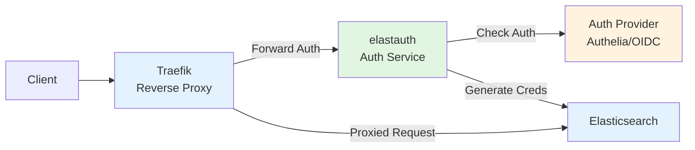
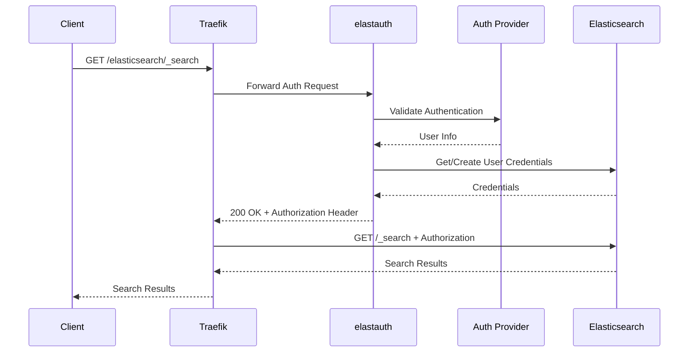
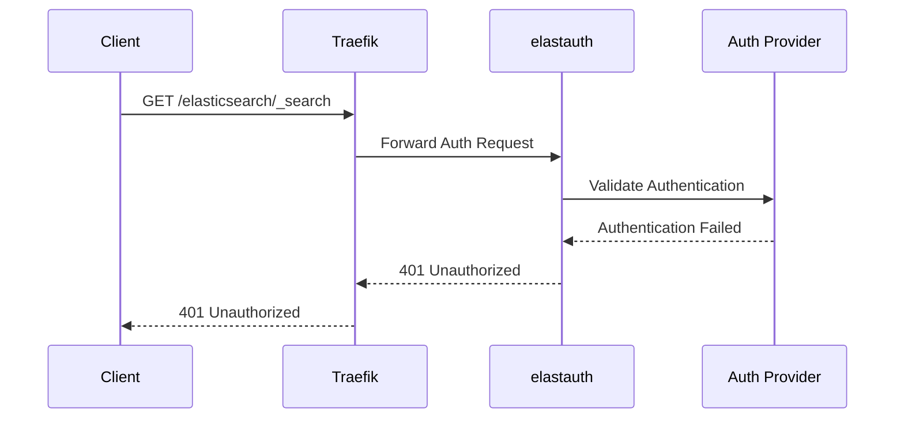

Authentication-only mode is elastauth's default operating mode, designed for integration with reverse proxies like Traefik using the forward authentication pattern.

## Architecture Overview

In authentication-only mode, elastauth acts as a pure authentication service that validates requests and returns authorization headers. The actual proxying to Elasticsearch is handled by an external reverse proxy.



## Request/Response Flow

### Successful Authentication Flow



### Failed Authentication Flow



## Component Responsibilities

### Traefik (Reverse Proxy)

**Responsibilities:**
- Receives all client requests
- Delegates authentication to elastauth via forward auth middleware
- Proxies authenticated requests to Elasticsearch
- Returns responses to clients

**Configuration:**
```yaml
http:
  middlewares:
    elastauth-forward:
      forwardAuth:
        address: "http://elastauth:5000/"
        authResponseHeaders:
          - "Authorization"
  
  routers:
    elasticsearch:
      rule: "PathPrefix(`/elasticsearch`)"
      middlewares:
        - elastauth-forward
      service: elasticsearch
  
  services:
    elasticsearch:
      loadBalancer:
        servers:
          - url: "http://elasticsearch:9200"
```

### elastauth (Authentication Service)

**Responsibilities:**
- Validates authentication via configured provider
- Extracts user information
- Generates/retrieves Elasticsearch credentials
- Returns authorization headers to Traefik
- Does NOT proxy requests to Elasticsearch

**Key Endpoints:**
- `/elastauth` - Main authentication endpoint (called by Traefik)
- `/elastauth/health` - Health check endpoint
- `/elastauth/ready` - Readiness check endpoint
- `/elastauth/config` - Configuration information endpoint

### Authentication Provider

**Responsibilities:**
- Validates authentication credentials
- Extracts user information (username, email, groups)
- Returns standardized user info to elastauth

**Supported Providers:**
- Authelia (header-based)
- OIDC/OAuth2 (JWT token-based)

### Elasticsearch

**Responsibilities:**
- Stores user credentials created by elastauth
- Authenticates requests using credentials
- Serves search and analytics requests

## When to Use Authentication-Only Mode

### Ideal Use Cases

✅ **Existing Traefik Infrastructure**
- You already use Traefik as your reverse proxy
- You want centralized routing and load balancing
- You need advanced routing rules and middleware

✅ **Multiple Backend Services**
- Elasticsearch is one of many services behind Traefik
- You want consistent authentication across all services
- You need unified access control

✅ **Complex Routing Requirements**
- Path-based routing to different Elasticsearch clusters
- Header-based routing decisions
- Advanced load balancing strategies

✅ **Separation of Concerns**
- Authentication logic separate from proxy logic
- Different teams manage auth vs infrastructure
- Easier to swap authentication providers

### Example Scenarios

**Scenario 1: Multi-Service Platform**
```
Traefik handles:
- /elasticsearch/* → Elasticsearch (with elastauth auth)
- /kibana/* → Kibana (with elastauth auth)
- /grafana/* → Grafana (with different auth)
- /api/* → Application API (with different auth)
```

**Scenario 2: Multi-Tenant Elasticsearch**
```
Traefik routes based on subdomain:
- tenant1.es.example.com → ES Cluster 1 (with elastauth)
- tenant2.es.example.com → ES Cluster 2 (with elastauth)
- shared.es.example.com → Shared ES Cluster (with elastauth)
```

**Scenario 3: Authelia Integration**
```
Traefik middleware chain:
1. Authelia (primary authentication)
2. elastauth (Elasticsearch credential generation)
3. Elasticsearch (backend service)
```

## Configuration Example

### elastauth Configuration

```yaml
# Authentication-only mode (default)
proxy:
  enabled: false  # Proxy mode disabled

# Authentication provider
auth_provider: "authelia"

authelia:
  header_username: "Remote-User"
  header_groups: "Remote-Groups"
  header_email: "Remote-Email"
  header_name: "Remote-Name"

# Elasticsearch for user management
elasticsearch:
  hosts:
    - "https://elasticsearch:9200"
  username: "elastauth"
  password: "${ELASTICSEARCH_PASSWORD}"

# Cache configuration
cache:
  type: "redis"
  expiration: "1h"
  redis_host: "redis:6379"

# Default roles for all users
default_roles:
  - "kibana_user"

# Group to role mappings
group_mappings:
  admin:
    - "kibana_admin"
    - "superuser"
```

### Traefik Configuration

```yaml
# traefik.yml (static configuration)
entryPoints:
  web:
    address: ":80"
  websecure:
    address: ":443"

providers:
  file:
    filename: /etc/traefik/dynamic-config.yml

# dynamic-config.yml (dynamic configuration)
http:
  middlewares:
    elastauth-forward:
      forwardAuth:
        address: "http://elastauth:5000/"
        authResponseHeaders:
          - "Authorization"
        trustForwardHeader: true
  
  routers:
    elasticsearch:
      rule: "PathPrefix(`/elasticsearch`)"
      entryPoints:
        - websecure
      middlewares:
        - elastauth-forward
      service: elasticsearch
      tls: {}
  
  services:
    elasticsearch:
      loadBalancer:
        servers:
          - url: "http://elasticsearch:9200"
```

## Advantages

### Flexibility
- Use Traefik's advanced routing capabilities
- Easy to add/remove services
- Centralized configuration

### Scalability
- Scale elastauth independently from proxy
- Scale Traefik independently from auth
- Horizontal scaling of both components

### Maintainability
- Clear separation of concerns
- Easier to debug (separate logs)
- Simpler to update components

### Integration
- Works with existing Traefik setups
- Compatible with other Traefik middleware
- Can chain with Authelia or other auth systems

## Disadvantages

### Complexity
- More components to manage
- More configuration files
- More network hops

### Performance
- Additional network round-trip for auth
- Traefik overhead
- More points of failure

### Deployment
- Requires Traefik deployment
- More containers to orchestrate
- More complex networking

## Performance Considerations

### Caching Strategy

Use Redis cache to minimize Elasticsearch calls:

```yaml
cache:
  type: "redis"
  expiration: "1h"  # Balance security vs performance
  redis_host: "redis:6379"
```

### Connection Pooling

Traefik handles connection pooling to Elasticsearch:

```yaml
# Traefik handles this automatically
services:
  elasticsearch:
    loadBalancer:
      servers:
        - url: "http://elasticsearch:9200"
```

### Health Checks

Configure appropriate health check intervals:

```yaml
# Traefik health checks
services:
  elasticsearch:
    loadBalancer:
      healthCheck:
        path: /_cluster/health
        interval: "10s"
        timeout: "3s"
```

## Security Considerations

### TLS Configuration

Enable TLS between all components:

```yaml
# Traefik TLS
entryPoints:
  websecure:
    address: ":443"
    http:
      tls:
        certResolver: letsencrypt

# elastauth to Elasticsearch TLS
elasticsearch:
  hosts:
    - "https://elasticsearch:9200"
  tls:
    enabled: true
    ca_cert: "/path/to/ca.crt"
```

### Header Security

Traefik should strip sensitive headers:

```yaml
middlewares:
  strip-headers:
    headers:
      customRequestHeaders:
        Remote-User: ""
        Remote-Groups: ""
```

### Network Isolation

Use Docker networks or Kubernetes network policies:

```yaml
# docker-compose.yml
networks:
  frontend:  # Client → Traefik
  backend:   # Traefik → elastauth → Elasticsearch
```

## Troubleshooting

### Authentication Fails

**Symptom:** Traefik returns 401 Unauthorized

**Check:**
1. elastauth logs: `docker compose logs elastauth`
2. Traefik forward auth configuration
3. Authentication provider connectivity
4. Header forwarding configuration

### Authorization Header Not Forwarded

**Symptom:** Elasticsearch returns 401 even after successful auth

**Check:**
1. Traefik `authResponseHeaders` configuration
2. elastauth response headers
3. Traefik to Elasticsearch request headers

### Performance Issues

**Symptom:** Slow response times

**Check:**
1. Redis cache hit rate
2. Elasticsearch response times
3. Network latency between components
4. Traefik connection pool settings

## Next Steps

- **[Proxy Mode Architecture](/elastauth/architecture/proxy-mode)** - Compare with transparent proxy mode
- **[Auth-Only Mode Deployment](/elastauth/deployment/auth-only-mode)** - Detailed deployment guide
- **[Traefik Integration Example](/elastauth/deployment/auth-only-mode#traefik-integration)** - Complete working example
- **[Operating Modes Comparison](/elastauth/deployment/modes)** - Choose the right mode for your use case
