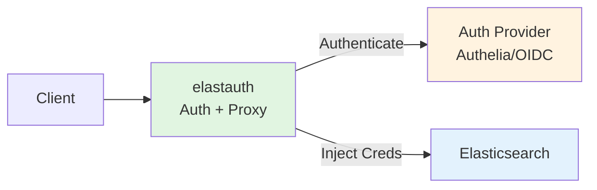
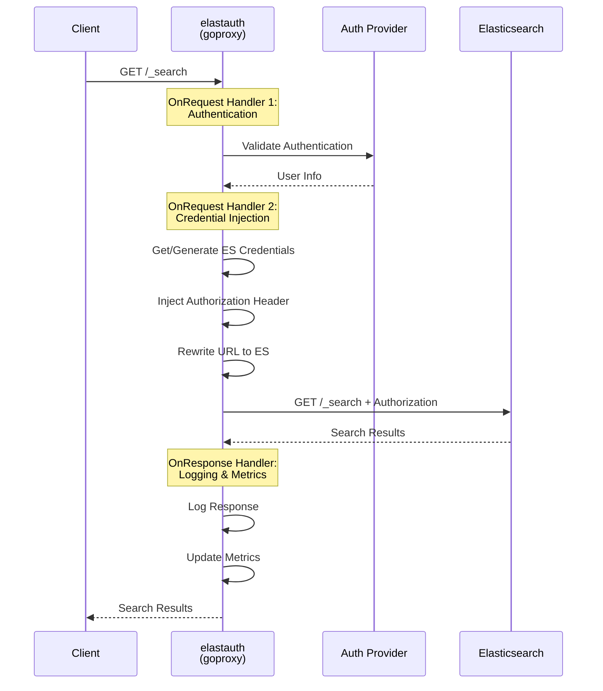
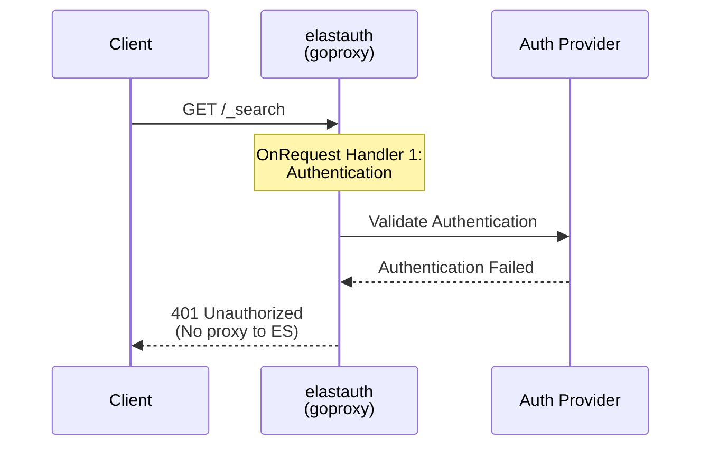
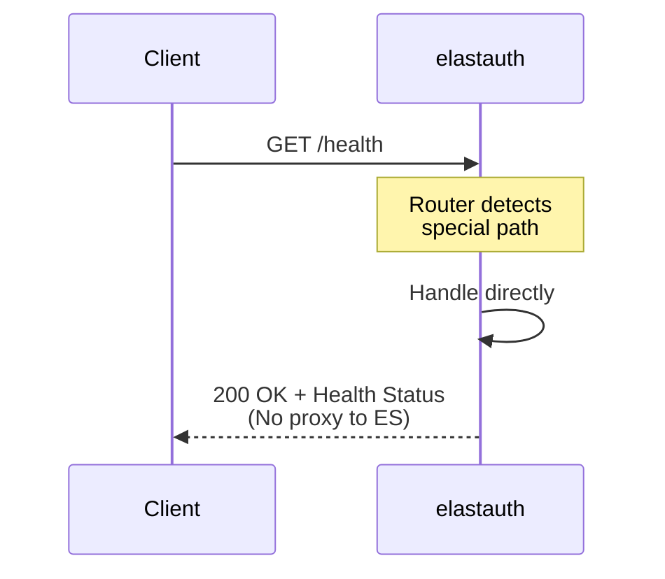
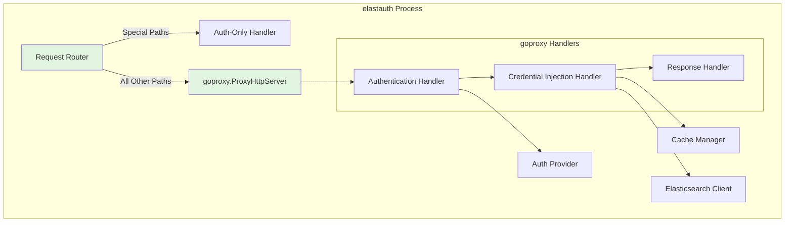

Transparent proxy mode is elastauth's integrated operating mode where it handles both authentication and request proxying to Elasticsearch in a single service.

## Architecture Overview

In transparent proxy mode, elastauth acts as a complete HTTP proxy that authenticates requests and forwards them to Elasticsearch with injected credentials. No external reverse proxy is required.



## Request/Response Flow

### Successful Request Flow



### Failed Authentication Flow



### Special Path Bypass Flow



## Component Architecture

### Internal Components



## Component Responsibilities

### Request Router

**Responsibilities:**
- Detects operating mode (auth-only vs proxy)
- Routes special paths to direct handlers
- Routes all other paths to goproxy in proxy mode

**Special Paths (Bypass Proxy):**
- `/health` - Health check endpoint
- `/ready` - Readiness check endpoint
- `/live` - Liveness check endpoint
- `/config` - Configuration endpoint
- `/docs` - Documentation endpoint
- `/metrics` - Metrics endpoint

### goproxy.ProxyHttpServer

**Responsibilities:**
- HTTP proxy protocol handling
- Request/response interception
- Connection management
- Error handling

**Why goproxy:**
- Battle-tested library (10+ years)
- Handles HTTP/HTTPS proxy correctly
- Built-in request/response hooks
- Proper connection pooling
- Active maintenance

### Authentication Handler

**Responsibilities:**
- Validates authentication via configured provider
- Extracts user information
- Stores user info in proxy context
- Returns 401/403 on auth failure (stops proxy)

**Implementation:**
```go
proxy.OnRequest().DoFunc(func(r *http.Request, ctx *goproxy.ProxyCtx) (*http.Request, *http.Response) {
    // Authenticate request
    userInfo, err := authProvider.GetUser(r.Context(), authReq)
    if err != nil {
        return r, goproxy.NewResponse(r, goproxy.ContentTypeText, 
            http.StatusUnauthorized, "Authentication failed")
    }
    
    // Store in context for next handler
    ctx.UserData = userInfo
    return r, nil
})
```

### Credential Injection Handler

**Responsibilities:**
- Retrieves user info from proxy context
- Gets or generates Elasticsearch credentials
- Injects Basic Auth header
- Rewrites request URL to target Elasticsearch

**Implementation:**
```go
proxy.OnRequest().DoFunc(func(r *http.Request, ctx *goproxy.ProxyCtx) (*http.Request, *http.Response) {
    userInfo := ctx.UserData.(*provider.UserInfo)
    
    // Get/generate credentials
    creds, err := getOrGenerateCredentials(r.Context(), userInfo, cacheManager)
    if err != nil {
        return r, goproxy.NewResponse(r, goproxy.ContentTypeText,
            http.StatusInternalServerError, "Failed to generate credentials")
    }
    
    // Inject auth and rewrite URL
    r.SetBasicAuth(creds.Username, creds.Password)
    r.URL.Scheme = targetURL.Scheme
    r.URL.Host = targetURL.Host
    r.Host = targetURL.Host
    
    return r, nil
})
```

### Response Handler

**Responsibilities:**
- Logs responses
- Updates metrics
- Sanitizes sensitive headers
- Forwards response to client

**Implementation:**
```go
proxy.OnResponse().DoFunc(func(r *http.Response, ctx *goproxy.ProxyCtx) *http.Response {
    // Log response
    logger.Info("proxied request", 
        "status", r.StatusCode,
        "method", ctx.Req.Method,
        "path", ctx.Req.URL.Path)
    
    // Update metrics
    proxyRequestsTotal.Inc()
    
    return r
})
```

## When to Use Transparent Proxy Mode

### Ideal Use Cases

✅ **Simple Deployments**
- Single service to manage
- No existing reverse proxy infrastructure
- Minimal configuration complexity

✅ **Direct Elasticsearch Access**
- Elasticsearch is the only backend service
- No need for advanced routing
- Simple path-based access

✅ **Reduced Latency**
- Fewer network hops
- Single authentication + proxy step
- Direct connection to Elasticsearch

✅ **Simplified Operations**
- One service to deploy and monitor
- Single configuration file
- Fewer moving parts

### Example Scenarios

**Scenario 1: Standalone Elasticsearch**
```
Client → elastauth (auth + proxy) → Elasticsearch
```

**Scenario 2: Kubernetes Deployment**
```
Ingress → elastauth Service → Elasticsearch Service
(elastauth handles auth + proxy internally)
```

**Scenario 3: Docker Compose Stack**
```
docker-compose.yml:
- elastauth (proxy mode)
- authelia (authentication)
- elasticsearch (backend)
```

## Configuration Example

### elastauth Configuration

```yaml
# Enable transparent proxy mode
proxy:
  enabled: true
  elasticsearch_url: "https://elasticsearch:9200"
  timeout: "30s"
  max_idle_conns: 100
  idle_conn_timeout: "90s"
  tls:
    enabled: true
    insecure_skip_verify: false
    ca_cert: "/path/to/ca.crt"

# Authentication provider
auth_provider: "authelia"

authelia:
  header_username: "Remote-User"
  header_groups: "Remote-Groups"
  header_email: "Remote-Email"
  header_name: "Remote-Name"

# Elasticsearch for user management
elasticsearch:
  hosts:
    - "https://elasticsearch:9200"
  username: "elastauth"
  password: "${ELASTICSEARCH_PASSWORD}"

# Cache configuration
cache:
  type: "redis"
  expiration: "1h"
  redis_host: "redis:6379"

# Default roles
default_roles:
  - "kibana_user"

# Group mappings
group_mappings:
  admin:
    - "kibana_admin"
    - "superuser"
```

### Client Configuration

Clients configure elastauth as their HTTP proxy:

```bash
# Using curl
curl -x http://elastauth:5000 \
  -H "Remote-User: john" \
  -H "Remote-Groups: admin" \
  http://elasticsearch:9200/_search

# Using environment variable
export HTTP_PROXY=http://elastauth:5000
curl http://elasticsearch:9200/_search
```

Or clients can send requests directly to elastauth:

```bash
# Direct request to elastauth
curl http://elastauth:5000/_search \
  -H "Remote-User: john" \
  -H "Remote-Groups: admin"
```

## Advantages

### Simplicity
- Single service to deploy
- One configuration file
- Fewer components to manage

### Performance
- Fewer network hops
- Single authentication step
- Direct connection to Elasticsearch

### Deployment
- Simpler Docker Compose setup
- Easier Kubernetes deployment
- Fewer containers to orchestrate

### Maintenance
- Single service to monitor
- Unified logs
- Simpler troubleshooting

## Disadvantages

### Flexibility
- No advanced routing capabilities
- Limited to Elasticsearch backend
- Cannot easily add other services

### Scalability
- Auth and proxy scale together
- Cannot scale independently
- More resource usage per instance

### Integration
- Requires client proxy configuration
- Cannot leverage existing Traefik setup
- Less flexible middleware chaining

## Performance Considerations

### Connection Pooling

Configure connection pool for Elasticsearch:

```yaml
proxy:
  max_idle_conns: 100        # Maximum idle connections
  idle_conn_timeout: "90s"   # Idle connection timeout
```

### Timeout Configuration

Set appropriate timeouts:

```yaml
proxy:
  timeout: "30s"  # Request timeout
```

### Caching Strategy

Use Redis cache to minimize Elasticsearch calls:

```yaml
cache:
  type: "redis"
  expiration: "1h"
  redis_host: "redis:6379"
```

### Request Streaming

goproxy automatically streams responses:
- No buffering of large responses
- Memory-efficient
- Suitable for large result sets

## Security Considerations

### TLS Configuration

Enable TLS to Elasticsearch:

```yaml
proxy:
  elasticsearch_url: "https://elasticsearch:9200"
  tls:
    enabled: true
    insecure_skip_verify: false  # Verify certificates
    ca_cert: "/path/to/ca.crt"
    client_cert: "/path/to/client.crt"
    client_key: "/path/to/client.key"
```

### Credential Security

- Credentials never exposed to clients
- Cached credentials are encrypted
- Sensitive headers sanitized from logs

### Input Validation

All user input is validated:
- Headers sanitized
- Query parameters validated
- Request body validated

### Network Isolation

Use Docker networks or Kubernetes network policies:

```yaml
# docker-compose.yml
networks:
  frontend:  # Client → elastauth
  backend:   # elastauth → Elasticsearch
```

## Monitoring and Observability

### Metrics

Proxy mode exposes additional metrics:

```
# Proxy-specific metrics
elastauth_proxy_requests_total
elastauth_proxy_request_duration_seconds
elastauth_proxy_errors_total
elastauth_proxy_cache_hits_total
elastauth_proxy_cache_misses_total

# Authentication metrics
elastauth_auth_success_total
elastauth_auth_failure_total
```

### Logging

Structured logging with request context:

```json
{
  "level": "info",
  "msg": "proxied request",
  "request_id": "abc123",
  "method": "GET",
  "path": "/_search",
  "status": 200,
  "duration_ms": 45,
  "user": "john"
}
```

### Health Checks

Health checks include Elasticsearch connectivity:

```bash
# Liveness (always responds)
curl http://elastauth:5000/live

# Readiness (checks Elasticsearch)
curl http://elastauth:5000/ready
```

## Troubleshooting

### Authentication Fails

**Symptom:** 401 Unauthorized responses

**Check:**
1. elastauth logs: `docker compose logs elastauth`
2. Authentication provider configuration
3. Request headers being sent
4. Auth provider connectivity

### Elasticsearch Connection Fails

**Symptom:** 502 Bad Gateway responses

**Check:**
1. Elasticsearch connectivity: `curl https://elasticsearch:9200`
2. Proxy configuration: `elasticsearch_url` setting
3. TLS configuration if using HTTPS
4. Network connectivity between containers

### Performance Issues

**Symptom:** Slow response times

**Check:**
1. Redis cache hit rate (metrics)
2. Elasticsearch response times
3. Connection pool settings
4. Network latency

### Credential Generation Fails

**Symptom:** 500 Internal Server Error

**Check:**
1. Elasticsearch user management permissions
2. elastauth Elasticsearch credentials
3. Cache connectivity (Redis)
4. Encryption key configuration

## Comparison with Auth-Only Mode

| Aspect | Proxy Mode | Auth-Only Mode |
|--------|-----------|----------------|
| **Components** | elastauth only | elastauth + Traefik |
| **Network Hops** | 1 (client → elastauth → ES) | 2 (client → Traefik → elastauth, Traefik → ES) |
| **Configuration** | Single config file | Multiple config files |
| **Routing** | Simple path-based | Advanced Traefik routing |
| **Scalability** | Scale together | Scale independently |
| **Flexibility** | Limited to ES | Multiple backends |
| **Deployment** | Simpler | More complex |
| **Use Case** | Standalone ES | Multi-service platform |

## Next Steps

- **[Auth-Only Mode Architecture](/elastauth/architecture/auth-only-mode)** - Compare with authentication-only mode
- **[Proxy Mode Deployment](/elastauth/deployment/proxy-mode)** - Detailed deployment guide
- **[Direct Proxy Example](/elastauth/deployment/proxy-mode#direct-proxy-example)** - Complete working example
- **[Operating Modes Comparison](/elastauth/deployment/modes)** - Choose the right mode for your use case
