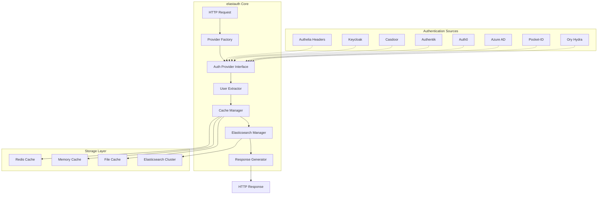
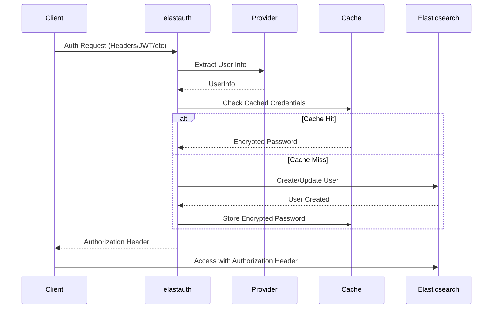
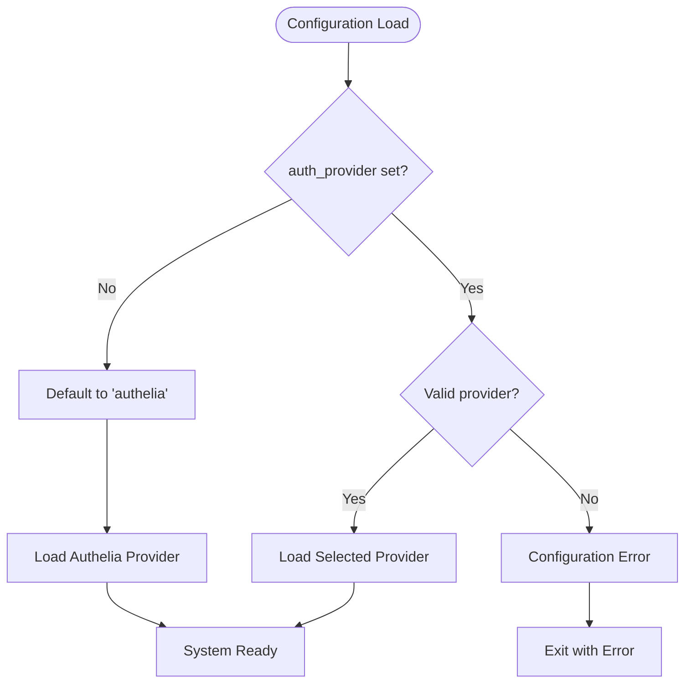
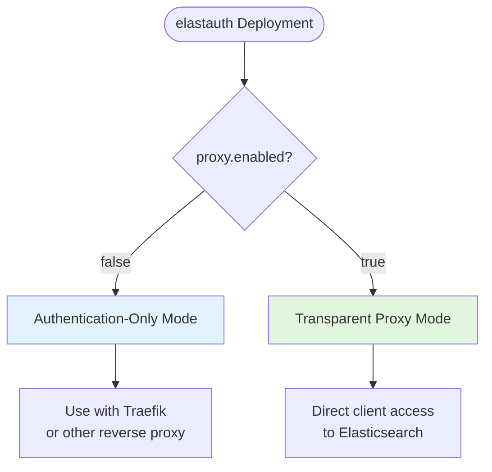
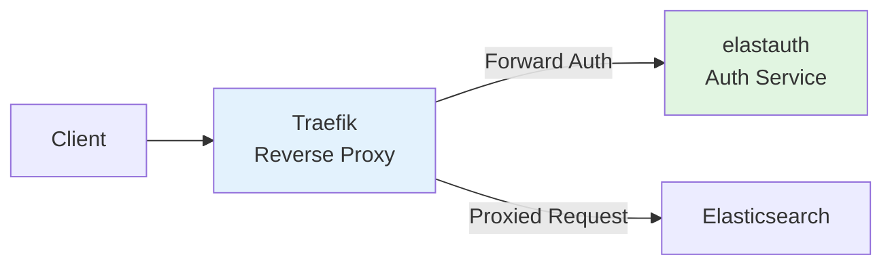
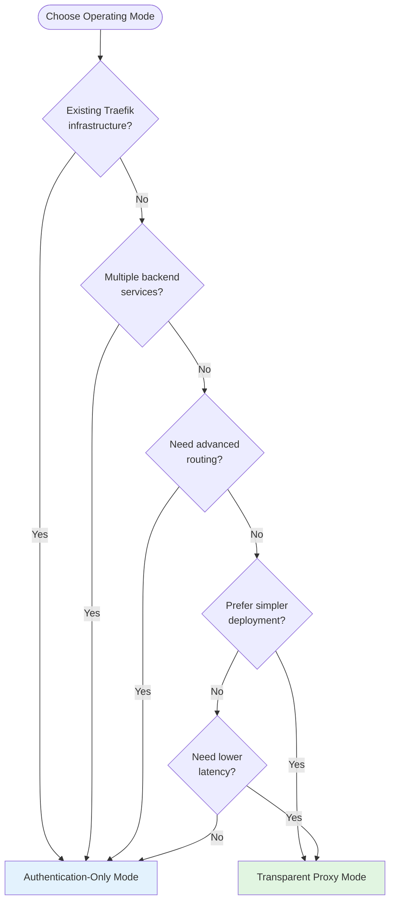

## Overview

elastauth is a stateless authentication proxy that bridges authentication providers with Elasticsearch and Kibana. It acts as a middleware layer that:

1. **Receives authentication requests** from clients with various authentication formats
2. **Extracts user information** using pluggable authentication providers
3. **Generates temporary Elasticsearch credentials** for the authenticated user
4. **Returns authorization headers** that clients can use to access Elasticsearch/Kibana

## Architecture

### High-Level System Architecture



### Authentication Flow Sequence



### Provider Selection Flow



## Core Components

### Authentication Providers

Authentication providers are pluggable components that extract user information from different authentication systems:

- **Authelia Provider**: Extracts user info from HTTP headers (Remote-User, Remote-Groups, etc.)
- **OAuth2/OIDC Provider**: Validates JWT tokens and extracts claims from any OAuth2/OIDC-compliant system

### User Information Standardization

All providers return a standardized `UserInfo` structure:

```json
{
  "username": "john.doe",
  "email": "john.doe@example.com", 
  "groups": ["admin", "developers"],
  "full_name": "John Doe"
}
```

### Credential Management

elastauth generates temporary Elasticsearch credentials for each user:

1. **Password Generation**: Creates a secure random password
2. **User Creation**: Creates/updates the user in Elasticsearch with appropriate roles
3. **Credential Caching**: Encrypts and caches credentials to avoid repeated Elasticsearch calls
4. **Authorization Header**: Returns a Basic Auth header for Elasticsearch access

### Caching Layer

elastauth uses a pluggable caching system powered by the [cachego](https://github.com/wasilak/cachego) library:

- **Memory Cache**: In-memory caching for single-instance deployments
- **Redis Cache**: Distributed caching for multi-instance deployments
- **File Cache**: File-based caching for persistent storage
- **No Cache**: Direct Elasticsearch calls on every request

## Key Principles

### Stateless Operation

elastauth maintains no persistent authentication state:

- Authentication decisions are made on each request
- User credentials are temporarily cached but not stored permanently
- Multiple instances can run independently with shared cache

### Security

- **Credential Encryption**: All cached credentials are encrypted using AES
- **Input Validation**: All user input is validated and sanitized
- **Secure Defaults**: Secure configuration defaults with explicit overrides

### Pluggable Architecture

- **Provider Interface**: Common interface for all authentication systems
- **Factory Pattern**: Dynamic provider instantiation based on configuration
- **Single Provider**: Exactly one provider active at runtime for simplicity

## Authentication Flow

### 1. Request Processing

1. Client sends request with authentication information
2. elastauth routes request to configured authentication provider
3. Provider extracts and validates user information

### 2. User Management

1. elastauth checks cache for existing credentials
2. If cache miss, generates new temporary password
3. Creates/updates user in Elasticsearch with:
   - Generated password
   - User metadata (email, full name)
   - Mapped roles based on groups
4. Encrypts and caches credentials

### 3. Response Generation

1. Decrypts cached credentials
2. Generates Basic Auth header
3. Returns JSON response with authorization header

## Integration Points

### Elasticsearch Integration

elastauth integrates with Elasticsearch through:

- **User Management API**: Creates and updates users
- **Role Mapping**: Maps user groups to Elasticsearch roles
- **Security Settings**: Configures user permissions and access

### Kibana Integration

Kibana automatically works with elastauth-managed users:

- Uses the same Elasticsearch security model
- Inherits role mappings and permissions
- No additional configuration required

### External Authentication Systems

elastauth integrates with external authentication through:

- **Header-based Systems**: Authelia, Traefik Forward Auth
- **OAuth2/OIDC Systems**: Keycloak, Casdoor, Authentik, Auth0, Azure AD
- **Custom Providers**: Extensible through the provider interface

## Configuration Examples

### Basic Authelia Configuration

```yaml
# Basic Authelia setup with memory cache
auth_provider: "authelia"

authelia:
  header_username: "Remote-User"
  header_groups: "Remote-Groups"
  header_email: "Remote-Email"
  header_name: "Remote-Name"

cache:
  type: "memory"
  expiration: "1h"

elasticsearch:
  hosts:
    - "https://elasticsearch:9200"
  username: "elastauth"
  password: "${ELASTICSEARCH_PASSWORD}"

default_roles:
  - "kibana_user"

group_mappings:
  admin:
    - "kibana_admin"
    - "superuser"
```

### OAuth2/OIDC with Redis Cache

```yaml
# OAuth2/OIDC setup with Redis cache for scaling
auth_provider: "oidc"

oidc:
  issuer: "https://keycloak.example.com/realms/myrealm"
  client_id: "elastauth"
  client_secret: "${OIDC_CLIENT_SECRET}"
  scopes: ["openid", "profile", "email", "roles"]
  claim_mappings:
    username: "preferred_username"
    email: "email"
    groups: "realm_access.roles"
    full_name: "name"
  token_validation: "jwks"

cache:
  type: "redis"
  expiration: "2h"
  redis_host: "redis:6379"
  redis_db: 0

elasticsearch:
  hosts:
    - "https://es1.example.com:9200"
    - "https://es2.example.com:9200"
    - "https://es3.example.com:9200"
  username: "elastauth"
  password: "${ELASTICSEARCH_PASSWORD}"

default_roles:
  - "kibana_user"

group_mappings:
  admin:
    - "kibana_admin"
    - "superuser"
  developers:
    - "kibana_user"
    - "dev_role"
  analysts:
    - "kibana_user"
    - "read_only"
```

### Production Multi-Instance Configuration

```yaml
# Production configuration for horizontal scaling
auth_provider: "oidc"

oidc:
  issuer: "https://auth.company.com"
  client_id: "elastauth-prod"
  client_secret: "${OIDC_CLIENT_SECRET}"
  scopes: ["openid", "profile", "email", "groups"]
  claim_mappings:
    username: "preferred_username"
    email: "email"
    groups: "groups"
    full_name: "name"
  token_validation: "both"
  use_pkce: true

cache:
  type: "redis"
  expiration: "4h"
  redis_host: "${REDIS_HOST}"
  redis_db: 0

elasticsearch:
  hosts:
    - "${ELASTICSEARCH_HOST_1}"
    - "${ELASTICSEARCH_HOST_2}"
    - "${ELASTICSEARCH_HOST_3}"
  username: "${ELASTICSEARCH_USERNAME}"
  password: "${ELASTICSEARCH_PASSWORD}"

# Encryption key must be identical across all instances
secret_key: "${SECRET_KEY}"

default_roles:
  - "kibana_user"

group_mappings:
  platform-admin:
    - "kibana_admin"
    - "superuser"
  data-engineers:
    - "kibana_user"
    - "data_writer"
  data-analysts:
    - "kibana_user"
    - "read_only"
  monitoring:
    - "kibana_user"
    - "monitoring_user"
```

## Configuration Philosophy

### Single Provider Selection

elastauth uses exactly one authentication provider at runtime:

- Configured via `auth_provider` setting
- Prevents configuration complexity and conflicts
- Enables clear authentication flow

### Environment Variable Support

All configuration can be overridden via environment variables:

- Supports containerized deployments
- Enables secret management through external systems
- Follows 12-factor app principles

### Validation and Defaults

- Configuration is validated at startup
- Clear error messages for invalid configurations
- Secure defaults with explicit overrides

## Deployment Patterns

### Single Instance

- Memory or file cache
- Simple configuration
- Suitable for small deployments

### Multi-Instance

- Redis cache required
- Shared configuration and encryption keys
- Horizontal scaling support
- Load balancer compatible

### Kubernetes

- ConfigMap and Secret support
- Health check endpoints
- Graceful shutdown handling
- Container-optimized logging

## Third-Party Components

elastauth integrates with several external systems:

### Elasticsearch

- **Purpose**: User and role management, search and analytics platform
- **Integration**: REST API for user management
- **Documentation**: [Elasticsearch Security](https://www.elastic.co/guide/en/elasticsearch/reference/current/security-api.html)

### Kibana

- **Purpose**: Data visualization and management interface
- **Integration**: Automatic through Elasticsearch security
- **Documentation**: [Kibana Security](https://www.elastic.co/guide/en/kibana/current/security.html)

### Authentication Systems

- **Authelia**: [Documentation](https://www.authelia.com/)
- **Keycloak**: [Documentation](https://www.keycloak.org/documentation)
- **Casdoor**: [Documentation](https://casdoor.org/docs/)
- **Authentik**: [Documentation](https://docs.goauthentik.io/)

### Caching

- **Redis**: [Documentation](https://redis.io/documentation)
- **cachego**: [Documentation](https://github.com/wasilak/cachego)

## Operating Modes

elastauth supports two distinct operating modes to accommodate different deployment architectures and requirements.

### Mode Overview



### Authentication-Only Mode (Default)

In authentication-only mode, elastauth acts as a pure authentication service that validates requests and returns authorization headers. An external reverse proxy (like Traefik) handles the actual proxying to Elasticsearch.

**Architecture:**


**Configuration:**
```yaml
proxy:
  enabled: false  # Default
```

**Key Characteristics:**
- Returns authorization headers only
- Does not proxy requests to Elasticsearch
- Designed for Traefik forward auth pattern
- Separates authentication from proxying
- Enables advanced routing capabilities

### Transparent Proxy Mode

In transparent proxy mode, elastauth handles both authentication and request proxying to Elasticsearch in a single service. No external reverse proxy is required.

**Architecture:**


**Configuration:**
```yaml
proxy:
  enabled: true
  elasticsearch_url: "https://elasticsearch:9200"
  timeout: "30s"
```

**Key Characteristics:**
- Authenticates and proxies requests
- Single service to deploy
- Direct connection to Elasticsearch
- Simpler deployment architecture
- Fewer network hops

## Operating Modes Comparison

| Aspect | Authentication-Only Mode | Transparent Proxy Mode |
|--------|-------------------------|------------------------|
| **Default** | ✅ Yes | No |
| **Components** | elastauth + Traefik | elastauth only |
| **Network Hops** | 2 (Traefik → elastauth, Traefik → ES) | 1 (elastauth → ES) |
| **Configuration** | Multiple config files | Single config file |
| **Routing** | Advanced (Traefik) | Simple path-based |
| **Scalability** | Scale independently | Scale together |
| **Flexibility** | Multiple backends | Elasticsearch only |
| **Deployment** | More complex | Simpler |
| **Latency** | Higher (extra hop) | Lower (direct) |
| **Use Case** | Multi-service platform | Standalone Elasticsearch |

### When to Use Authentication-Only Mode

✅ **Choose authentication-only mode when:**
- You already use Traefik as your reverse proxy
- You need to protect multiple backend services
- You require advanced routing rules (path-based, header-based, etc.)
- You want to scale authentication and proxy independently
- You need Traefik's middleware capabilities
- You have complex load balancing requirements

**Example Use Cases:**
- Multi-tenant platform with multiple Elasticsearch clusters
- Platform with Elasticsearch, Kibana, Grafana, and other services
- Integration with existing Traefik infrastructure
- Chaining with Authelia or other authentication systems

### When to Use Transparent Proxy Mode

✅ **Choose transparent proxy mode when:**
- Elasticsearch is your only backend service
- You want simpler deployment with fewer components
- You need lower latency (fewer network hops)
- You don't have existing reverse proxy infrastructure
- You prefer unified configuration and logging
- You want easier troubleshooting

**Example Use Cases:**
- Standalone Elasticsearch deployment
- Simple Docker Compose stack
- Kubernetes deployment with single backend
- Development and testing environments

### Mode Selection Decision Tree



## Next Steps

### Architecture Deep Dive
- **[Authentication-Only Mode Architecture](/elastauth/architecture/auth-only-mode)** - Detailed architecture and flow diagrams
- **[Transparent Proxy Mode Architecture](/elastauth/architecture/proxy-mode)** - Detailed architecture and flow diagrams
- **[Operating Modes Comparison](/elastauth/deployment/modes)** - Detailed comparison and selection guide

### Getting Started
- **[Authentication Providers](/elastauth/providers/)** - Configure your authentication system
  - [Authelia Provider](/elastauth/providers/authelia) - Header-based authentication setup
  - [OAuth2/OIDC Provider](/elastauth/providers/oidc) - JWT token authentication setup
- **[Cache Providers](/elastauth/cache/)** - Configure caching for performance
  - [Redis Cache](/elastauth/cache/redis) - Distributed caching for scaling
  - [Memory Cache](/elastauth/cache/) - Simple in-memory caching

### Deployment Guides
- **[Authentication-Only Mode Deployment](/elastauth/deployment/auth-only-mode)** - Deploy with Traefik
- **[Transparent Proxy Mode Deployment](/elastauth/deployment/proxy-mode)** - Deploy as standalone proxy

### Configuration and Deployment
Refer to the main README for deployment instructions and configuration examples.

### Operations and Maintenance
- **[Troubleshooting](/elastauth/guides/troubleshooting)** - Common issues and solutions