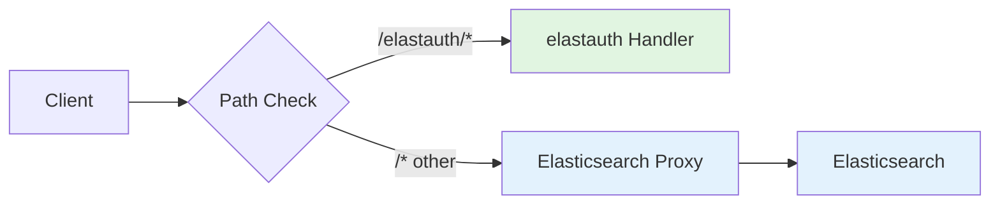

import { Tabs, TabItem } from '@astrojs/starlight/components';
import { Steps } from '@astrojs/starlight/components';
import { Card, CardGrid } from '@astrojs/starlight/components';

This guide helps you migrate from elastauth v1.x to v2.0, which introduces a breaking change in endpoint paths.

## What Changed

### Endpoint Prefix

All elastauth endpoints now require the `/elastauth/` prefix to enable transparent proxying where all `/*` paths can be forwarded to Elasticsearch without conflicts.

<Tabs syncKey="endpoints">
  <TabItem label="Before (v1.x)">
    ```
    /                    → Main authentication endpoint
    /health              → Health check
    /ready               → Readiness probe
    /live                → Liveness probe
    /config              → Configuration endpoint
    /docs                → Swagger UI
    /api/openapi.yaml    → OpenAPI specification
    ```
  </TabItem>
  <TabItem label="After (v2.0)">
    ```
    /elastauth           → Main authentication endpoint
    /elastauth/health    → Health check
    /elastauth/ready     → Readiness probe
    /elastauth/live      → Liveness probe
    /elastauth/config    → Configuration endpoint
    /elastauth/docs      → Swagger UI
    /elastauth/api/openapi.yaml → OpenAPI specification
    ```
  </TabItem>
</Tabs>

## Why This Change?

### Problem in v1.x

Previously, elastauth's endpoints could overlap with Elasticsearch paths:
- `/health` could conflict with Elasticsearch's health endpoint
- `/_search` and other ES paths had to be explicitly handled
- No clean separation between elastauth and proxied content

### Solution in v2.0

By scoping all elastauth endpoints under `/elastauth/*`:

<CardGrid>
  <Card title="Clean Separation" icon="approve-check">
    elastauth endpoints are clearly distinct from Elasticsearch paths
  </Card>
  <Card title="Transparent Proxying" icon="rocket">
    All `/*` paths can go directly to Elasticsearch in proxy mode
  </Card>
  <Card title="Simpler Routing" icon="setting">
    Just check if path starts with `/elastauth/` - no complex rules
  </Card>
  <Card title="Consistent" icon="list-format">
    Same endpoint structure in all operating modes
  </Card>
</CardGrid>

## Migration Steps

### 1. Update Health Checks

<Tabs syncKey="platform">
  <TabItem label="Docker Compose">
    ```yaml
    # Before
    healthcheck:
      test: ["CMD", "wget", "--spider", "-q", "http://localhost:8080/health"]

    # After
    healthcheck:
      test: ["CMD", "wget", "--spider", "-q", "http://localhost:8080/elastauth/health"]
    ```
  </TabItem>
  <TabItem label="Kubernetes">
    ```yaml
    # Before
    livenessProbe:
      httpGet:
        path: /live
        port: 8080
    readinessProbe:
      httpGet:
        path: /ready
        port: 8080

    # After
    livenessProbe:
      httpGet:
        path: /elastauth/live
        port: 8080
    readinessProbe:
      httpGet:
        path: /elastauth/ready
        port: 8080
    ```
  </TabItem>
</Tabs>

### 2. Update Traefik Configuration

If using auth-only mode with Traefik ForwardAuth:

```yaml
# Before
http:
  middlewares:
    elastauth:
      forwardAuth:
        address: "http://elastauth:5000/"

# After
http:
  middlewares:
    elastauth:
      forwardAuth:
        address: "http://elastauth:5000/elastauth"
```

### 3. Update Monitoring

<Tabs syncKey="monitoring">
  <TabItem label="Prometheus">
    ```yaml
    # Before
    - job_name: 'elastauth'
      metrics_path: '/metrics'
      static_configs:
        - targets: ['elastauth:8080']

    # After
    - job_name: 'elastauth'
      metrics_path: '/elastauth/metrics'
      static_configs:
        - targets: ['elastauth:8080']
    ```
  </TabItem>
  <TabItem label="Curl">
    ```bash
    # Before
    curl http://elastauth:8080/config

    # After
    curl http://elastauth:8080/elastauth/config
    ```
  </TabItem>
</Tabs>

### 4. Update Scripts and Automation

<Steps>

1. **Find all references** to old endpoints in your codebase:
   ```bash
   grep -r "localhost:8080/health" .
   grep -r "elastauth:5000/ready" .
   grep -r "/live" .
   grep -r "/config" .
   ```

2. **Replace with new paths** using `/elastauth/*` prefix

3. **Test each endpoint** to verify it works

</Steps>

## Request Flow Changes

### Transparent Proxy Mode



**Examples:**

<Tabs syncKey="request-type">
  <TabItem label="elastauth Endpoints">
    ```bash
    # These are handled by elastauth (NOT proxied)
    curl http://localhost:8080/elastauth/health
    curl http://localhost:8080/elastauth/config
    curl http://localhost:8080/elastauth/docs
    ```
  </TabItem>
  <TabItem label="Elasticsearch Endpoints">
    ```bash
    # These are proxied to Elasticsearch (with auth)
    curl -H "Remote-User: john" http://localhost:8080/_search
    curl -H "Remote-User: john" http://localhost:8080/_cluster/health
    curl -H "Remote-User: john" http://localhost:8080/my-index/_doc/1
    ```
  </TabItem>
</Tabs>

### Auth-Only Mode

No change in behavior - just endpoint paths updated. Traefik still forwards to elastauth for authentication, then to Elasticsearch.

## Testing Your Migration

### Health Check Tests

<Steps>

1. **Test liveness probe:**
   ```bash
   curl http://localhost:8080/elastauth/live
   ```
   Expected response:
   ```json
   {
     "status": "OK",
     "timestamp": "2026-01-15T15:56:38Z",
     "uptime": "1h23m45s",
     "mode": "proxy"
   }
   ```

2. **Test readiness probe:**
   ```bash
   curl http://localhost:8080/elastauth/ready
   ```
   Expected response:
   ```json
   {
     "status": "OK",
     "checks": {
       "elasticsearch": {"status": "OK"},
       "cache": {"status": "OK"},
       "provider": {"status": "OK"}
     },
     "timestamp": "2026-01-15T15:56:38Z",
     "mode": "proxy"
   }
   ```

3. **Test configuration endpoint:**
   ```bash
   curl http://localhost:8080/elastauth/config
   ```
   Expected: Configuration JSON with auth provider, cache, and proxy settings

</Steps>

### Proxy Mode Tests

If using transparent proxy mode:

<Steps>

1. **Test elastauth endpoint** (should NOT proxy):
   ```bash
   curl http://localhost:8080/elastauth/health
   ```
   Expected: elastauth health response

2. **Test Elasticsearch path** (should proxy):
   ```bash
   curl -H "Remote-User: testuser" \
        -H "Remote-Groups: admin" \
        http://localhost:8080/_cluster/health
   ```
   Expected: Elasticsearch cluster health (proxied with authentication)

3. **Verify authentication** is required:
   ```bash
   curl http://localhost:8080/_cluster/health
   ```
   Expected: 401 Unauthorized (no auth headers)

</Steps>

## Rollback Plan

If you need to rollback to v1.x:

<Steps>

1. **Stop the current deployment:**
   ```bash
   docker compose down
   # or
   kubectl delete -f deployment.yaml
   ```

2. **Revert to v1.x image/version:**
   ```yaml
   # docker-compose.yml
   services:
     elastauth:
       image: ghcr.io/wasilak/elastauth:v1.x
   ```

3. **Restore old endpoint configurations:**
   - Revert health check paths
   - Revert Kubernetes probe paths
   - Revert Traefik middleware configuration
   - Revert monitoring scrape configs

4. **Redeploy:**
   ```bash
   docker compose up -d
   # or
   kubectl apply -f deployment.yaml
   ```

</Steps>

## Benefits of v2.0

### For Transparent Proxy Mode

<CardGrid>
  <Card title="No Path Conflicts" icon="approve-check">
    elastauth endpoints never conflict with Elasticsearch paths
  </Card>
  <Card title="Simpler Configuration" icon="setting">
    No need for complex path matching rules
  </Card>
  <Card title="Better Debugging" icon="document">
    Clear distinction in logs between elastauth and ES requests
  </Card>
  <Card title="Cleaner Metrics" icon="list-format">
    Separate metrics for elastauth vs proxied requests
  </Card>
</CardGrid>

### Request Flow Example

```
Client Request Flow:
✅ /_search              → Proxied to Elasticsearch
✅ /_cluster/health      → Proxied to Elasticsearch
✅ /my-index/_doc/1      → Proxied to Elasticsearch
✅ /elastauth/health     → Handled by elastauth (not proxied)
```

## Common Issues

### Issue: Health checks failing after upgrade

:::caution[Health Check Paths]
Ensure all health check configurations use the new `/elastauth/*` paths.
:::

**Solution:**

<Steps>

1. Check your health check configuration
2. Update to use `/elastauth/health`, `/elastauth/ready`, or `/elastauth/live`
3. Restart the service
4. Verify health checks pass

</Steps>

### Issue: Traefik ForwardAuth not working

:::caution[ForwardAuth Address]
The ForwardAuth middleware address must point to `/elastauth` not `/`.
:::

**Solution:**

```yaml
http:
  middlewares:
    elastauth:
      forwardAuth:
        address: "http://elastauth:5000/elastauth"
        # NOT: "http://elastauth:5000/"
```

### Issue: Metrics not being scraped

:::caution[Metrics Path]
Prometheus scrape path must be `/elastauth/metrics`.
:::

**Solution:**

```yaml
scrape_configs:
  - job_name: 'elastauth'
    metrics_path: '/elastauth/metrics'
    static_configs:
      - targets: ['elastauth:8080']
```

## FAQ

**Q: Do I need to change my Elasticsearch queries?**

A: No. Elasticsearch paths (like `/_search`, `/_cluster/health`) are unchanged. Only elastauth's own endpoints changed.

**Q: Will this affect my existing authentication flow?**

A: The authentication flow is unchanged. Only the endpoint URLs changed.

**Q: Can I use both old and new endpoints during migration?**

A: No. This is a breaking change. You must update all references to use the new `/elastauth/*` paths.

**Q: Does this affect the Elasticsearch proxy functionality?**

A: No. In proxy mode, all non-`/elastauth/*` paths are still proxied to Elasticsearch as before.

**Q: What about custom middleware or plugins?**

A: Update any custom code that references elastauth endpoints to use the new `/elastauth/*` prefix.

## Timeline

- **Version**: v2.0
- **Released**: January 15, 2026
- **Commit**: f12303653f3062cc06e7fa297415d4045ea6a4ec
- **Affects**: All elastauth deployments (both auth-only and proxy modes)

## Next Steps

<CardGrid>
  <Card title="Deployment Guide" href="/elastauth/deployment/modes/">
    Choose the right deployment mode for your use case
  </Card>
  <Card title="Configuration Reference" href="/elastauth/configuration/">
    Complete configuration options
  </Card>
  <Card title="Troubleshooting" href="/elastauth/guides/troubleshooting/">
    Common issues and solutions
  </Card>
  <Card title="Architecture" href="/elastauth/architecture/proxy-mode/">
    Understand how transparent proxy mode works
  </Card>
</CardGrid>

## Support

If you encounter issues during migration:

1. **Check logs:** `docker compose logs elastauth`
2. **Verify endpoints:** `curl http://localhost:8080/elastauth/health`
3. **Review documentation:** [elastauth.io](https://wasilak.github.io/elastauth/)
4. **Open an issue:** [GitHub Issues](https://github.com/wasilak/elastauth/issues)
