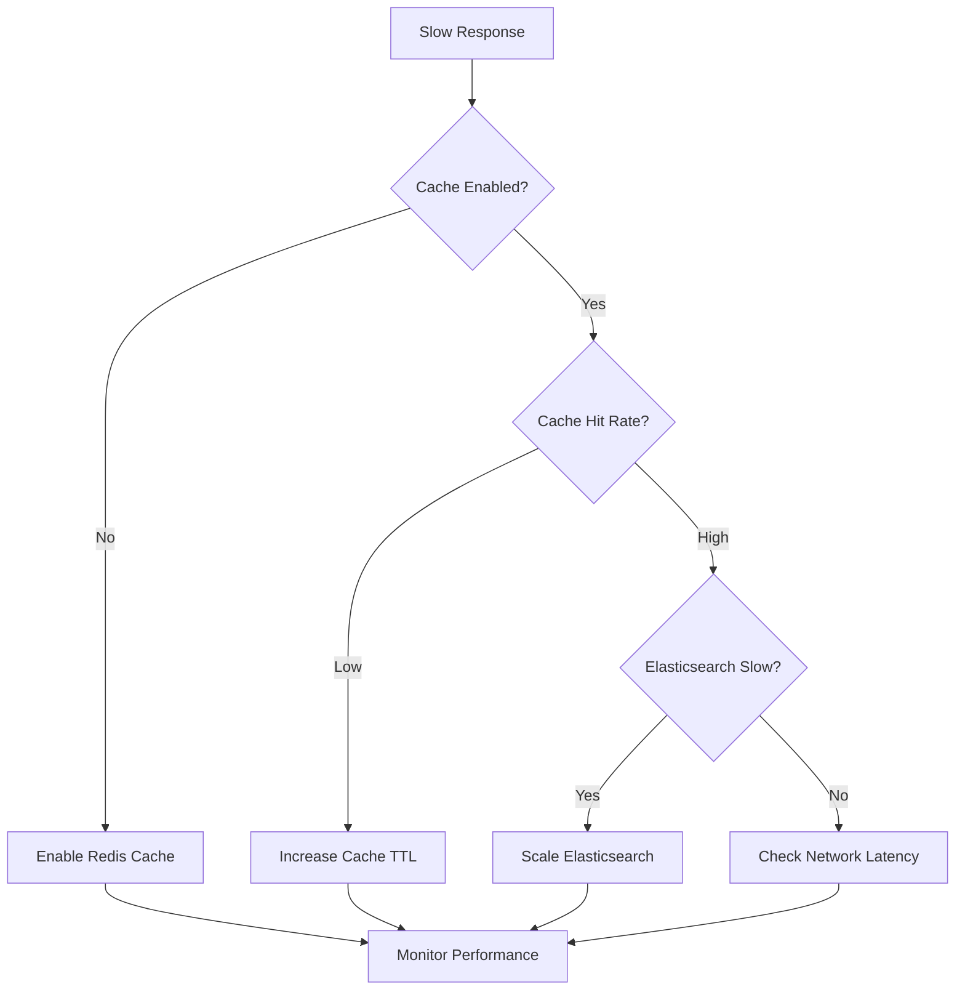

# Troubleshooting Guide

This comprehensive guide covers common issues and solutions for elastauth deployments across different environments and configurations.

## Quick Diagnosis

### Health Check Commands

```bash
# Test elastauth health
curl http://elastauth:5000/health

# Test authentication flow
curl -H "Authorization: Bearer YOUR_JWT_TOKEN" \
     http://elastauth:5000/

# Check configuration
curl http://elastauth:5000/config

# Test Elasticsearch connectivity
curl -u elastauth:password \
     http://elasticsearch:9200/_cluster/health

# Test Redis connectivity (if using Redis cache)
redis-cli -h redis-host -p 6379 ping
```

### Log Analysis Quick Reference

```bash
# View recent logs
docker logs --tail 100 elastauth-container

# Follow logs in real-time
docker logs -f elastauth-container

# Search for specific errors
docker logs elastauth-container 2>&1 | grep -i error

# Kubernetes logs
kubectl logs deployment/elastauth --tail=100
kubectl logs -f deployment/elastauth
```

## Authentication Issues

### Authelia Provider Problems

#### Missing or Invalid Headers

**Symptoms:**
- HTTP 400: "Remote-User header not found"
- HTTP 400: "Invalid user information"
- Authentication works in browser but fails via API

**Diagnosis:**
```bash
# Test headers directly
curl -v -H "Remote-User: testuser" \
        -H "Remote-Groups: admin,users" \
        -H "Remote-Email: test@example.com" \
        http://elastauth:5000/

# Check if proxy is forwarding headers
curl -v http://your-proxy/elastauth-endpoint
```

**Solutions:**
1. **Configure proxy to forward headers** - See [Authelia Integration Guide](/guides/authelia)
2. **Verify header names match configuration** - Check [Authelia Provider](/providers/authelia#configuration-examples)
3. **Test Authelia configuration** - Verify Authelia is setting headers correctly

#### Traefik Forward Auth Issues

**Configuration Example:**
```yaml
# docker-compose.yml
services:
  traefik:
    image: traefik:latest
    command:
      - --providers.docker=true
    labels:
      - "traefik.http.middlewares.authelia.forwardauth.address=http://authelia:9091/api/verify"
      - "traefik.http.middlewares.authelia.forwardauth.trustForwardHeader=true"
      - "traefik.http.middlewares.authelia.forwardauth.authResponseHeaders=Remote-User,Remote-Groups,Remote-Email,Remote-Name"
```

### OAuth2/OIDC Provider Problems

#### JWT Token Validation Failures

**Symptoms:**
- HTTP 401: "Token validation failed"
- "Invalid signature" errors
- "Token expired" errors

**Diagnosis:**
```bash
# Decode JWT token to inspect claims
echo "YOUR_JWT_PAYLOAD" | base64 -d | jq .

# Check token expiration
date -d @$(echo "YOUR_JWT_PAYLOAD" | base64 -d | jq -r .exp)

# Test JWKS endpoint accessibility
curl https://your-provider.com/.well-known/jwks.json

# Test OIDC discovery
curl https://your-provider.com/.well-known/openid-configuration
```

**Solutions:**
1. **Clock synchronization** - Ensure system clocks are synchronized
2. **Token refresh** - Implement token refresh before expiration
3. **JWKS connectivity** - Verify network access to JWKS endpoint
4. **Issuer configuration** - Check issuer URL matches exactly

#### Claim Mapping Issues

**Symptoms:**
- HTTP 400: "Required claim not found"
- Users have incorrect groups/roles
- Missing user information

**Diagnosis:**
```bash
# Inspect token claims
echo "YOUR_JWT_PAYLOAD" | base64 -d | jq .

# Check elastauth claim mapping configuration
curl http://elastauth:5000/config | jq .provider_config.claim_mappings
```

**Solutions:**
1. **Update claim mappings** - See [OIDC Provider Configuration](/providers/oidc#claim-mapping)
2. **Check nested claims** - Use dot notation for nested claims (e.g., "realm_access.roles")
3. **Verify provider claims** - Ensure your OIDC provider includes required claims

## Infrastructure Issues

### Elasticsearch Connection Problems

#### Connection Refused

**Symptoms:**
- "Connection refused" errors
- "Failed to initialize Elasticsearch client"
- HTTP 500 responses

**Diagnosis:**
```bash
# Test connectivity from elastauth container
docker exec elastauth-container curl -v http://elasticsearch:9200

# Check Elasticsearch health
curl http://elasticsearch:9200/_cluster/health

# Verify DNS resolution
docker exec elastauth-container nslookup elasticsearch
```

**Solutions:**
1. **Check Elasticsearch status** - Ensure Elasticsearch is running
2. **Verify network connectivity** - Check Docker networks or Kubernetes networking
3. **Update host configuration** - See [Elasticsearch Setup Guide](/guides/elasticsearch)

#### Authentication Failures

**Symptoms:**
- HTTP 401 from Elasticsearch
- "Authentication failed" in elastauth logs
- Cannot create/update users

**Diagnosis:**
```bash
# Test elastauth user credentials
curl -u elastauth:password \
     http://elasticsearch:9200/_security/_authenticate

# Check user permissions
curl -u elastauth:password \
     http://elasticsearch:9200/_security/user/elastauth
```

**Solutions:**
1. **Create elastauth user** - See [Elasticsearch User Setup](/guides/elasticsearch#user-setup)
2. **Grant required permissions** - Ensure user has manage_security privilege
3. **Update password** - Sync password between configuration and Elasticsearch

### Cache Connection Issues

#### Redis Connection Problems

**Symptoms:**
- "Failed to connect to Redis" errors
- Cache misses in all requests
- Slow response times

**Diagnosis:**
```bash
# Test Redis connectivity
redis-cli -h redis-host -p 6379 ping

# Test from elastauth container
docker exec elastauth-container telnet redis-host 6379

# Check Redis authentication
redis-cli -h redis-host -p 6379 -a password ping
```

**Solutions:**
1. **Verify Redis status** - Ensure Redis is running and accessible
2. **Check authentication** - Verify Redis password if authentication is enabled
3. **Network connectivity** - Check Docker networks or Kubernetes services
4. **Database selection** - Ensure correct Redis database number

#### Memory Cache Issues

**Symptoms:**
- High memory usage
- Out of memory errors
- Container restarts

**Solutions:**
1. **Switch to Redis cache** - See [Redis Cache Setup](/cache/redis)
2. **Reduce cache TTL** - Lower cache expiration time
3. **Increase memory limits** - Allocate more memory to elastauth container

## Performance Issues

### Slow Response Times

**Diagnosis Flow:**


**Performance Optimization:**
1. **Enable caching** - Use [Redis cache](/cache/redis) for production
2. **Tune cache TTL** - Balance between performance and security
3. **Scale Elasticsearch** - Add more nodes for better performance
4. **Optimize network** - Reduce latency between components

### High Resource Usage

**Memory Optimization:**
```yaml
# Kubernetes resource limits
resources:
  requests:
    memory: "128Mi"
    cpu: "100m"
  limits:
    memory: "256Mi"
    cpu: "200m"
```

**CPU Optimization:**
- Use Redis cache to reduce Elasticsearch calls
- Implement connection pooling
- Monitor JWT validation performance

## Deployment Issues

### Docker Deployment Problems

#### Container Startup Failures

**Common Issues:**
```bash
# Check container logs
docker logs elastauth-container

# Verify configuration file mounting
docker exec elastauth-container cat /config.yml

# Test configuration outside container
./elastauth --config config.yml --validate
```

**Solutions:**
1. **Fix configuration errors** - Validate YAML syntax and required fields
2. **Check file permissions** - Ensure config file is readable
3. **Verify volume mounts** - Check Docker volume configuration
4. **Environment variables** - Ensure all required variables are set

### Kubernetes Deployment Problems

#### Pod Issues

**Diagnosis Commands:**
```bash
# Check pod status
kubectl get pods -l app=elastauth
kubectl describe pod elastauth-pod-name

# Check events
kubectl get events --sort-by=.metadata.creationTimestamp

# Check resource usage
kubectl top pod elastauth-pod-name
```

**Common Solutions:**
1. **Resource limits** - Increase CPU/memory limits if needed
2. **ConfigMap updates** - Restart pods after configuration changes
3. **Image pull issues** - Check image availability and pull secrets
4. **Network policies** - Verify network connectivity between pods

## Security Issues

### Token Security

#### Token Validation Failures

**Security Checklist:**
- [ ] System clocks synchronized
- [ ] HTTPS used for all communications
- [ ] JWKS endpoint accessible
- [ ] Token expiration properly handled
- [ ] Issuer URL matches exactly

#### Permission Issues

**Role Mapping Diagnosis:**
```bash
# Check user roles in Elasticsearch
curl -u elastauth:password \
     http://elasticsearch:9200/_security/user/username

# Verify group extraction
curl http://elastauth:5000/config | jq .group_mappings

# Test user permissions
curl -u username:temp-password \
     http://elasticsearch:9200/_security/_authenticate
```

## Monitoring and Alerting

### Health Check Setup

```yaml
# Docker Compose health checks
healthcheck:
  test: ["CMD", "curl", "-f", "http://localhost:5000/health"]
  interval: 30s
  timeout: 10s
  retries: 3
  start_period: 40s
```

### Log Monitoring

**Key Log Patterns to Monitor:**
```bash
# Authentication failures
grep "authentication failed" elastauth.log

# Cache performance
grep -E "(Cache hit|Cache miss)" elastauth.log

# Elasticsearch errors
grep "elasticsearch" elastauth.log | grep -i error

# Performance metrics
grep "response_time" elastauth.log
```

## Advanced Troubleshooting

### Debug Mode

**Enable Debug Logging:**
```yaml
# config.yml
log_level: "debug"

# Environment variable
LOG_LEVEL=debug

# Docker
docker run -e LOG_LEVEL=debug elastauth:latest
```

### Network Debugging

**Container Networking:**
```bash
# Test DNS resolution
docker exec elastauth-container nslookup elasticsearch

# Test port connectivity
docker exec elastauth-container telnet elasticsearch 9200

# Check network configuration
docker network ls
docker network inspect network-name
```

**Kubernetes Networking:**
```bash
# Test service connectivity
kubectl exec elastauth-pod -- curl http://elasticsearch:9200

# Check service endpoints
kubectl get endpoints elasticsearch

# Test DNS resolution
kubectl exec elastauth-pod -- nslookup elasticsearch
```

## Getting Help

### Information to Collect

**Before seeking help, gather:**
1. **Version information**: `./elastauth --version`
2. **Configuration**: Sanitized config file (remove secrets)
3. **Logs**: Recent logs with error messages
4. **Environment**: Docker/Kubernetes, OS, versions
5. **Provider details**: Authentication provider and version
6. **Network setup**: Proxy, load balancer configuration

### Support Resources

- **[GitHub Issues](https://github.com/wasilak/elastauth/issues)** - Bug reports and feature requests
- **[Documentation](/getting-started/concepts)** - Complete documentation
- **[Configuration Examples](/guides/configuration)** - Working configuration examples
- **[Community Discussions](https://github.com/wasilak/elastauth/discussions)** - Community support

### Related Documentation

- **[Authentication Providers](/providers/)** - Provider-specific troubleshooting
- **[Cache Configuration](/cache/)** - Cache-related issues
- **[Deployment Guides](/deployment/)** - Deployment-specific problems
- **[Security Guide](/guides/security)** - Security-related issues
- **[Performance Guide](/guides/performance)** - Performance optimization

### Authentication Failures

#### Symptoms
- HTTP 400/401 responses from elastauth
- "Authentication failed" errors in logs
- Users cannot access Kibana

#### Diagnosis

1. **Check elastauth logs**:
```bash
docker logs elastauth-container
# or
kubectl logs deployment/elastauth
```

2. **Test authentication directly**:
```bash
# For Authelia provider
curl -H "Remote-User: testuser" \
     -H "Remote-Groups: admin" \
     http://elastauth:5000/

# For OIDC provider  
curl -H "Authorization: Bearer YOUR_JWT_TOKEN" \
     http://elastauth:5000/
```

3. **Verify provider configuration**:
```bash
# Check config endpoint
curl http://elastauth:5000/config
```

#### Solutions

**Authelia Provider Issues**:
- Verify headers are being sent by proxy (Traefik/nginx)
- Check header names match configuration
- Ensure Authelia is setting headers correctly

**OIDC Provider Issues**:
- Verify JWT token is valid and not expired
- Check issuer URL matches provider configuration
- Ensure required claims are present in token
- Validate JWKS endpoint is accessible

### Elasticsearch Connection Issues

#### Symptoms
- "Failed to initialize Elasticsearch client" errors
- HTTP 500 responses from elastauth
- Cannot create/update users in Elasticsearch

#### Diagnosis

1. **Test Elasticsearch connectivity**:
```bash
# From elastauth container
curl -u elastauth:password http://elasticsearch:9200/_cluster/health
```

2. **Check Elasticsearch logs**:
```bash
docker logs elasticsearch-container
```

3. **Verify credentials**:
```bash
# Test authentication
curl -u elastauth:password http://elasticsearch:9200/_security/_authenticate
```

#### Solutions

- **Connection refused**: Check Elasticsearch is running and accessible
- **Authentication failed**: Verify elastauth user exists and has correct permissions
- **SSL/TLS issues**: Check certificate configuration and trust
- **Network issues**: Verify network connectivity between containers/pods

### Cache Connection Issues

#### Symptoms
- "Failed to connect to cache" errors
- Slow response times
- Cache misses in logs

#### Diagnosis

1. **Test cache connectivity**:
```bash
# Redis
redis-cli -h redis-host -p 6379 ping

# From elastauth container
telnet redis-host 6379
```

2. **Check cache logs**:
```bash
docker logs redis-container
```

#### Solutions

**Redis Issues**:
- Verify Redis is running and accessible
- Check Redis authentication if enabled
- Ensure Redis database number is correct
- Verify network connectivity

**Memory Cache Issues**:
- Check available memory on elastauth instance
- Monitor memory usage growth
- Consider TTL adjustment if memory usage is high

### Configuration Issues

#### Symptoms
- elastauth fails to start
- "Configuration validation failed" errors
- Unexpected behavior

#### Diagnosis

1. **Validate configuration**:
```bash
./elastauth --config config.yml --validate
```

2. **Check configuration loading**:
```bash
# Enable debug logging
LOG_LEVEL=debug ./elastauth
```

3. **Review configuration**:
```bash
# Check effective configuration
curl http://elastauth:5000/config
```

#### Solutions

- **Invalid YAML**: Check YAML syntax and indentation
- **Missing required fields**: Add all required configuration fields
- **Environment variable issues**: Verify environment variables are set correctly
- **Provider configuration**: Ensure provider-specific settings are correct

## Performance Issues

### Slow Response Times

#### Symptoms
- High response times from elastauth
- Timeouts from clients
- Poor user experience

#### Diagnosis

1. **Check response times**:
```bash
# Test response time
time curl -H "Remote-User: testuser" http://elastauth:5000/
```

2. **Monitor cache hit rates**:
```bash
# Check logs for cache hits/misses
grep -E "(Cache hit|Cache miss)" elastauth.log
```

3. **Check Elasticsearch performance**:
```bash
# Elasticsearch cluster health
curl http://elasticsearch:9200/_cluster/health
```

#### Solutions

- **Enable caching**: Add Redis cache to reduce Elasticsearch calls
- **Tune cache TTL**: Adjust cache expiration for better hit rates
- **Scale Elasticsearch**: Add more Elasticsearch nodes if needed
- **Optimize network**: Reduce network latency between components

### High Memory Usage

#### Symptoms
- elastauth consuming excessive memory
- Out of memory errors
- Container restarts

#### Diagnosis

1. **Monitor memory usage**:
```bash
# Docker
docker stats elastauth-container

# Kubernetes
kubectl top pod elastauth-pod
```

2. **Check cache size**:
```bash
# Redis memory usage
redis-cli info memory

# Memory cache (check logs for cache size)
grep "cache size" elastauth.log
```

#### Solutions

- **Reduce cache TTL**: Lower cache expiration time
- **Switch to Redis**: Use Redis instead of memory cache
- **Increase memory limits**: Allocate more memory to elastauth
- **Monitor cache growth**: Set up alerts for memory usage

## Security Issues

### Token Validation Failures

#### Symptoms
- "Token validation failed" errors
- Invalid signature errors
- Expired token errors

#### Diagnosis

1. **Decode JWT token**:
```bash
# Decode token payload (replace with actual token)
echo "JWT_PAYLOAD_PART" | base64 -d | jq .
```

2. **Check token expiration**:
```bash
# Check exp claim in decoded token
date -d @EXPIRATION_TIMESTAMP
```

3. **Verify JWKS endpoint**:
```bash
curl https://your-provider.com/.well-known/jwks.json
```

#### Solutions

- **Clock skew**: Synchronize system clocks
- **Expired tokens**: Refresh tokens before expiration
- **Invalid signatures**: Verify JWKS endpoint and issuer configuration
- **Network issues**: Ensure JWKS endpoint is accessible

### Permission Issues

#### Symptoms
- Users cannot access Kibana features
- "Access denied" errors in Kibana
- Missing roles or permissions

#### Diagnosis

1. **Check user roles**:
```bash
# Get user info from Elasticsearch
curl -u elastauth:password \
     http://elasticsearch:9200/_security/user/username
```

2. **Verify role mappings**:
```bash
# Check elastauth configuration
curl http://elastauth:5000/config
```

3. **Test Elasticsearch permissions**:
```bash
# Test user permissions
curl -u username:temp-password \
     http://elasticsearch:9200/_security/_authenticate
```

#### Solutions

- **Update role mappings**: Adjust group_mappings in configuration
- **Check default roles**: Ensure default_roles are appropriate
- **Verify group extraction**: Check that groups are correctly extracted from provider
- **Elasticsearch role configuration**: Verify roles exist in Elasticsearch

## Deployment Issues

### Container Startup Issues

#### Symptoms
- Container fails to start
- Exit code 1 errors
- Configuration validation failures

#### Diagnosis

1. **Check container logs**:
```bash
docker logs elastauth-container
```

2. **Verify configuration mounting**:
```bash
# Check if config file is mounted correctly
docker exec elastauth-container cat /config.yml
```

3. **Test configuration**:
```bash
# Validate configuration outside container
./elastauth --config config.yml --validate
```

#### Solutions

- **Fix configuration**: Correct configuration errors
- **Check file permissions**: Ensure config file is readable
- **Verify mounts**: Check volume mounts are correct
- **Environment variables**: Ensure required environment variables are set

### Kubernetes Deployment Issues

#### Symptoms
- Pods in CrashLoopBackOff state
- Service not accessible
- ConfigMap/Secret issues

#### Diagnosis

1. **Check pod status**:
```bash
kubectl get pods -l app=elastauth
kubectl describe pod elastauth-pod
```

2. **Check logs**:
```bash
kubectl logs deployment/elastauth
```

3. **Verify ConfigMap/Secrets**:
```bash
kubectl get configmap elastauth-config -o yaml
kubectl get secret elastauth-secrets -o yaml
```

#### Solutions

- **Fix resource definitions**: Correct Kubernetes YAML files
- **Check resource limits**: Ensure adequate CPU/memory limits
- **Verify networking**: Check service and ingress configuration
- **ConfigMap/Secret updates**: Restart pods after configuration changes

## Monitoring and Alerting

### Health Check Failures

#### Symptoms
- Health check endpoint returns errors
- Load balancer removes elastauth from rotation
- Service marked as unhealthy

#### Diagnosis

1. **Test health endpoint**:
```bash
curl http://elastauth:5000/health
```

2. **Check dependencies**:
```bash
# Test Elasticsearch
curl http://elasticsearch:9200/_cluster/health

# Test Redis (if used)
redis-cli -h redis-host ping
```

#### Solutions

- **Fix dependency issues**: Resolve Elasticsearch/Redis connectivity
- **Adjust health check timeouts**: Increase timeout values if needed
- **Monitor dependencies**: Set up monitoring for all dependencies

### Log Analysis

#### Common Log Patterns

**Successful authentication**:
```json
{
  "level": "info",
  "msg": "User authenticated successfully",
  "user": "john.doe",
  "provider": "oidc"
}
```

**Cache operations**:
```json
{
  "level": "debug",
  "msg": "Cache hit",
  "cacheKey": "elastauth-encoded-username",
  "user": "john.doe"
}
```

**Errors**:
```json
{
  "level": "error", 
  "msg": "Failed to get user from provider",
  "error": "token validation failed",
  "provider": "oidc"
}
```

## Getting Help

### Information to Collect

When seeking help, collect:

1. **elastauth version**: `./elastauth --version`
2. **Configuration**: Sanitized configuration file
3. **Logs**: Recent elastauth logs with errors
4. **Environment**: Deployment method (Docker, Kubernetes, etc.)
5. **Provider details**: Authentication provider type and version

### Support Channels

- **GitHub Issues**: [elastauth repository](https://github.com/wasilak/elastauth/issues)
- **Documentation**: Check all relevant documentation sections
- **Community**: Search existing issues and discussions

### Debug Mode

Enable debug logging for detailed troubleshooting:

```yaml
# config.yml
log_level: "debug"

# Or via environment variable
LOG_LEVEL=debug ./elastauth
```

## Prevention

### Best Practices

1. **Configuration validation**: Always validate configuration before deployment
2. **Health monitoring**: Set up health checks and monitoring
3. **Log aggregation**: Centralize logs for easier troubleshooting
4. **Testing**: Test authentication flows in staging environment
5. **Documentation**: Keep deployment documentation up to date

### Monitoring Setup

```yaml
# Example monitoring configuration
monitoring:
  health_checks:
    - endpoint: "/health"
      interval: "30s"
      timeout: "5s"
  
  metrics:
    - cache_hit_rate
    - response_time
    - error_rate
    
  alerts:
    - high_error_rate
    - cache_connectivity
    - elasticsearch_connectivity
```