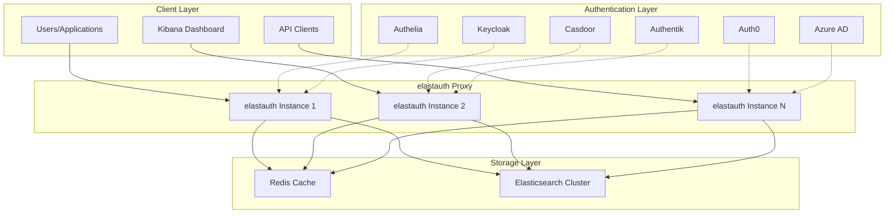
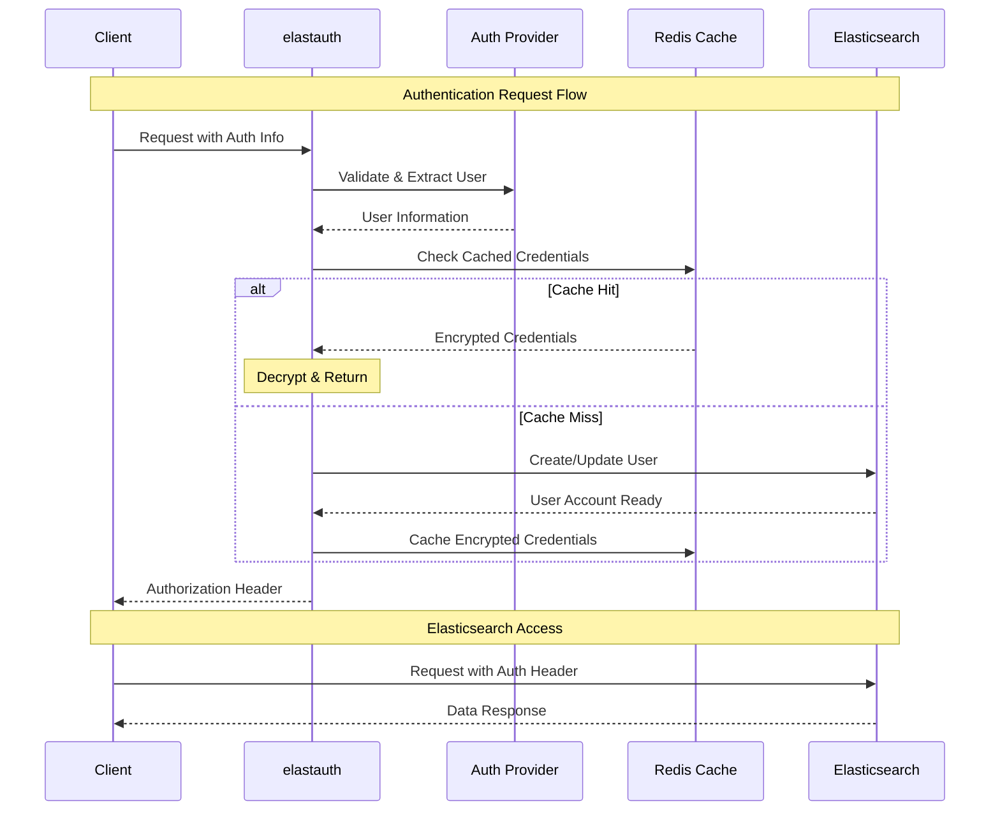

# Welcome to elastauth

elastauth is a stateless authentication proxy that sits between your users and Elasticsearch/Kibana, providing seamless authentication through pluggable providers.

## Key Features

- **Pluggable Authentication**: Support for multiple authentication providers (Authelia, OAuth2/OIDC)
- **Stateless Design**: No persistent authentication state, perfect for horizontal scaling
- **Elasticsearch Integration**: Automatic user management and role mapping
- **Flexible Caching**: Support for Redis, memory, and file-based caching
- **Production Ready**: Kubernetes-ready with health checks and graceful shutdown

## Quick Start

Get started with elastauth in minutes:

### 1. Choose Your Authentication Provider
- **[Authelia](/elastauth/providers/authelia)** - If you're using Authelia for authentication
- **[OAuth2/OIDC](/elastauth/providers/oidc)** - For Keycloak, Casdoor, Authentik, Auth0, Azure AD, and others

### 2. Configure elastauth
```yaml
# Basic configuration example
auth_provider: "oidc"  # or "authelia"

oidc:
  issuer: "https://your-auth-provider.com"
  client_id: "elastauth"
  client_secret: "${OIDC_CLIENT_SECRET}"

cache:
  type: "redis"  # or "memory" for single instance
  redis_host: "redis:6379"

elasticsearch:
  hosts: ["https://elasticsearch:9200"]
  username: "elastauth"
  password: "${ELASTICSEARCH_PASSWORD}"
```

### 3. Deploy elastauth
Choose your deployment method:
- **[Docker](/elastauth/deployment/docker)** - Quick container deployment
- **[Kubernetes](/elastauth/deployment/kubernetes)** - Production-ready orchestration
- **[Binary](/elastauth/deployment/binary)** - Direct binary deployment

### 4. Test Your Setup
```bash
# Test authentication endpoint
curl -H "Authorization: Bearer YOUR_JWT_TOKEN" \
     http://elastauth:5000/

# Use returned authorization header with Elasticsearch
curl -H "Authorization: Basic base64encodedcreds" \
     https://elasticsearch:9200/_cluster/health
```

## Architecture Overview

elastauth uses a pluggable architecture that supports multiple authentication providers while maintaining a stateless design perfect for horizontal scaling.



### Authentication Flow



## Supported Providers

elastauth supports a wide range of authentication providers:

- **[Authelia](/elastauth/providers/authelia)**: Header-based authentication
- **[OAuth2/OIDC](/elastauth/providers/oidc)**: Generic OAuth2/OIDC support for:
  - Keycloak
  - Authentik  
  - Casdoor
  - Auth0
  - Azure AD
  - And many more...

## Next Steps

### 📚 Learn the Fundamentals
- **[Core Concepts](/elastauth/getting-started/concepts)** - Understand elastauth's architecture and principles
- **[Configuration Guide](/elastauth/guides/configuration)** - Complete configuration reference
- **[Security Model](/elastauth/guides/security)** - Authentication and authorization concepts

### 🔧 Configure Authentication
- **[Authentication Providers](/elastauth/providers/)** - Choose and configure your auth system
  - [Authelia Provider](/elastauth/providers/authelia) - Header-based authentication
  - [OAuth2/OIDC Provider](/elastauth/providers/oidc) - JWT token authentication
- **[Cache Configuration](/elastauth/cache/)** - Optimize performance with caching
  - [Redis Cache](/elastauth/cache/redis) - Distributed caching for scaling

### 🚀 Deploy to Production
- **[Docker Deployment](/elastauth/deployment/docker)** - Container-based deployment
- **[Kubernetes Deployment](/elastauth/deployment/kubernetes)** - Production orchestration
- **[Scaling Guide](/elastauth/guides/scaling)** - Horizontal scaling considerations
- **[Monitoring](/elastauth/guides/monitoring)** - Health checks and observability

### 🔍 Operations & Troubleshooting
- **[Troubleshooting Guide](/elastauth/guides/troubleshooting)** - Common issues and solutions
- **[Upgrading](/elastauth/guides/upgrading)** - Version upgrade procedures
- **[Performance Tuning](/elastauth/guides/performance)** - Optimization best practices

### 🔗 Integration Examples
- **[Elasticsearch Setup](/elastauth/guides/elasticsearch)** - Configure Elasticsearch integration
- **[Kibana Integration](/elastauth/guides/kibana)** - Set up Kibana with elastauth
- **[Load Balancer Configuration](/elastauth/guides/load-balancer)** - Production load balancing