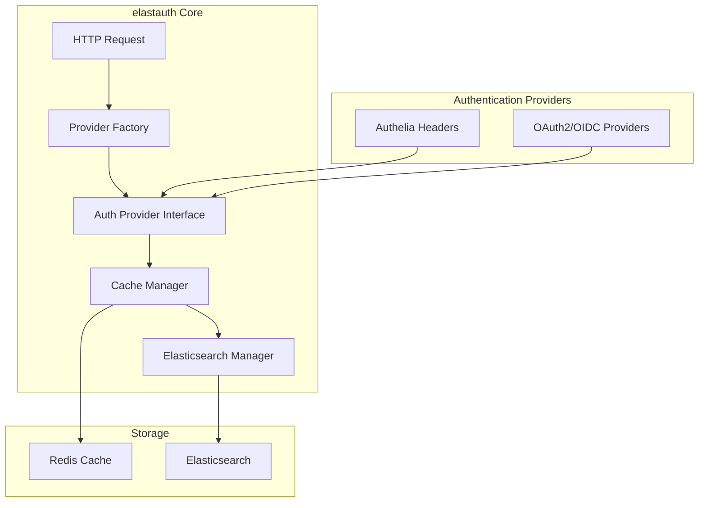

# Welcome to elastauth

elastauth is a stateless authentication proxy that sits between your users and Elasticsearch/Kibana, providing seamless authentication through pluggable providers.

## Key Features

- **Pluggable Authentication**: Support for multiple authentication providers (Authelia, OAuth2/OIDC)
- **Stateless Design**: No persistent authentication state, perfect for horizontal scaling
- **Elasticsearch Integration**: Automatic user management and role mapping
- **Flexible Caching**: Support for Redis, memory, and file-based caching
- **Production Ready**: Kubernetes-ready with health checks and graceful shutdown

## Quick Start

Get started with elastauth in minutes:

1. [Install elastauth](./getting-started/installation)
2. [Configure your authentication provider](./getting-started/configuration)
3. [Deploy to your infrastructure](./deployment/docker)

## Architecture Overview

## Supported Providers

elastauth supports a wide range of authentication providers:

- **[Authelia](./providers/authelia)**: Header-based authentication
- **[OAuth2/OIDC](./providers/oidc)**: Generic OAuth2/OIDC support for:
  - Keycloak
  - Authentik  
  - Casdoor
  - Auth0
  - Azure AD
  - And many more...

## Next Steps

- [Learn about elastauth concepts](./getting-started/concepts)
- [Configure your first provider](./getting-started/configuration)
- [Explore deployment options](./deployment/docker)